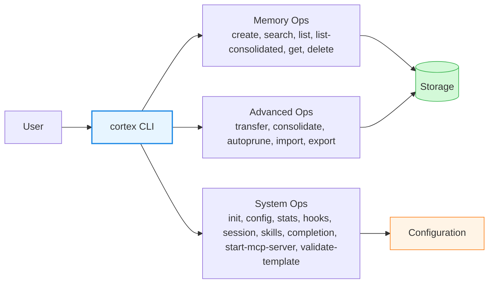
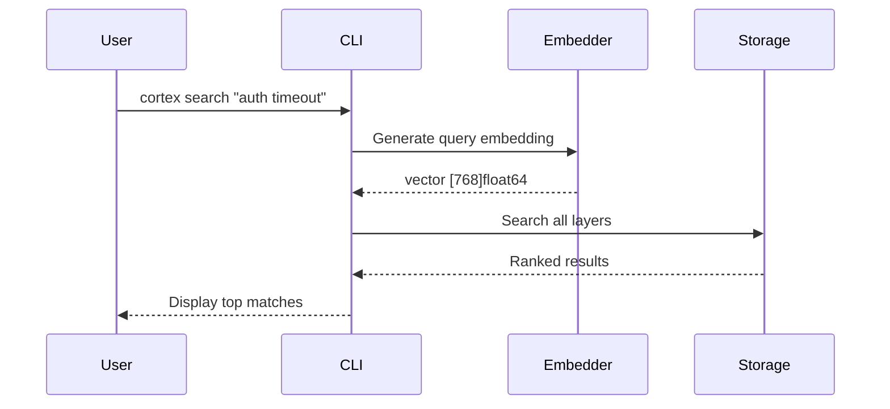
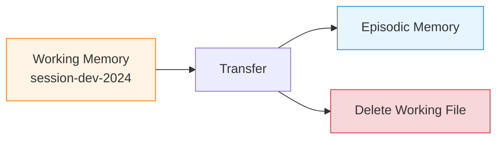
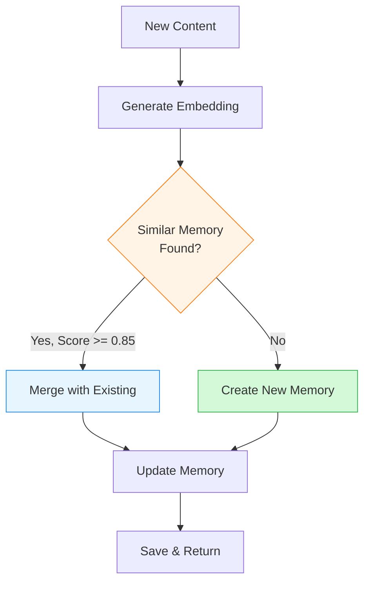
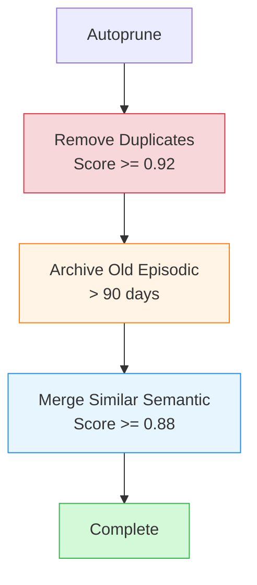

# Cortex - CLI Reference

Complete command-line reference for Cortex.

## Table of Contents

- [Overview](#overview)
- [Global Flags](#global-flags)
- [Memory Operations](#memory-operations)
- [Advanced Operations](#advanced-operations)
- [System Commands](#system-commands)
- [Output Formats](#output-formats)
- [Examples](#examples)

---

## Overview

Cortex provides a comprehensive CLI for managing your semantic memory system.



### Command Categories

| Category | Commands | Purpose |
|----------|----------|---------|
| **Memory Operations** | create, search, list, list-consolidated, get, delete | Basic CRUD operations |
| **Advanced Operations** | transfer-working, consolidate, autoprune, export, import | Memory lifecycle management |
| **System Commands** | init, config, stats, hooks, session, skills, completion, start-mcp-server, validate-template | Configuration and utilities |

---

## Global Flags

Available for all commands:

| Flag | Default | Description |
|------|---------|-------------|
| `--config` | `.agents/cortex/config.toml` | Configuration file path |
| `--help` / `-h` | - | Show command help |

> **Note:** `--json` is a per-command flag, not global. Check each command's documentation for available output options.

**Example**:
```bash
cortex search "query" --config /path/to/config.toml --json
```

---

## Memory Operations

### cortex search

Search memories semantically across all layers.



**Usage**:
```bash
cortex search "<query>" [flags]
```

**Required Arguments**:
- `<query>` - Search query text

**Flags**:
| Flag | Short | Type | Default | Description |
|------|-------|------|---------|-------------|
| `--top` | `-n` | int | 5 | Maximum number of results |
| `--min-score` | | float | 0.5 | Minimum similarity score (0.0-1.0) |
| `--level` | `-l` | string | all | Filter by level: working, episodic, semantic |
| `--session` | | string | - | Filter working memories by session ID |
| `--include-obsolete` | | bool | false | Include soft-deleted memories |
| `--json` | | bool | false | Output as JSON |

**Examples**:
```bash
# Search all layers
cortex search "authentication issues"

# Search only semantic memories
cortex search "coding conventions" --level semantic

# Search multiple levels
cortex search "bug fixes" --level episodic,semantic

# Get more results with lower threshold
cortex search "database" --top 10 --min-score 0.3

# Search working memories for specific session
cortex search "current task" --level working --session dev-2024

# JSON output
cortex search "API design" --json
```

**Output** (text format):
```
Search Results for "authentication issues":

1. [Score: 0.92] Fixed auth timeout bug
   Level: episodic | ID: 550e8400-e29b-41d4-a716-446655440000
   Tags: bugfix, auth, networking
   Created: 2024-01-15 10:30:00

   Added retry logic with exponential backoff to prevent...

2. [Score: 0.87] Auth timeout convention
   Level: semantic | ID: 660e8400-e29b-41d4-a716-446655440001
   Tags: convention, auth
   Created: 2024-01-10 14:20:00

   Always use context with timeout for auth operations...
```

---

### cortex create

Create a new memory with embeddings.

**Usage**:
```bash
cortex create --title "<title>" --level <level> --content "<content>" [flags]
```

**Required Flags**:
| Flag | Short | Type | Description |
|------|-------|------|-------------|
| `--title` | `-t` | string | Memory title (min 3 chars) |
| `--level` | `-l` | string | Memory level: working, episodic, semantic |
| `--content` | `-c` | string | Memory content (min 10 chars, supports Markdown) |

**Optional Flags**:
| Flag | Short | Type | Default | Description |
|------|-------|------|---------|-------------|
| `--session` | | string | auto-derived | Session ID (required for working level, auto-derived from git branch by default) |
| `--tags` | | string | - | Comma-separated tags |
| `--source` | | string | manual | Source: manual, auto, llm |
| `--task-id` | | string | - | Associated task/ticket ID |
| `--author` | | string | - | Author name |
| `--json` | | bool | false | Output as JSON |

> **Note:** Session IDs are automatically derived from your git branch name when `session.auto_derive: true` (default). For example, branch `fix/sil-123/auth` becomes session `session-fix-sil-123`. See [Configuration](../guides/configuration.md#session-section) for details.

**Examples**:
```bash
# Create semantic memory (permanent knowledge)
cortex create \
  --title "Database timeout convention" \
  --level semantic \
  --content "All database queries must use context with timeout" \
  --tags "convention,database"

# Create episodic memory (time-bound event)
cortex create \
  --title "Fixed auth race condition" \
  --level episodic \
  --content "Added mutex lock to token refresh logic" \
  --tags "bugfix,auth,concurrency" \
  --task-id "JIRA-123"

# Create working memory (session context)
cortex create \
  --title "Debugging auth timeout" \
  --level working \
  --session dev-2024 \
  --content "Reproduced issue after 30s. Checking middleware."

# Multi-line content with Markdown
cortex create \
  --title "API Design Pattern" \
  --level semantic \
  --content "# REST API Conventions

## Naming
- Use plural nouns for resources
- Use kebab-case for URLs

## Status Codes
- 200 OK for successful GET
- 201 Created for successful POST
- 204 No Content for successful DELETE"
```

**Output**:
```
✓ Created memory: Database timeout convention
  ID: 550e8400-e29b-41d4-a716-446655440000
  Level: semantic
  Tags: convention, database
```

---

### cortex list

List memories with optional filtering.

**Usage**:
```bash
cortex list [flags]
```

**Flags**:
| Flag | Short | Type | Default | Description |
|------|-------|------|---------|-------------|
| `--level` | `-l` | string | all | Filter by level(s) |
| `--session` | | string | - | Filter working by session ID |
| `--tags` | | string | - | Filter by tags (comma-separated) |
| `--limit` | | int | 0 | Maximum results (0 = unlimited) |
| `--offset` | | int | 0 | Skip first N results |
| `--include-obsolete` | | bool | false | Include soft-deleted memories |
| `--reverse` | | bool | false | Reverse sort order |
| `--json` | | bool | false | Output as JSON |

**Examples**:
```bash
# List all memories
cortex list

# List only semantic memories
cortex list --level semantic

# List episodic and semantic
cortex list --level episodic,semantic

# List with tag filter
cortex list --tags "bugfix,auth"

# List with pagination
cortex list --limit 10 --offset 20

# List working memories for session
cortex list --level working --session dev-2024

# List including obsolete
cortex list --include-obsolete
```

**Output**:
```
Memories (Total: 42):

1. Database timeout convention
   ID: 550e8400-e29b-41d4-a716-446655440000
   Level: semantic | Tags: convention, database
   Created: 2024-01-15 10:30:00

2. Fixed auth race condition
   ID: 660e8400-e29b-41d4-a716-446655440001
   Level: episodic | Tags: bugfix, auth
   Created: 2024-01-14 09:15:00

...
```

---

### cortex get

Get a specific memory by ID.

**Usage**:
```bash
cortex get <id> [flags]
```

**Required Arguments**:
- `<id>` - Memory ID (UUID)

**Flags**:
| Flag | Type | Default | Description |
|------|------|---------|-------------|
| `--json` | bool | false | Output as JSON |

**Examples**:
```bash
# Get memory by ID
cortex get 550e8400-e29b-41d4-a716-446655440000

# JSON output
cortex get 550e8400-e29b-41d4-a716-446655440000 --json
```

**Output**:
```
Memory: Database timeout convention
ID: 550e8400-e29b-41d4-a716-446655440000
Level: semantic
Tags: convention, database
Created: 2024-01-15 10:30:00
Updated: 2024-01-15 10:30:00

Content:
───────
All database queries must use context with timeout to enable
proper cancellation and prevent hanging queries.

Example:
  ctx, cancel := context.WithTimeout(context.Background(), 5*time.Second)
  defer cancel()
  rows, err := db.QueryContext(ctx, "SELECT * FROM users")

Context:
────────
Source: manual
Author: john@example.com
Task ID: -
```

---

### cortex delete

Permanently delete a memory.

**Usage**:
```bash
cortex delete <id> [flags]
```

**Required Arguments**:
- `<id>` - Memory ID (UUID)

**Flags**:
| Flag | Short | Type | Default | Description |
|------|------|---------|---------|-------------|
| `--force` | `-f` | bool | false | Skip confirmation prompt |
| `--json` | | bool | false | Output as JSON |

**Examples**:
```bash
# Delete with confirmation
cortex delete 550e8400-e29b-41d4-a716-446655440000

# Force delete (no prompt)
cortex delete 550e8400-e29b-41d4-a716-446655440000 --force
```

**Output**:
```
⚠ Warning: This will permanently delete the memory:
  Title: Database timeout convention
  Level: semantic
  ID: 550e8400-e29b-41d4-a716-446655440000

Are you sure? (y/N): y

✓ Deleted memory: 550e8400-e29b-41d4-a716-446655440000
```

> **Note**: For soft deletion (mark as obsolete), use `cortex mark-obsolete` instead.

---

### cortex list-consolidated

List memories filtered by a specific memory level.

**Usage**:
```bash
cortex list-consolidated [flags]
```

**Flags**:
| Flag | Short | Type | Default | Description |
|------|-------|------|---------|-------------|
| `--level` | `-l` | string | - | Filter by level: `working`, `episodic`, `semantic` |
| `--json` | - | bool | false | Output as JSON |

**Examples**:
```bash
# List all working memories
cortex list-consolidated --level working

# List semantic memories as JSON
cortex list-consolidated --level semantic --json

# List all episodic memories
cortex list-consolidated --level episodic
```

> **Note**: Soft-deleting a memory (marking it as obsolete without permanent removal) is available via the `cortex_mark_obsolete` MCP tool. Use `cortex delete` for permanent removal from the CLI.

---

## Advanced Operations

### cortex transfer-working

Transfer working memories to episodic by session ID.



**Usage**:
```bash
cortex transfer-working --session <session-id> [flags]
```

**Required Flags**:
| Flag | Type | Description |
|------|------|-------------|
| `--session` | string | Session ID to transfer |

**Optional Flags**:
| Flag | Type | Default | Description |
|------|------|---------|-------------|
| `--json` | bool | false | Output as JSON |

**Examples**:
```bash
# Transfer all working memories for a session
cortex transfer-working --session dev-2024

# Transfer with JSON output
cortex transfer-working --session bugfix-auth --json
```

**Output**:
```
Transferring working memories from session: dev-2024

✓ Transferred 5 memories to episodic level
  - Debugging auth timeout
  - Found race condition
  - Tested fix
  - Code review notes
  - Deployment checklist

Working session file deleted: working/session-dev-2024.gob
```

**What Happens**:
1. Loads working memories for the session
2. Changes level from `working` to `episodic`
3. Moves memories to persistent storage
4. Deletes the working session file
5. Updates vector index

---

### cortex consolidate

Create memory with duplicate detection and merging.



**Usage**:
```bash
cortex consolidate --level <level> --content "<content>" [flags]
```

**Required Flags**:
| Flag | Type | Description |
|------|------|-------------|
| `--level` | string | Memory level: working, episodic, semantic |
| `--content` | string | Content to consolidate |

**Optional Flags**:
| Flag | Type | Default | Description |
|------|------|---------|-------------|
| `--session` | string | auto-derived | Session ID (auto-derived from git branch, falls back to UUID) |
| `--tags` | string | - | Comma-separated tags |
| `--source` | string | llm | Source: manual, auto, llm |
| `--force` | bool | false | Bypass duplicate detection |
| `--threshold` | float | 0.85 | Similarity threshold for merging |
| `--json` | bool | false | Output as JSON |

> **Note:** Session IDs are automatically derived from your git branch when `session.auto_derive: true` (default). See [Configuration](../guides/configuration.md#session-section) for pattern configuration.

**Examples**:
```bash
# Consolidate to semantic (with auto-dedup)
cortex consolidate \
  --level semantic \
  --content "Always use context with timeout for database queries" \
  --tags "convention,database"

# Consolidate to episodic
cortex consolidate \
  --level episodic \
  --content "Fixed memory leak in worker pool by adding proper cleanup" \
  --tags "bugfix,performance"

# Force create (bypass duplicate detection)
cortex consolidate \
  --level semantic \
  --content "Use dependency injection" \
  --force

# Custom similarity threshold
cortex consolidate \
  --level semantic \
  --content "API versioning strategy" \
  --threshold 0.90
```

**Output** (new memory):
```
✓ Created new memory
  Action: created
  ID: 550e8400-e29b-41d4-a716-446655440000
  Level: semantic
```

**Output** (merged):
```
✓ Merged with existing memory
  Action: merged
  ID: 660e8400-e29b-41d4-a716-446655440001
  Level: semantic
  Similarity: 0.89

  Existing memory updated with new content.
```

---

### cortex autoprune

Clean and optimize memory database.



**Usage**:
```bash
cortex autoprune [flags]
```

**Flags**:
| Flag | Type | Default | Description |
|------|------|---------|-------------|
| `--duplicates` | bool | true | Remove duplicate memories |
| `--archive-episodic` | bool | true | Archive old episodic memories |
| `--merge-semantic` | bool | true | Merge similar semantic memories |
| `--all` | bool | false | Enable all operations |
| `--dry-run` | bool | false | Show what would be done without doing it |
| `--json` | bool | false | Output as JSON |

**Examples**:
```bash
# Run all cleanup operations
cortex autoprune --all

# Only remove duplicates
cortex autoprune --duplicates --no-archive-episodic --no-merge-semantic

# Dry run (preview changes)
cortex autoprune --all --dry-run

# Only archive old episodic
cortex autoprune --archive-episodic --no-duplicates --no-merge-semantic
```

**Output**:
```
Running autoprune operations...

1. Removing Duplicates (threshold: 0.92)
   ✓ Removed 3 duplicate memories

2. Archiving Old Episodic (retention: 90 days)
   ✓ Archived 12 memories older than 90 days

3. Merging Similar Semantic (threshold: 0.88)
   ✓ Merged 2 pairs of similar memories

Summary:
────────
Total processed: 42 memories
Duplicates removed: 3
Episodic archived: 12
Semantic merged: 4 → 2
Space saved: ~85 KB
```

---

### cortex export

Export memories to Markdown format.

**Usage**:
```bash
cortex export [flags]
```

**Flags**:
| Flag | Short | Type | Default | Description |
|------|-------|------|---------|-------------|
| `--output` | `-o` | string | . | Output directory or file |
| `--all` | | bool | false | Export all memories |
| `--id` | | string | - | Export specific memory by ID |
| `--level` | `-l` | string | - | Export memories by level |
| `--tags` | | string | - | Filter by tags |
| `--synthesis` | | bool | false | Export as synthesis (combined document) |
| `--intent` | | string | - | Synthesis intent/query |
| `--format` | | string | markdown | Export format (markdown only for now) |

**Examples**:
```bash
# Export all memories to directory
cortex export --all --output ./backup/

# Export single memory
cortex export --id 550e8400-e29b-41d4-a716-446655440000 --output memory.md

# Export by level
cortex export --level semantic --output ./semantic/

# Export with tag filter
cortex export --tags "bugfix,auth" --output ./bugfixes/

# Export as synthesis
cortex export --synthesis --intent "auth best practices" --output auth-guide.md
```

**Output** (batch export):
```
Exporting memories...

✓ Exported 42 memories to ./backup/
  - 550e8400-database-timeout-convention.md
  - 660e8400-auth-race-condition-fix.md
  - 770e8400-api-design-pattern.md
  ...
```

**Markdown Format**:
```markdown
---
id: 550e8400-e29b-41d4-a716-446655440000
title: Database timeout convention
level: semantic
tags:
  - convention
  - database
created_at: 2024-01-15T10:30:00Z
updated_at: 2024-01-15T10:30:00Z
---

# Database timeout convention

All database queries must use context with timeout to enable
proper cancellation and prevent hanging queries.

Example:
  ctx, cancel := context.WithTimeout(context.Background(), 5*time.Second)
  defer cancel()
  rows, err := db.QueryContext(ctx, "SELECT * FROM users")
```

---

### cortex import

Import memories from Markdown files.

**Usage**:
```bash
cortex import <files...> [flags]
```

**Required Arguments**:
- `<files...>` - One or more Markdown files or glob patterns

**Flags**:
| Flag | Short | Type | Default | Description |
|------|-------|------|---------|-------------|
| `--force` | `-f` | bool | false | Overwrite existing memories |
| `--dry-run` | | bool | false | Validate without importing |
| `--json` | | bool | false | Output as JSON |

**Examples**:
```bash
# Import single file
cortex import memory.md

# Import multiple files
cortex import memory1.md memory2.md memory3.md

# Import with glob pattern
cortex import ./backup/*.md

# Dry run (validate only)
cortex import --dry-run ./backup/*.md

# Force overwrite existing
cortex import --force updated-memory.md
```

**Output**:
```
Importing memories...

✓ memory1.md - Imported (new)
✓ memory2.md - Imported (new)
⚠ memory3.md - Skipped (already exists, use --force to overwrite)
✗ memory4.md - Failed (invalid format)

Summary:
────────
Total files: 4
Imported: 2
Skipped: 1
Failed: 1
```

---

## System Commands

### cortex init

Initialise Cortex in the current project by injecting agent rules into `AGENTS.md` and/or `CLAUDE.md`.

**Usage**:
```bash
cortex init [flags]
```

**Flags**:
| Flag | Default | Description |
|------|---------|-------------|
| `--mcp` | false | Inject MCP tool rules instead of CLI binary rules |
| `--skills` | false | Also install Cortex agent skill files |
| `--hooks` | false | Also install Claude Code session hook scripts |
| `--force` | false | Overwrite existing Cortex rules section |

**Behaviour**:
- By default, rules describe how to use the `cortex` CLI binary.
- With `--mcp`, rules describe the MCP tool interface instead.
- If `AGENTS.md` exists, the Cortex rules section is appended (or updated with `--force`).
- If neither file exists, `AGENTS.md` is created.
- The injected section is wrapped in HTML comment markers (`<!-- cortex-rules-start -->` / `<!-- cortex-rules-end -->`) for idempotent re-runs.

**Examples**:
```bash
# CLI binary rules (default)
cortex init

# MCP tool rules instead
cortex init --mcp

# Rules + skill files + hooks
cortex init --skills --hooks

# Update an existing Cortex section
cortex init --force
```

---

### cortex config

Manage configuration.

**Usage**:
```bash
cortex config [subcommand] [flags]
```

Without a subcommand, displays the current configuration.

**Subcommands**:
| Subcommand | Description |
|------------|-------------|
| `init` | Create default configuration file |
| `path` | Show configuration file path |
| `get <key>` | Get a specific configuration value by key |
| `schema <type>` | Show or export JSON schema for a template type |
| `template validate <file>` | Validate a template configuration file |

**Examples**:
```bash
# Show current configuration
cortex config

# Show configuration as JSON
cortex config --json

# Create default config file at .agents/cortex/config.toml
cortex config init

# Show config file path
cortex config path

# Get a specific config value
cortex config get storage.backend
cortex config get embeddings.model

# Export markdown template schema
cortex config schema markdown
cortex config schema markdown -o markdown-template.schema.json

# Validate custom template
cortex config template validate my-template.yaml
```

**Output** (default):
```
Configuration:
──────────────

Storage:
  Backend: gob
  Path: .agents/cortex

Embeddings:
  Provider: ollama
  Model: nomic-embed-text
  Endpoint: http://localhost:11434
  Timeout: 30s

Search:
  Top K: 5
  Min Score: 0.5

Consolidation:
  Similarity Threshold: 0.85
  Auto Transfer: true

Autoprune:
  Duplicates Threshold: 0.92
  Episodic Retention Days: 90
  Semantic Merge Threshold: 0.88
```

---

### cortex stats

Display database statistics.

**Usage**:
```bash
cortex stats [flags]
```

**Flags**:
| Flag | Type | Default | Description |
|------|------|---------|-------------|
| `--json` | bool | false | Output as JSON |

**Examples**:
```bash
# Show statistics
cortex stats

# JSON output
cortex stats --json
```

**Output**:
```
Cortex Database Statistics
──────────────────────────

Memory Count:
  Working: 5 memories (2 sessions)
  Episodic: 38 memories
  Semantic: 15 memories
  Total: 58 memories

Storage:
  Main file: 342 KB
  Working files: 28 KB
  Total: 370 KB

Vector Index:
  Total vectors: 58
  Dimensions: 768
  Index size: 345 KB (in-memory)

Recent Activity:
  Last created: 2024-01-15 10:30:00
  Last updated: 2024-01-15 10:30:00
  Last search: 2024-01-15 11:45:00
```

---

### cortex completion

Generate shell completion scripts.

**Usage**:
```bash
cortex completion <shell> [flags]
```

**Supported Shells**:
- `bash`
- `zsh`
- `fish`
- `powershell`

**Examples**:
```bash
# Generate bash completion
cortex completion bash > /etc/bash_completion.d/cortex

# Generate zsh completion
cortex completion zsh > "${fpath[1]}/_cortex"

# Generate fish completion
cortex completion fish > ~/.config/fish/completions/cortex.fish

# Generate PowerShell completion
cortex completion powershell > cortex.ps1
```

**Installation**:

**Bash**:
```bash
cortex completion bash | sudo tee /etc/bash_completion.d/cortex
source /etc/bash_completion.d/cortex
```

**Zsh**:
```bash
cortex completion zsh > "${fpath[1]}/_cortex"
# Restart shell or run: compinit
```

**Fish**:
```bash
cortex completion fish > ~/.config/fish/completions/cortex.fish
```

---

### cortex start-mcp-server

Start MCP server for AI assistant integration.

**Usage**:
```bash
cortex start-mcp-server [flags]
```

**Flags**:
| Flag | Type | Default | Description |
|------|------|---------|-------------|
| `--transport` | string | stdio | Transport mode: stdio or sse |
| `--address` | string | :8080 | Address for SSE transport |
| `--v` | bool | false | Verbose level 1: log MCP method calls |
| `--vv` | bool | false | Verbose level 2: log tool calls |
| `--vvv` | bool | false | Verbose level 3: log full JSON payloads |
| `--no-logs` | bool | false | Disable all server-side logging |

**Examples**:
```bash
# Start with stdio transport (default, for Claude Code/Cursor)
cortex start-mcp-server

# Start with SSE transport
cortex start-mcp-server --transport sse --address :8080

# Custom port
cortex start-mcp-server --transport sse --address :3000
```

**Output** (stdio):
```
Starting Cortex MCP Server...
Transport: stdio
Protocol: JSON-RPC 2.0
MCP Version: 2024-11-05

Tools available:
  - cortex_search
  - cortex_create
  - cortex_list
  - cortex_get
  - cortex_consolidate
  - cortex_promote_memory
  - cortex_update_memory
  - cortex_mark_obsolete
  - cortex_review_session
  - cortex_choose_memory_layer
  - cortex_choose_working_consolidation
  - cortex_think_about_task_completion
  - cortex_think_about_memory_maintenance

Server ready. Waiting for messages on stdin...
```

**Output** (SSE):
```
Starting Cortex MCP Server...
Transport: SSE (Server-Sent Events)
Address: http://localhost:8080

Endpoints:
  GET  /sse      - SSE event stream
  POST /message  - Send JSON-RPC requests
  GET  /health   - Health check

Server listening on :8080
```

> **Note**: For integration with Claude Code or Cursor, use the default stdio transport.

---

### cortex validate-template

Validate a custom template file for memory or synthesis exports.

**Usage**:
```bash
cortex validate-template <file> [flags]
```

**Flags**:
| Flag | Short | Default | Description |
|------|-------|---------|-------------|
| `--type` | `-t` | auto | Template type: auto, memory, synthesis, markdown |

**Supported formats**:
- `.yaml` / `.yml` — Structured template configuration
- `.json` — JSON template configuration
- `.tmpl` — Plain Go template (for memory body only)

**Validation checks**:
- File format and syntax
- Go template syntax
- Required fields
- Type compatibility

**Examples**:
```bash
# Auto-detect template type and validate
cortex validate-template memory.yaml

# Validate a synthesis template
cortex validate-template synthesis.json --type synthesis

# Validate a plain Go template
cortex validate-template simple.tmpl
```

**Output** (valid):
```
✓ Template is valid (memory)
  File: memory.yaml
```

**Output** (invalid):
```
✗ Template validation failed (memory)
  File: memory.yaml

Errors:
  1. [body] missing required field
```

---

### cortex hooks

Manage hook scripts for Claude Code and GitHub Copilot.

**Usage**:
```bash
cortex hooks <subcommand> [flags]
```

**Subcommands**:
| Subcommand | Description |
|------------|-------------|
| `init` | Generate hook scripts for automatic memory management |

**Flags** (init):
| Flag | Type | Default | Description |
|------|------|---------|-------------|
| `--claude` | bool | true | Generate Claude Code hooks |
| `--copilot` | bool | false | Generate GitHub Copilot hooks |
| `--force` | bool | false | Overwrite existing files |

**Examples**:
```bash
# Generate Claude Code hooks (default)
cortex hooks init

# Generate GitHub Copilot hooks
cortex hooks init --copilot

# Generate both
cortex hooks init --claude --copilot

# Overwrite existing hooks
cortex hooks init --force
```

---

### cortex session

Session management utilities.

**Usage**:
```bash
cortex session <subcommand>
```

**Subcommands**:
| Subcommand | Description |
|------------|-------------|
| `id` | Print the deterministic session ID for the current git branch |

**Examples**:
```bash
# Print session ID derived from current git branch
cortex session id
```

---

### cortex skills

Manage Cortex agent skills.

**Usage**:
```bash
cortex skills <subcommand> [flags]
```

**Subcommands**:
| Subcommand | Description |
|------------|-------------|
| `install` | Install Cortex skill files for Claude Code and/or GitHub Copilot |

**Flags** (install):
| Flag | Type | Default | Description |
|------|------|---------|-------------|
| `--claude` | bool | true | Install for Claude Code |
| `--copilot` | bool | false | Install for GitHub Copilot |
| `--global` | bool | false | Install globally (user-level) instead of project-level |

**Examples**:
```bash
# Install skills locally for Claude Code (default)
cortex skills install

# Install for both Claude and Copilot
cortex skills install --claude --copilot

# Install globally
cortex skills install --global
```

---

## Output Formats

### Text Format (Default)

Human-readable output with colors and formatting.

**Example**:
```bash
cortex search "database"
```

**Output**:
```
Search Results for "database":

1. [Score: 0.92] Database timeout convention
   Level: semantic | ID: 550e8400...
   ...
```

### JSON Format

Machine-readable JSON output for scripting.

**Example**:
```bash
cortex search "database" --json
```

**Output**:
```json
{
  "query": "database",
  "results": [
    {
      "memory": {
        "id": "550e8400-e29b-41d4-a716-446655440000",
        "level": "semantic",
        "title": "Database timeout convention",
        "content": "All database queries must...",
        "tags": ["convention", "database"],
        "created_at": "2024-01-15T10:30:00Z",
        "updated_at": "2024-01-15T10:30:00Z"
      },
      "score": 0.92
    }
  ],
  "count": 1
}
```

---

## Examples

### Daily Workflow

```bash
# Morning: Check what you worked on yesterday
cortex search "yesterday's work" --level episodic --top 10

# Start new work session
cortex create \
  --title "Starting feature X" \
  --level working \
  --session feature-x-jan2024 \
  --content "Implementing user authentication flow"

# Track progress during the day
cortex create \
  --title "Found database bottleneck" \
  --level working \
  --session feature-x-jan2024 \
  --content "Query taking 2s, need to add index"

# End of day: Transfer to episodic
cortex transfer-working --session feature-x-jan2024

# Document a learning as permanent knowledge
cortex create \
  --title "Database indexing strategy" \
  --level semantic \
  --content "Always add indexes on foreign keys and commonly filtered columns"
```

### Bug Fix Documentation

```bash
# 1. Track the investigation
cortex create \
  --title "Investigating memory leak" \
  --level working \
  --session bug-memleak \
  --content "Memory usage growing to 2GB after 24h"

# 2. Document the fix
cortex create \
  --title "Fixed memory leak in worker pool" \
  --level episodic \
  --content "Added defer cleanup() in worker goroutines" \
  --tags "bugfix,memory,goroutines" \
  --task-id "JIRA-456"

# 3. Extract general pattern
cortex consolidate \
  --level semantic \
  --content "Always use defer for cleanup in goroutines to prevent leaks" \
  --tags "pattern,goroutines,cleanup"
```

### Team Knowledge Base

```bash
# Export all conventions
cortex export \
  --level semantic \
  --tags convention \
  --output ./team-conventions/

# Import shared knowledge
cortex import ./shared-knowledge/*.md

# Search for team patterns
cortex search "error handling" --level semantic
```

### Maintenance

```bash
# Weekly cleanup
cortex autoprune --all

# Check database health
cortex stats

# Backup
cortex export --all --output ./backups/cortex-$(date +%Y%m%d)/

# Remove very old episodic memories
cortex list --level episodic | grep "2023-" | while read id _; do
  cortex delete "$id" --force
done
```

---

## Related Documentation

- **[Memory Model](../architecture/memory-model.md)** - Understanding memory levels
- **[MCP Integration](mcp.md)** - Using Cortex with AI assistants
- **[Configuration](../guides/configuration.md)** - Configuring Cortex
- **[Troubleshooting](../guides/troubleshooting.md)** - Common issues

---

**Last Updated**: 2026-02-04
**CLI Version**: 1.0 (19 commands)
