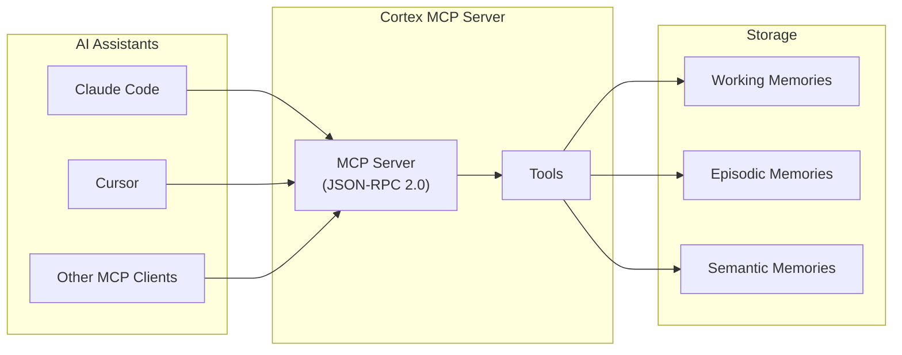
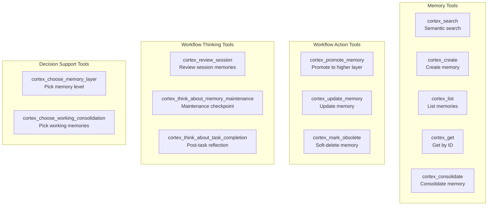
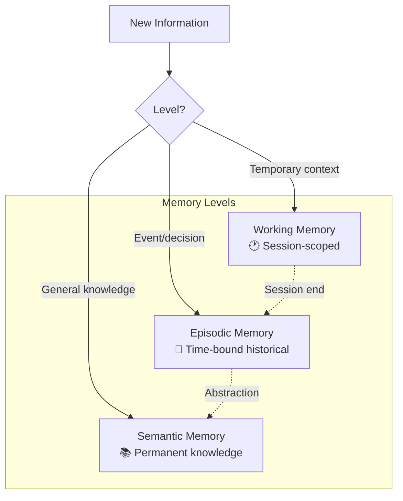
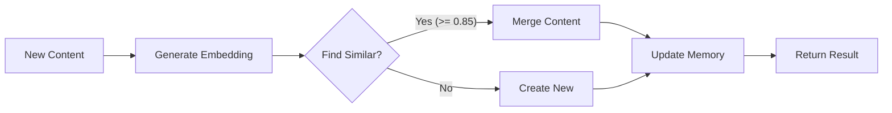
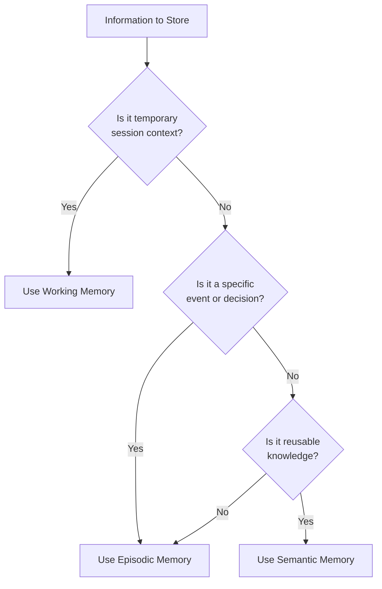
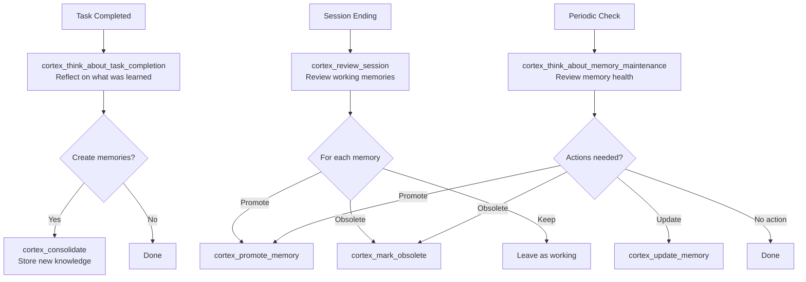

# Cortex - MCP Integration

This document describes how to integrate Cortex with MCP-compatible tools like Claude Code and Cursor.

## Overview

Cortex provides an MCP (Model Context Protocol) server that exposes memory operations as tools. This allows AI assistants to:

- Search for relevant memories semantically
- Create new memories to store solutions, issues, and analyses
- List and retrieve existing memories
- Consolidate information into multi-level memory system
- Self-maintain memory quality through workflow tools (promote, update, mark obsolete)
- Reflect on completed work and session outcomes via thinking checkpoints



## Installation

Build and install Cortex:

```bash
make build
# or
make install
```

The MCP server is available as a subcommand: `cortex start-mcp-server`

## Transport Modes

The MCP server supports two transport modes:

| Transport | Description | Use Case |
|-----------|-------------|----------|
| `stdio` | Communication via stdin/stdout | CLI integrations (default) |
| `sse` | Server-Sent Events over HTTP | Web integrations, remote access |

### Stdio Transport (Default)

The stdio transport communicates via standard input/output streams. This is the default mode used by CLI tools like Claude Code and Cursor.

```bash
uvx --from . cortex start-mcp-server
# or explicitly:
uvx --from . cortex start-mcp-server --transport stdio
```

### SSE Transport

The SSE (Server-Sent Events) transport runs an HTTP server for web-based integrations.

```bash
uvx --from . cortex start-mcp-server --transport sse --address :8080
```

**Endpoints:**

| Endpoint | Method | Description |
|----------|--------|-------------|
| `/sse` | GET | SSE event stream for server messages |
| `/message?session_id=<id>` | POST | Send JSON-RPC requests to the server |

**Connection Flow:**

1. Client connects to `GET /sse` to establish the event stream
2. Server sends an `endpoint` event with the message URL including session ID
3. Client sends requests via `POST /message?session_id=<id>`
4. Server sends responses as `message` events on the SSE stream

**Example SSE Client (JavaScript):**

```javascript
const eventSource = new EventSource('http://localhost:8080/sse');
let messageEndpoint = '';

eventSource.addEventListener('endpoint', (e) => {
  messageEndpoint = e.data;
  console.log('Message endpoint:', messageEndpoint);
});

eventSource.addEventListener('message', (e) => {
  const response = JSON.parse(e.data);
  console.log('Response:', response);
});

// Send a request
async function sendRequest(method, params) {
  const response = await fetch(messageEndpoint, {
    method: 'POST',
    headers: { 'Content-Type': 'application/json' },
    body: JSON.stringify({
      jsonrpc: '2.0',
      id: Date.now(),
      method: method,
      params: params
    })
  });
  return response.json();
}
```

## CLI Configuration

### Claude Code

Add the following to your Claude Code MCP configuration (`~/.config/claude-code/mcp.json`):

```json
{
  "mcpServers": {
    "cortex": {
      "command": "uvx --from . cortex",
      "args": ["start-mcp-server"]
    }
  }
}
```

### Cursor

Add to your Cursor MCP settings:

```json
{
  "mcp": {
    "servers": {
      "cortex": {
        "command": "uvx --from . cortex",
        "args": ["start-mcp-server"]
      }
    }
  }
}
```

## Command-Line Flags

| Flag | Default | Description |
|------|---------|-------------|
| `--transport` | `stdio` | Transport mode: `stdio` or `sse` |
| `--address` | `:8080` | Address for SSE transport (e.g., `:8080` or `127.0.0.1:8080`) |
| `--no-logs` | `false` | Disable all logging output |
| `--v` | `false` | Verbose logging (level 1: MCP methods) |
| `--vv` | `false` | More verbose (level 2: tool calls) |
| `--vvv` | `false` | Debug logging (level 3: full JSON payloads) |

## Available Tools



| Tool | Category | Purpose | Key Parameters |
|------|----------|---------|----------------|
| `uvx --from . cortex_search` | Memory | Find memories by meaning | `query`, `top_k`, `min_score`, `level` |
| `uvx --from . cortex_create` | Memory | Create a memory in a layer | `title`, `content`, `level`, `tags` |
| `uvx --from . cortex_list` | Memory | List memories | `level`, `include_obsolete` |
| `uvx --from . cortex_get` | Memory | Get memory by ID | `id` |
| `uvx --from . cortex_consolidate` | Memory | Consolidate into a layer with dedup | `synthesis`, `memory_level`, `context` |
| `uvx --from . cortex_promote_memory` | Workflow | Promote memory to a higher layer | `memory_id`, `revised_content`, `tags` |
| `uvx --from . cortex_update_memory` | Workflow | Update memory content/title/tags | `memory_id`, `title`, `content`, `tags` |
| `uvx --from . cortex_mark_obsolete` | Workflow | Soft-delete a memory | `memory_id`, `reason` |
| `uvx --from . cortex_review_session` | Workflow | Review session memories for actions | `session_id`, `task_summary` |
| `uvx --from . cortex_think_about_memory_maintenance` | Workflow | Periodic memory health review | `focus_level`, `focus_tags` |
| `uvx --from . cortex_think_about_task_completion` | Workflow | Post-task reflection for knowledge capture | `task_description`, `outcome` |
| `uvx --from . cortex_choose_memory_layer` | Decision | Ask the model to choose a memory layer | `content` |
| `uvx --from . cortex_choose_working_consolidation` | Decision | Ask the model to pick working memories to consolidate | `working_memories` |

### cortex_search

Search memories using semantic similarity.

**Parameters:**
- `query` (required): The search query
- `top_k` (optional): Maximum results (default: 5)
- `min_score` (optional): Minimum similarity score 0-1 (default: 0.5)
- `level` (optional): Filter by memory level (working|episodic|semantic)

**Example:**
```json
{
  "name": "cortex_search",
  "arguments": {
    "query": "authentication error handling",
    "top_k": 3,
    "level": "semantic"
  }
}
```

### cortex_create

Create a new memory.

**Parameters:**
- `title` (required): Memory title
- `content` (required): Memory content (Markdown supported)
- `level` (required): Memory level (working|episodic|semantic)
- `tags` (optional): Array of tags for categorization

**Example:**
```json
{
  "name": "cortex_create",
  "arguments": {
    "title": "JWT Token Refresh Pattern",
    "content": "## Problem\nTokens expire...\n\n## Solution\nImplement refresh...",
    "level": "semantic",
    "tags": ["authentication", "jwt", "security"]
  }
}
```

### cortex_list

List all memories.

**Parameters:**
- `level` (optional): Filter by level
- `include_obsolete` (optional): Include obsolete memories (default: false)

**Example:**
```json
{
  "name": "cortex_list",
  "arguments": {
    "level": "episodic"
  }
}
```

### cortex_get

Get a specific memory by ID.

**Parameters:**
- `id` (required): The memory ID

**Example:**
```json
{
  "name": "cortex_get",
  "arguments": {
    "id": "550e8400-e29b-41d4-a716-446655440000"
  }
}
```

### cortex_consolidate

Consolidate information into the multi-level memory system. This tool enables AI assistants to store information at different memory levels based on its nature and intended persistence.



**Parameters:**
- `synthesis` (required): Content to consolidate
- `memory_level` (required): Memory level - `working`, `episodic`, or `semantic`
- `context` (optional): Context object with task/session/tags metadata
- `force` (optional): Bypass duplicate detection (default: false)

**Context Fields:**
- `session_id` (required for working level): Session identifier
- `task_id` (optional): Task identifier
- `timestamp` (optional): RFC3339 timestamp
- `author` (optional): Author or source
- `tags` (optional): Tags for categorization
- `source` (optional): Source of content - `manual`, `auto`, or `llm` (default: `llm`)
- `related_memories` (optional): Related memory IDs

**Memory Level Selection:**

| Level | When to Use | Retention |
|-------|-------------|-----------|
| `working` | Current session context, temporary notes | Until session ends |
| `episodic` | Events, decisions, incidents, meeting notes | Configurable (default 90 days) |
| `semantic` | Patterns, conventions, permanent knowledge | Permanent |

**Example - Working Memory:**
```json
{
  "name": "cortex_consolidate",
  "arguments": {
    "synthesis": "Currently investigating auth timeout in module X",
    "memory_level": "working",
    "context": {
      "session_id": "dev-session-2024-01-15",
      "tags": ["debugging", "auth"],
      "source": "llm"
    }
  }
}
```

**Example - Episodic Memory:**
```json
{
  "name": "cortex_consolidate",
  "arguments": {
    "synthesis": "Fixed race condition in auth middleware by adding mutex lock. Issue was caused by concurrent token refresh requests.",
    "memory_level": "episodic",
    "context": {
      "tags": ["bugfix", "auth", "concurrency"],
      "source": "llm"
    }
  }
}
```

**Example - Semantic Memory:**
```json
{
  "name": "cortex_consolidate",
  "arguments": {
    "synthesis": "All database queries must use context with timeout to enable proper cancellation and prevent hanging queries.",
    "memory_level": "semantic",
    "context": {
      "tags": ["convention", "database", "context"],
      "source": "llm"
    }
  }
}
```

**Response:**

The tool returns a result indicating whether a new memory was created or merged with an existing similar memory:

```json
{
  "action": "created",
  "memory_id": "550e8400-e29b-41d4-a716-446655440000",
  "level": "episodic",
  "message": "Memory consolidated successfully"
}
```

Or when merged with existing:

```json
{
  "action": "merged",
  "memory_id": "existing-memory-id",
  "level": "semantic",
  "similarity": 0.89,
  "message": "Content merged with existing similar memory"
}
```

**Duplicate Detection:**

The consolidation system automatically detects similar content (similarity threshold: 0.85) and merges it with existing memories to avoid redundancy. Use `force: true` to bypass this check.



### cortex_promote_memory

Promote a memory to a higher layer: working to episodic, or episodic to semantic. Creates a new memory at the target level, tracking lineage via `merged_from`. Optionally provide revised content for the promoted memory.

**Parameters:**
- `memory_id` (required): ID of the memory to promote
- `revised_content` (optional): Revised content for the promoted memory
- `revised_title` (optional): Revised title for the promoted memory
- `tags` (optional): Tags to set on the promoted memory

**Example:**
```json
{
  "name": "cortex_promote_memory",
  "arguments": {
    "memory_id": "550e8400-e29b-41d4-a716-446655440000",
    "revised_title": "Database connection pooling best practice",
    "tags": ["database", "performance", "convention"]
  }
}
```

**Response:**
```json
{
  "success": true,
  "action": "promoted",
  "from_level": "episodic",
  "to_level": "semantic",
  "source_id": "550e8400-e29b-41d4-a716-446655440000",
  "memory": { ... }
}
```

### cortex_update_memory

Update an existing memory's title, content, or tags. Re-generates the embedding if content or title changes. Use this for memory maintenance: fixing errors, improving descriptions, or updating tags.

**Parameters:**
- `memory_id` (required): ID of the memory to update
- `title` (optional): New title
- `content` (optional): New content
- `tags` (optional): New tags (replaces existing)

**Example:**
```json
{
  "name": "cortex_update_memory",
  "arguments": {
    "memory_id": "550e8400-e29b-41d4-a716-446655440000",
    "content": "Updated and corrected content with new findings.",
    "tags": ["updated", "database"]
  }
}
```

**Response:**
```json
{
  "success": true,
  "action": "updated",
  "re_embedded": true,
  "memory": { ... }
}
```

### cortex_mark_obsolete

Soft-delete a memory by marking it as obsolete. Obsolete memories are excluded from search results by default but can still be retrieved with `include_obsolete: true`.

**Parameters:**
- `memory_id` (required): ID of the memory to mark as obsolete
- `reason` (optional): Reason for marking obsolete

**Example:**
```json
{
  "name": "cortex_mark_obsolete",
  "arguments": {
    "memory_id": "550e8400-e29b-41d4-a716-446655440000",
    "reason": "Superseded by newer database convention"
  }
}
```

**Response:**
```json
{
  "success": true,
  "action": "marked_obsolete",
  "memory_id": "550e8400-e29b-41d4-a716-446655440000",
  "reason": "Superseded by newer database convention"
}
```

### cortex_review_session

End-of-session memory review. Call this when a task or session is complete. It fetches all working memories from the session and returns a decision prompt asking the LLM to evaluate each memory: promote to episodic/semantic, mark obsolete, or leave as working.

**Parameters:**
- `session_id` (required): Session ID to review
- `task_summary` (optional): Summary of what was accomplished

**Example:**
```json
{
  "name": "cortex_review_session",
  "arguments": {
    "session_id": "feature-auth-2024",
    "task_summary": "Implemented JWT refresh token flow with exponential backoff"
  }
}
```

**Returns:** A structured prompt with all session working memories, asking the LLM to decide actions for each.

### cortex_think_about_memory_maintenance

Periodic memory maintenance checkpoint. Call this to review the overall health of the memory store. Returns a prompt with memory statistics and all memories, asking the LLM to identify maintenance actions: mark obsolete, promote, update, or merge.

**Parameters:**
- `focus_level` (optional): Focus on a specific level (working|episodic|semantic)
- `focus_tags` (optional): Focus on memories with specific tags

**Example:**
```json
{
  "name": "cortex_think_about_memory_maintenance",
  "arguments": {
    "focus_level": "episodic",
    "focus_tags": ["database"]
  }
}
```

**Returns:** A structured prompt with memory statistics and data, asking the LLM to identify maintenance actions.

### cortex_think_about_task_completion

Post-task reflection checkpoint. Call this after completing a significant task. Returns a prompt asking the LLM to reflect on what was learned and what knowledge should be recorded as new memories.

**Parameters:**
- `task_description` (required): Description of the completed task
- `outcome` (required): What was the outcome
- `session_id` (optional): Session ID for context
- `related_memory_ids` (optional): IDs of memories relevant during the task

**Example:**
```json
{
  "name": "cortex_think_about_task_completion",
  "arguments": {
    "task_description": "Migrated authentication from session cookies to JWT tokens",
    "outcome": "Successfully migrated. All tests passing. 20% latency reduction.",
    "related_memory_ids": ["mem-1", "mem-2"]
  }
}
```

**Returns:** A structured prompt asking the LLM to identify knowledge worth preserving from the completed task.

### cortex_choose_memory_layer

Ask the model to select the correct memory layer for a new memory using the bundled prompt. The bundled prompt can be overridden in the Cortex config file.

**Parameters:**
- `content` (required): Memory content to classify
- `title` (optional): Memory title
- `tags` (optional): Tags
- `session_id` (optional): Session ID if working-level is likely

**Example:**
```json
{
  "name": "cortex_choose_memory_layer",
  "arguments": {
    "title": "Cache invalidation decision",
    "content": "We decided to expire cache entries after 10 minutes to reduce stale data.",
    "tags": ["cache", "decision"]
  }
}
```

### cortex_choose_working_consolidation

Ask the model to select which working memories should be consolidated using the bundled prompt. The bundled prompt can be overridden in the Cortex config file.

**Parameters:**
- `working_memories` (required): Working memory candidates to review
- `selection_goal` (optional): Optional focus for consolidation

**Example:**
```json
{
  "name": "cortex_choose_working_consolidation",
  "arguments": {
    "selection_goal": "Keep only completed decisions and outcomes.",
    "working_memories": [
      {
        "id": "mem-1",
        "title": "Investigating auth timeout",
        "content": "Hypothesis: retry logic missing in auth module."
      },
      {
        "id": "mem-2",
        "title": "Fix implemented",
        "content": "Added exponential backoff and jitter to auth retries."
      }
    ]
  }
}
```

## Prompt Overrides

All thinking/decision tools use configurable prompts. To override the bundled prompts, set the following keys in the Cortex config file:

```yaml
mcp:
  prompts:
    choose_memory_layer: |-
      Your custom prompt here...
    choose_working_consolidation: |-
      Your custom prompt here...
    review_session: |-
      Your custom session review prompt...
    memory_maintenance: |-
      Your custom maintenance prompt...
    task_completion: |-
      Your custom task completion prompt...
```

## Default Prompt Content

If you do not override prompts in the config file, Cortex uses the following defaults:

**Default `mcp.prompts.choose_memory_layer`:**
```
You are selecting the correct Cortex memory layer for a new memory.

Choose exactly one: working, episodic, semantic.

Guidelines:
- working: temporary session context, active tasks, scratch notes. Requires session_id.
- episodic: time-bound events/decisions/outcomes useful for historical recall.
- semantic: durable, reusable knowledge or conventions that should persist.

Return JSON only:
{"level":"working|episodic|semantic","rationale":"short reason","needs_session_id":true|false}
```

**Default `mcp.prompts.choose_working_consolidation`:**
```
You are selecting which working memories should be consolidated.

Pick entries that capture completed work, decisions, or knowledge that should persist.
Exclude transient notes that are only useful during the session.

Return JSON only:
{"selected_ids":["id1","id2"],"rationale":"short reason","suggested_level":"episodic|semantic|mixed"}
```

## Environment Variables

**Storage:**
- `CORTEX_STORAGE_PATH`: Path to the storage directory (default: `.agents/cortex`)

**Embeddings:**
- `CORTEX_EMBEDDINGS_ENDPOINT`: Ollama endpoint (default: `http://localhost:11434`)
- `CORTEX_EMBEDDINGS_MODEL`: Embedding model (default: `nomic-embed-text`)

**Consolidation:**
- `CORTEX_CONSOLIDATION_SIMILARITY_THRESHOLD`: Duplicate detection threshold (default: `0.85`)
- `CORTEX_CONSOLIDATION_AUTO_TRANSFER`: Auto-transfer working memories on session end (default: `true`)

## Protocol

The MCP server communicates using JSON-RPC 2.0 over the selected transport (stdio or SSE). It implements the MCP specification version `2024-11-05`.

### Supported Methods

- `initialize`: Initialize the server connection
- `initialized`: Notification that client is ready
- `tools/list`: List available tools
- `tools/call`: Invoke a tool
- `shutdown`: Gracefully shutdown the server

## Troubleshooting

### Ollama Connection

Ensure Ollama is running:

```bash
ollama serve
```

And the embedding model is available:

```bash
ollama pull nomic-embed-text
```

### Storage Permissions

Ensure the storage directory exists and is writable:

```bash
mkdir -p .agents/cortex
```

### Debug Logging

The MCP server logs to stderr. To capture logs:

```bash
uvx --from . cortex start-mcp-server 2>mcp.log
```

## Best Practices for LLM Integration

### When to Use Each Memory Level



### Recommended Patterns

**During Active Development Sessions:**
```
1. Use working memory for current task context
2. Use `cortex_choose_memory_layer` when unsure which layer fits best
3. Use `cortex_choose_working_consolidation` to pick working memories worth preserving
```

**End of Session (Workflow):**
```
1. Call `cortex_review_session` to review all working memories
2. Based on the returned prompt, use `cortex_promote_memory` for valuable findings
3. Use `cortex_mark_obsolete` for outdated/irrelevant memories
4. Call `cortex_think_about_task_completion` to capture final insights
```

**Periodic Maintenance:**
```
1. Call `cortex_think_about_memory_maintenance` to review memory health
2. Use `cortex_update_memory` to fix inaccurate content
3. Use `cortex_promote_memory` to elevate proven episodic knowledge to semantic
4. Use `cortex_mark_obsolete` for outdated information
```

**Bug Fix Documentation:**
```
1. Store the fix details in episodic memory (includes timestamp context)
2. If the fix reveals a general pattern, also store in semantic memory
3. Call `cortex_think_about_task_completion` to capture additional insights
```

**Convention/Rule Documentation:**
```
1. Store directly in semantic memory for permanent retention
2. Include rationale and examples in the content
```

### Self-Maintenance Workflow

The workflow tools enable Cortex to improve and maintain its own memory quality through LLM-guided reflection:



### Content Quality Guidelines

| Level | Content Style | Example |
|-------|---------------|---------|
| Working | Brief, action-oriented | "Debugging auth timeout - tried X, next: Y" |
| Episodic | Complete context with outcome | "Fixed auth timeout by adding retry logic. Root cause was network instability." |
| Semantic | Documentation-quality, self-contained | "Network requests should include retry logic with exponential backoff. Default: 3 retries, base delay 1s." |

### Session Management

For working memory, use consistent session IDs across related work:

```json
{
  "level": "working",
  "session_id": "feature-auth-improvement-2024",
  "content": "..."
}
```

This allows all related context to be transferred together when the session ends.

---

## Related Documentation

- [CONFIGURATION.md](../guides/configuration.md) - Configuration reference
- [CLI_REFERENCE.md](reference.md) - CLI command reference
- [MEMORY_MODEL.md](../architecture/memory-model.md) - Memory model documentation
- [ARCHITECTURE.md](../architecture/overview.md) - System architecture
