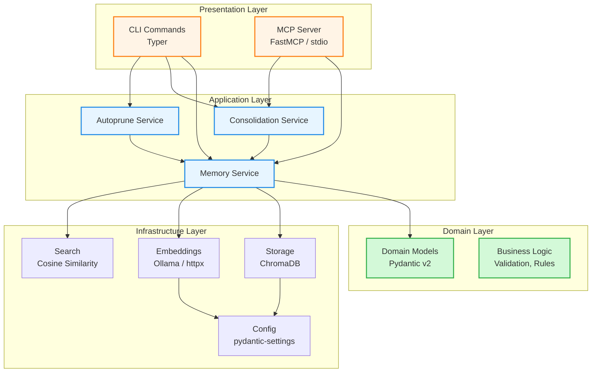
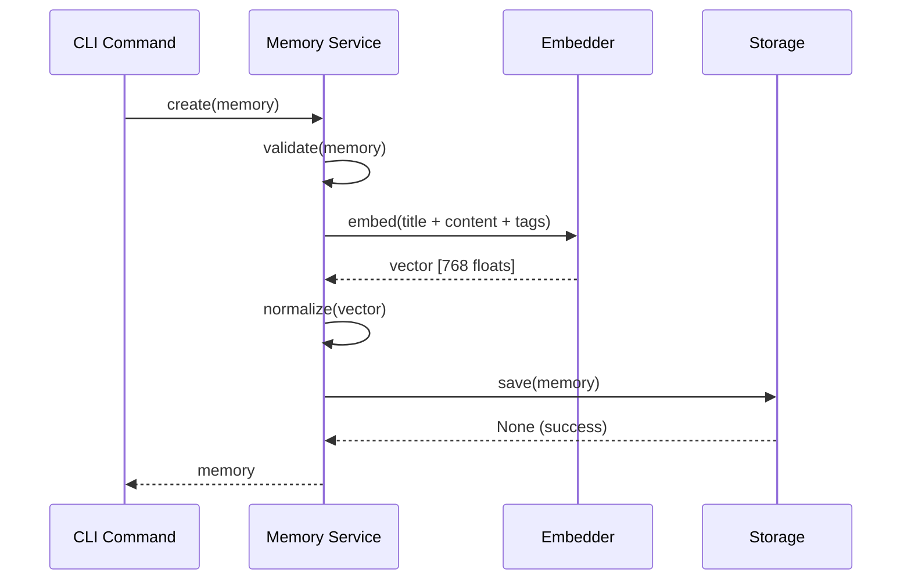
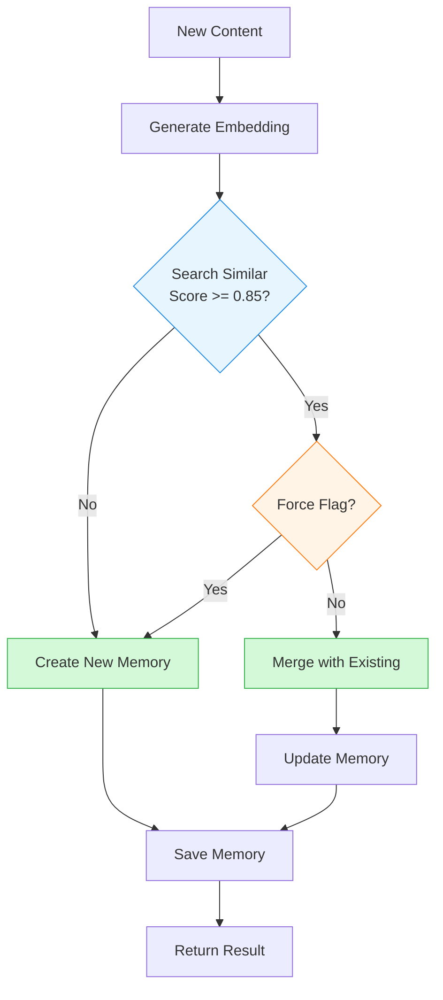
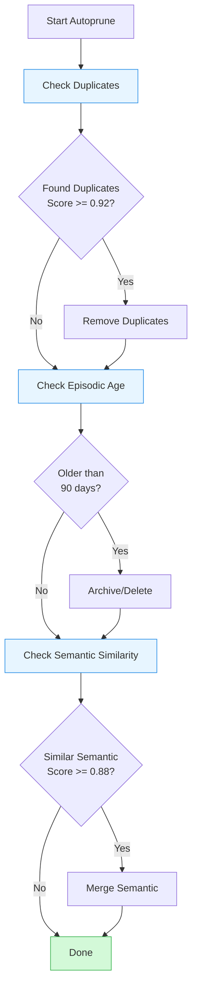
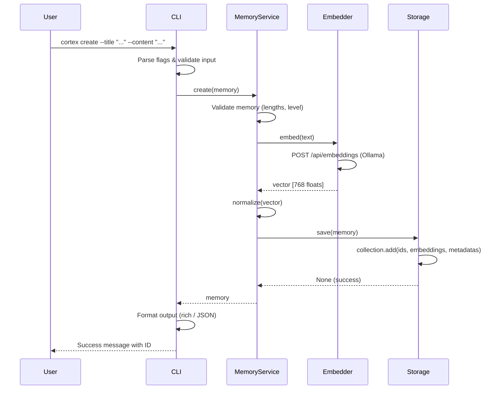
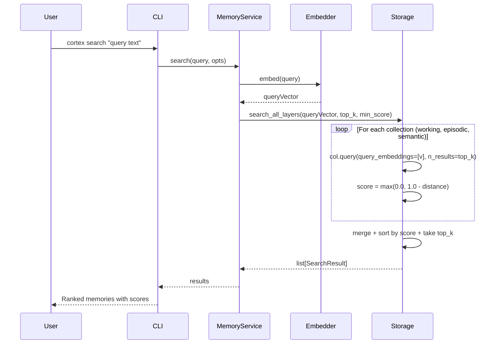
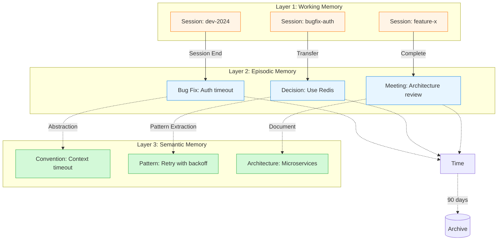
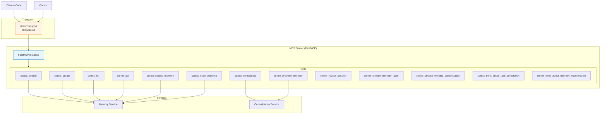

# Cortex - Architecture

This document provides a comprehensive overview of Cortex's system architecture, component design, and data flow.

## Table of Contents

- [System Overview](#system-overview)
- [Architectural Layers](#architectural-layers)
- [Core Components](#core-components)
- [Data Flow](#data-flow)
- [Memory System Architecture](#memory-system-architecture)
- [Storage Architecture](#storage-architecture)
- [MCP Integration](#mcp-integration)
- [Design Decisions](#design-decisions)

---

## System Overview

Cortex is a **three-layer semantic memory system** for AI assistants, implementing a clean architecture with clear separation of concerns.



### Key Characteristics

- **Layered Architecture**: Clear separation between presentation, application, domain, and infrastructure
- **Dependency Injection**: Services receive dependencies via constructors
- **Protocol-Based Design**: Infrastructure components implement Protocols for testability
- **Pydantic v2 Models**: All domain objects are validated Pydantic models
- **ChromaDB Storage**: Vector storage with three named collections (working, episodic, semantic)

---

## Architectural Layers

### 1. Presentation Layer

**Purpose**: Handle user interaction and external communication

**Components**:
- **CLI Commands** (`src/cortex/cli/`)
  - Typer command definitions
  - Flag parsing and validation
  - User-facing error messages
  - Output formatting (rich tables / JSON)

- **MCP Server** (`src/cortex/mcp/`)
  - FastMCP server with 13 registered tools
  - stdio transport (default)
  - Tool definitions matching stable names for integrations

**Responsibilities**:
- Parse and validate user input
- Format and display output
- Handle protocol-specific concerns
- Translate between external and internal representations

### 2. Application Layer

**Purpose**: Coordinate business operations and use cases

**Components**:
- **Memory Service** (`src/cortex/memory/service.py`)
  - CRUD operations for memories
  - Semantic search orchestration
  - Embedding generation coordination
  - Memory lifecycle management

- **Consolidation Service** (`src/cortex/consolidation/service.py`)
  - Duplicate detection via cosine similarity
  - Memory merging logic
  - Similarity threshold enforcement
  - Promote-to-semantic operations

- **Autoprune Service** (`src/cortex/consolidation/autoprune.py`)
  - Duplicate cleanup
  - Episodic memory archiving by age
  - Semantic memory merging
  - Batch optimization

### 3. Domain Layer

**Purpose**: Define core business entities and rules

**Components**:
- **Memory Model** (`src/cortex/models/memory.py`)

```python
class Memory(BaseModel):
    id: str = Field(default_factory=lambda: str(uuid4()))
    level: MemoryLevel
    title: str         # 3–60 characters
    content: str       # min 10 characters
    tags: list[str] = []
    embedding: list[float] | None = None
    context: MemoryContext = MemoryContext()
    created_at: datetime = Field(default_factory=datetime.utcnow)
    updated_at: datetime = Field(default_factory=datetime.utcnow)
    merged_from: list[str] = []
    obsolete: bool = False
```

- **Memory Level Enum**

```python
class MemoryLevel(str, Enum):
    WORKING  = "working"   # Session-scoped
    EPISODIC = "episodic"  # Time-bound
    SEMANTIC = "semantic"  # Permanent
```

- **Memory Context**

```python
class MemoryContext(BaseModel):
    task_id: str = ""
    session_id: str = ""
    author: str = ""
    source: str = "manual"     # manual | auto | llm
    tags: list[str] = []
    related_memories: list[str] = []
```

### 4. Infrastructure Layer

**Purpose**: Implement technical capabilities

**Storage** (`src/cortex/storage/`):

```python
class Storage(Protocol):
    def save(self, memory: Memory) -> None: ...
    def get(self, memory_id: str) -> Memory: ...
    def list(self, level=None, session_id=None, include_obsolete=False) -> list[Memory]: ...
    def delete(self, memory_id: str) -> None: ...
    def update(self, memory: Memory) -> None: ...
    def search_all_layers(self, vector, top_k, min_score, ...) -> list[SearchResult]: ...
    def transfer_working_to_episodic(self, session_id: str) -> int: ...
    def get_embedding(self, memory_id: str) -> list[float]: ...
    def close(self) -> None: ...
```

**Embeddings** (`src/cortex/embeddings/`):

```python
class Embedder(Protocol):
    def embed(self, text: str) -> list[float]: ...
    def embed_batch(self, texts: list[str]) -> list[list[float]]: ...
    def dimension(self) -> int: ...
```

**Search** (`src/cortex/search/cosine.py`):

```python
def cosine_similarity(a: list[float], b: list[float]) -> float:
    va, vb = np.array(a), np.array(b)
    dot = np.dot(va, vb)
    norm_a, norm_b = np.linalg.norm(va), np.linalg.norm(vb)
    if norm_a == 0 or norm_b == 0:
        return 0.0
    return float(dot / (norm_a * norm_b))
```

---

## Core Components

### Memory Service

The central orchestrator for all memory operations.



**Key Methods**:
- `create(memory)` — Create new memory with embeddings
- `search(query, opts)` — Semantic search across layers
- `get(memory_id)` — Retrieve memory by ID (prefix matching)
- `list(opts)` — List with filtering
- `update(memory)` — Update existing memory
- `delete(memory_id)` — Permanent deletion
- `mark_obsolete(memory_id)` — Soft deletion

### Consolidation Service

Handles memory consolidation with duplicate detection.



### Autoprune Service

Automated memory maintenance and optimization.



**Autoprune Operations**:
1. **Remove Duplicates**: Similarity >= 0.92
2. **Archive Episodic**: Age > retention period (default 90 days)
3. **Merge Semantic**: Similarity >= 0.88

---

## Data Flow

### Create Memory Flow



### Search Memory Flow



---

## Memory System Architecture

### Three-Layer Hierarchy



---

## Storage Architecture

### ChromaDB Collections

Cortex uses three ChromaDB collections, one per memory level:

| Collection | Contents |
|---|---|
| `cortex_working` | Working memories (session-scoped) |
| `cortex_episodic` | Episodic memories (time-bound) |
| `cortex_semantic` | Semantic memories (permanent) |

### Metadata Schema

ChromaDB only supports `str`, `int`, `float`, `bool` in metadata. Lists are serialized with `json.dumps()`:

```python
{
    "title": str,
    "level": str,              # "working" | "episodic" | "semantic"
    "tags": str,               # json.dumps(list[str])
    "session_id": str,         # "" if not working
    "task_id": str,
    "author": str,
    "source": str,
    "ctx_tags": str,           # json.dumps(list[str])
    "related_memories": str,   # json.dumps(list[str])
    "created_at": str,         # ISO 8601
    "updated_at": str,
    "merged_from": str,        # json.dumps(list[str])
    "obsolete": bool,
}
```

### Storage Directory

```bash
.agents/cortex/
├── chroma.sqlite3        # ChromaDB main persistence file
├── <uuid>/               # ChromaDB segment data directories
│   └── ...
└── config.yaml           # Local configuration
```

### ID Prefix Matching

ChromaDB does not support native prefix search. Cortex implements it by scanning all IDs:

```python
all_ids = collection.get()["ids"]
matches = [id for id in all_ids if id.startswith(prefix)]
if len(matches) == 1:
    return collection.get(ids=[matches[0]])
elif len(matches) > 1:
    raise AmbiguousIDError(prefix, matches)
```

### Transfer Working → Episodic

```python
# 1. Get all working memories for session
items = working_col.get(where={"session_id": session_id})
# 2. Re-add to episodic collection with level="episodic"
episodic_col.add(embeddings=..., metadatas=..., ids=...)
# 3. Delete from working collection
working_col.delete(ids=items["ids"])
```

---

## MCP Integration

### MCP Server Architecture



Tool names are **stable** — renaming breaks integrations (Claude Code, Cursor).

---

## Configuration

Configuration is loaded by pydantic-settings with this priority (highest first):

1. CLI flags
2. `CORTEX_*` environment variables (`__` for nested keys)
3. `.agents/cortex/config.yaml`
4. Built-in defaults

```python
class Settings(BaseSettings):
    model_config = SettingsConfigDict(
        env_prefix="CORTEX_",
        env_nested_delimiter="__",
        yaml_file=".agents/cortex/config.yaml",
    )
    storage: StorageConfig = StorageConfig()
    embeddings: EmbeddingsConfig = EmbeddingsConfig()
    search: SearchConfig = SearchConfig()
    consolidation: ConsolidationConfig = ConsolidationConfig()
    autoprune: AutopruneConfig = AutopruneConfig()
    session: SessionConfig = SessionConfig()
```

Settings are loaded once in the CLI root command and injected into services.

---

## Design Decisions

### Why ChromaDB?

**Rationale**: Purpose-built vector database with native similarity search

**Benefits**:
- Native vector storage and cosine similarity search
- No manual vector indexing required
- Persistent SQLite backend
- Python-native, no external service needed
- Metadata filtering built-in

**Trade-offs**:
- More complex than file-based storage
- ChromaDB metadata is flat (str/int/float/bool only — lists need `json.dumps()`)

### Why Typer?

**Rationale**: Modern Python CLI framework built on Click

**Benefits**:
- Type annotations drive CLI argument definitions
- Automatic `--help` generation
- Rich output integration
- Pythonic and testable

### Why pydantic-settings?

**Rationale**: Unified YAML + env var config with type validation

**Benefits**:
- Config, env vars, and defaults in one place
- Automatic type coercion and validation
- `__` nested delimiter for env vars

### Why Ollama for Embeddings?

**Rationale**: Local-first, privacy-preserving, cost-effective

**Benefits**:
- Runs locally (no cloud costs or data leakage)
- Fast inference on modern hardware
- Offline capability
- Free and open source

### Why Cosine Similarity?

**Rationale**: Standard for semantic similarity in embedding spaces

**Benefits**:
- Well-understood metric
- Normalized to [-1, 1] (practically [0, 1] for non-negative embeddings)
- Efficient computation with NumPy

**Note**: ChromaDB returns cosine distance; score = `max(0.0, 1.0 - distance)`.

---

## Performance Characteristics

### Time Complexity

| Operation | Complexity | Notes |
|-----------|------------|-------|
| Create | O(E + W) | E = embedding time, W = ChromaDB write |
| Get by ID | O(1) | Direct ChromaDB lookup |
| Search | O(N) | ChromaDB handles vector scan |
| List | O(N) | Linear scan with filter |
| Delete | O(1) | Direct ChromaDB delete |
| Transfer | O(M) | M = memories to transfer |

### Bottlenecks

1. **Embedding Generation**: 100–500 ms per request (Ollama latency)
2. **ChromaDB Search**: Linear for small datasets; ANN for larger ones (built-in)
3. **ID Prefix Scan**: O(N) — avoid when exact IDs are available

### Optimization Strategies

1. **Batch Embeddings**: Use `embed_batch` for bulk operations
2. **LRU Cache**: Ollama embedder caches last 128 embeddings in memory
3. **Exact IDs**: Use full UUIDs to bypass prefix scan

---

## Related Documentation

- **[Development Guide](development.md)** - Setup, testing, common tasks
- **[Configuration](configuration.md)** - Configuration reference
- **[Troubleshooting](troubleshooting.md)** - Common issues and solutions
- **[MCP Integration](../cli/mcp.md)** - MCP server implementation

---

**Last Updated**: 2026-04-10
**Architecture Version**: 2.0 (Python rewrite — Typer / ChromaDB / pydantic-settings)
