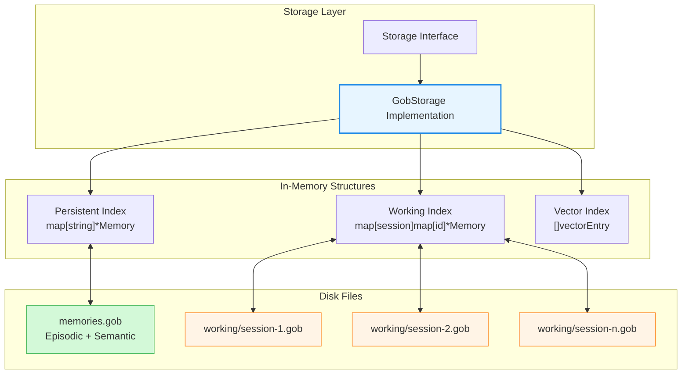
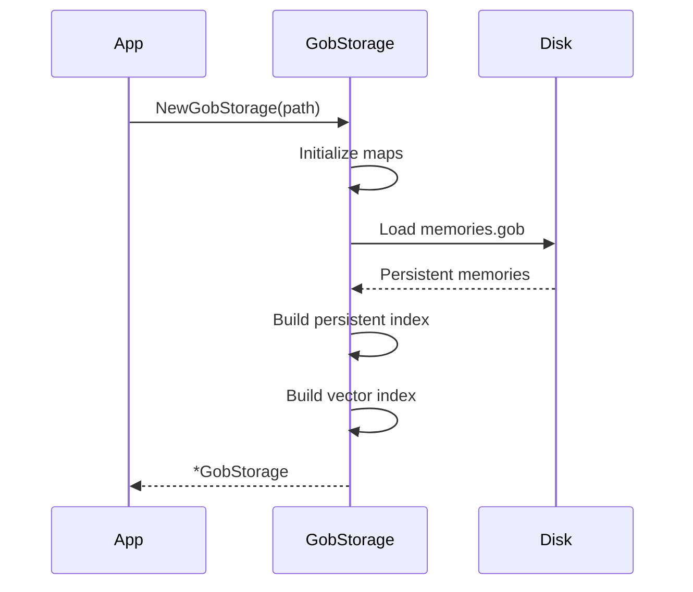
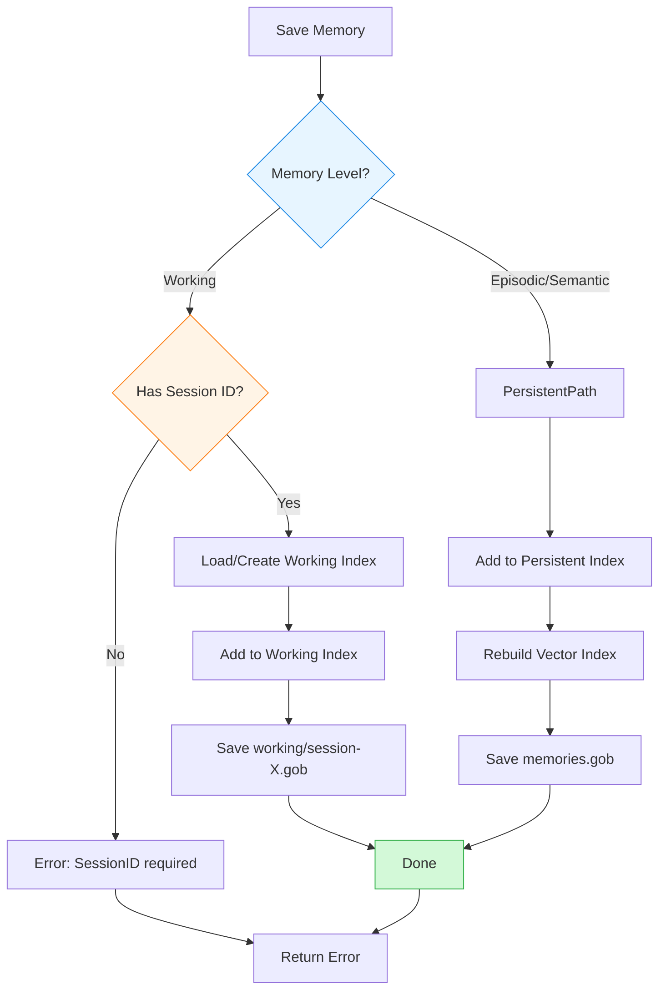
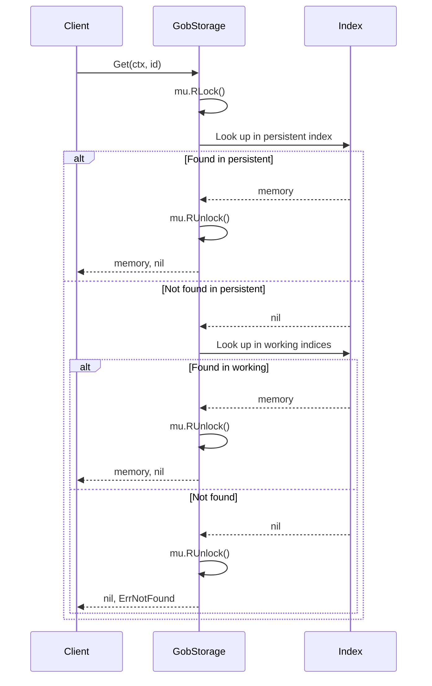
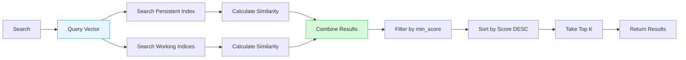
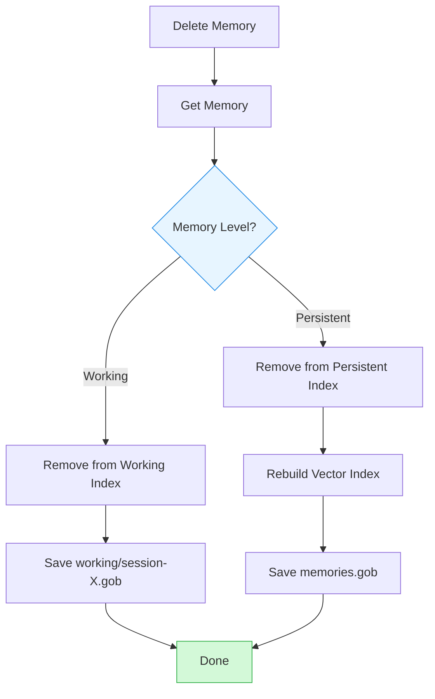
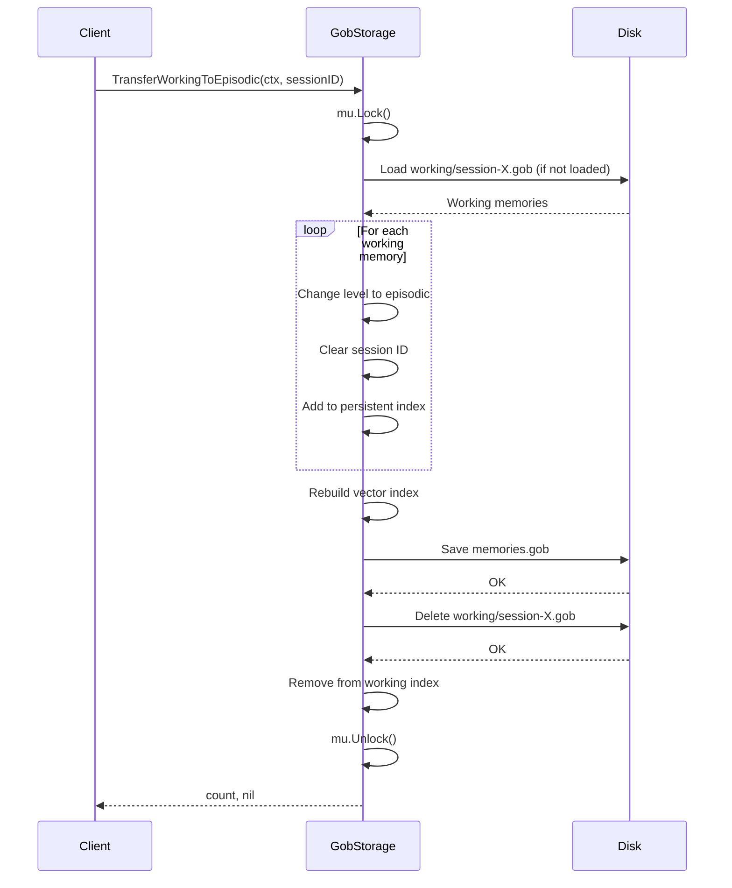

# Cortex - Storage System

This document provides detailed information about Cortex's storage layer, including architecture, implementation, and operations.

## Table of Contents

- [Overview](#overview)
- [Storage Architecture](#storage-architecture)
- [GobStorage Implementation](#gobstorage-implementation)
- [File Structure](#file-structure)
- [Storage Operations](#storage-operations)
- [Thread Safety](#thread-safety)
- [Performance](#performance)
- [Migration and Backup](#migration-and-backup)
- [Troubleshooting](#troubleshooting)

---

## Overview

Cortex uses a **Gob-based storage system** with separate handling for persistent (episodic/semantic) and working (session) memories.

### Key Features

- **Binary Serialization**: Go's `encoding/gob` for efficient storage
- **In-Memory Index**: Fast lookups without disk I/O
- **Thread-Safe**: Protected by `sync.RWMutex`
- **Dual-File Strategy**: Separate files for persistent and working memories
- **Vector Index**: Optimized for semantic search



---

## Storage Architecture

### Storage Interface

The storage layer is defined by the `Storage` interface:

```go
type Storage interface {
    // Basic CRUD Operations
    Save(ctx context.Context, m *Memory) error
    Get(ctx context.Context, id string) (*Memory, error)
    List(ctx context.Context, opts ListOptions) ([]*Memory, error)
    Delete(ctx context.Context, id string) error
    Update(ctx context.Context, m *Memory) error

    // Search Operations
    SearchAllLayers(ctx context.Context, vector []float64, opts SearchOptions) ([]*SearchResult, error)

    // Memory Lifecycle
    TransferWorkingToEpisodic(ctx context.Context, sessionID string) (int, error)

    // Resource Management
    Close() error
}
```

### Design Principles

1. **Interface-Based Design**: Implementation details hidden behind interface
2. **Context-Aware**: All operations accept `context.Context` for cancellation
3. **Error Handling**: Explicit error returns for all operations
4. **Resource Management**: Explicit `Close()` for cleanup

---

## GobStorage Implementation

### Structure

```go
type GobStorage struct {
    path string // Storage directory path
    mu   sync.RWMutex

    // Persistent memories (episodic + semantic)
    persistentIndex map[string]*Memory

    // Working memories by session
    // map[sessionID]map[memoryID]*Memory
    workingIndex map[string]map[string]*Memory

    // Vector index for fast search
    vectorIndex []vectorEntry
}

type vectorEntry struct {
    id        string
    vector    []float64
    level     MemoryLevel
    sessionID string  // Only for working memories
}
```

### Initialization



**Initialization Steps**:
1. Create directory if it doesn't exist
2. Initialize empty indices
3. Load `memories.gob` (if exists)
4. Build in-memory index from loaded memories
5. Build vector index for search optimization
6. **Note**: Working files are loaded on-demand

---

## File Structure

### Storage Directory Layout

```bash
.agents/cortex/
├── memories.gob              # Persistent storage (episodic + semantic)
├── working/                  # Working memory directory
│   ├── session-abc123.gob    # Session ABC123 memories
│   ├── session-def456.gob    # Session DEF456 memories
│   └── session-xyz789.gob    # Session XYZ789 memories
└── config.yaml               # Local configuration (if present)
```

### File Formats

#### memories.gob

**Contents**: Array of `Memory` structs (episodic + semantic only)

```go
// Serialized structure
type persistentFile struct {
    Version  int        // File format version
    Memories []*Memory  // All persistent memories
}
```

**Format**: Go binary encoding (Gob)
**Size**: Varies (~1KB per memory + embedding vector)

#### working/session-{id}.gob

**Contents**: Array of `Memory` structs (working level only)

```go
// Serialized structure
type workingFile struct {
    Version   int        // File format version
    SessionID string     // Session identifier
    Memories  []*Memory  // Working memories for this session
}
```

**Format**: Go binary encoding (Gob)
**Lifecycle**: Created on first working memory save, deleted on transfer

---

## Storage Operations

### Save Operation



**Thread Safety**: Write lock (`mu.Lock()`) held during entire operation

**Steps**:
1. Acquire write lock
2. Determine memory level
3. Add to appropriate index
4. Rebuild vector index (if needed)
5. Write to disk
6. Release lock

### Get Operation



**Thread Safety**: Read lock (`mu.RLock()`) held during operation

**Complexity**: O(1) - Hash map lookup

### Search Operation



**Thread Safety**: Read lock (`mu.RLock()`) held during operation

**Algorithm**:
1. Acquire read lock
2. Iterate through vector index
3. Calculate cosine similarity for each vector
4. Filter by minimum score threshold
5. Sort by score (descending)
6. Take top K results
7. Release lock

**Complexity**: O(N·D) where N = memories, D = vector dimension

### List Operation

```go
type ListOptions struct {
    Level           MemoryLevel  // Filter by level (optional)
    SessionID       string       // Filter working by session (optional)
    Tags            []string     // Filter by tags (optional)
    IncludeObsolete bool         // Include obsolete memories
    Limit           int          // Maximum results (0 = unlimited)
    Offset          int          // Skip first N results
    SortBy          string       // Sort field (default: created_at)
    SortOrder       string       // "asc" or "desc"
}
```

**Thread Safety**: Read lock (`mu.RLock()`) held during operation

**Steps**:
1. Collect memories from appropriate indices based on level filter
2. Apply tag filters
3. Apply obsolete filter
4. Sort by specified field
5. Apply offset and limit

**Complexity**: O(N log N) for sorting

### Delete Operation



**Thread Safety**: Write lock (`mu.Lock()`) held during operation

**Note**: Permanent deletion. For soft delete, use `MarkObsolete` instead.

### Transfer Working to Episodic



**Thread Safety**: Write lock (`mu.Lock()`) held during entire operation

**Steps**:
1. Load working memories for session
2. Change level to episodic for each memory
3. Move to persistent index
4. Rebuild vector index
5. Save persistent file
6. Delete working file
7. Remove from working index

---

## Thread Safety

### Locking Strategy

```go
type GobStorage struct {
    mu sync.RWMutex  // Protects all indices and file operations
    // ...
}
```

**Lock Types**:
- **Read Lock** (`mu.RLock()`): Used for read-only operations (Get, List, Search)
- **Write Lock** (`mu.Lock()`): Used for mutations (Save, Delete, Update, Transfer)

### Concurrency Patterns

#### Multiple Readers

```go
// Multiple readers can access simultaneously
go storage.Get(ctx, id1)   // Reader 1
go storage.Get(ctx, id2)   // Reader 2
go storage.Search(ctx, q)  // Reader 3
```

**Allowed**: Multiple concurrent read operations

#### Single Writer

```go
// Only one writer at a time
storage.Save(ctx, m1)  // Blocks other writers and readers
```

**Blocked**: All other operations wait for write to complete

#### Read-Write Interaction

```go
// Reader holds lock
go storage.Search(ctx, q)  // Acquires RLock

// Writer waits
go storage.Save(ctx, m)    // Waits for RLock to be released
```

### Critical Sections

**Minimized**: Lock hold time kept short
- File I/O happens while lock is held (necessary for consistency)
- Embedding generation happens **before** acquiring lock
- Output formatting happens **after** releasing lock

---

## Performance

### Time Complexity

| Operation | Complexity | Lock Type |
|-----------|------------|-----------|
| Save | O(W) | Write |
| Get | O(1) | Read |
| List | O(N log N) | Read |
| Delete | O(W) | Write |
| Update | O(W) | Write |
| Search | O(N·D) | Read |
| Transfer | O(M·W) | Write |

Where:
- W = Disk write time
- N = Total memories
- D = Vector dimension (768)
- M = Memories to transfer

### Space Complexity

| Component | Size per Memory |
|-----------|-----------------|
| Memory struct | ~200 bytes |
| Embedding vector | 768 × 8 bytes = 6KB |
| Index overhead | ~100 bytes |
| **Total** | **~6.3KB per memory** |

### Memory Usage Estimates

| Memories | Persistent Index | Vector Index | Total RAM |
|----------|------------------|--------------|-----------|
| 1,000 | ~6 MB | ~6 MB | ~12 MB |
| 10,000 | ~60 MB | ~60 MB | ~120 MB |
| 100,000 | ~600 MB | ~600 MB | ~1.2 GB |

### Disk Usage

Gob files are compressed binary:
- Average: ~5KB per memory (with 768-dim vector)
- Varies based on content length

### Optimization Recommendations

**For < 10,000 memories**: Current implementation is optimal

**For 10,000-100,000 memories**:
- Consider chunked vector index
- Implement lazy loading for old episodic memories
- Add disk-based vector index (e.g., HNSW)

**For > 100,000 memories**:
- Migrate to SQLite with vector extension
- Use approximate nearest neighbor (ANN) index
- Implement pagination for list operations

---

## Migration and Backup

### Backup Strategy

#### Simple Backup

```bash
# Backup entire storage directory
cp -r .agents/cortex .agents/cortex.backup
```

#### Automated Backup

```bash
#!/bin/bash
# backup-cortex.sh

STORAGE_DIR="$HOME/.local/share/cortex-ai"
BACKUP_DIR="$HOME/backups/cortex"
TIMESTAMP=$(date +%Y%m%d-%H%M%S)

mkdir -p "$BACKUP_DIR"
tar -czf "$BACKUP_DIR/cortex-$TIMESTAMP.tar.gz" -C "$STORAGE_DIR" .

# Keep only last 30 backups
ls -t "$BACKUP_DIR"/cortex-*.tar.gz | tail -n +31 | xargs -r rm
```

### Export to Markdown

```bash
# Export all memories to human-readable format
cortex export --all --output ./backup/

# This creates one .md file per memory with YAML frontmatter
```

### Restore from Backup

```bash
# Stop any Cortex processes first
pkill -f "cortex start-mcp-server"

# Restore from tar backup
tar -xzf ~/backups/cortex/cortex-20240115-143000.tar.gz -C .agents/cortex

# Or restore from directory backup
rm -rf .agents/cortex
cp -r .agents/cortex.backup .agents/cortex
```

### Import from Markdown

```bash
# Import memories from Markdown files
cortex import ./backup/*.md

# Dry run first (validate without importing)
cortex import --dry-run ./backup/*.md
```

---

## Troubleshooting

### Common Issues

#### 1. Corrupted Storage File

**Symptoms**:
```
Error: failed to load memories: gob: ...
```

**Solutions**:
```bash
# Option 1: Restore from backup
cp .agents/cortex.backup/memories.gob .agents/cortex/

# Option 2: Start fresh (WARNING: data loss)
rm .agents/cortex/memories.gob

# Option 3: Export to Markdown first (if partially readable)
cortex list --json > memories.json
```

#### 2. Permission Errors

**Symptoms**:
```
Error: permission denied: .agents/cortex/memories.gob
```

**Solutions**:
```bash
# Fix permissions
chmod 644 .agents/cortex/memories.gob
chmod 755 .agents/cortex
```

#### 3. Disk Space Issues

**Symptoms**:
```
Error: no space left on device
```

**Check Usage**:
```bash
du -sh .agents/cortex
du -sh .agents/cortex/working
```

**Solutions**:
```bash
# Remove old working memories
cortex transfer-working --session old-session-id
rm .agents/cortex/working/session-old-session-id.gob

# Run autoprune to clean up
cortex autoprune --all
```

#### 4. Slow Performance

**Symptoms**: Operations taking longer than expected

**Diagnose**:
```bash
# Check number of memories
cortex stats

# Check file sizes
ls -lh .agents/cortex/
```

**Solutions**:
- If > 50,000 memories: Consider migration to SQLite
- Run autoprune to reduce duplicates
- Export old episodic memories and delete them

#### 5. Working Memory Not Found

**Symptoms**:
```
Error: working memory not found for session: dev-123
```

**Causes**:
- Session ID typo
- Working file deleted
- Memory already transferred

**Check**:
```bash
# List working files
ls -la .agents/cortex/working/

# Search for memory in persistent storage
cortex search "content from that session" --level episodic
```

---

## Future Enhancements

### Planned Improvements

1. **SQLite Backend**
   - Advanced queries
   - Better for > 100k memories
   - SQL-based filtering

2. **Vector Index Optimization**
   - HNSW (Hierarchical Navigable Small World)
   - Approximate nearest neighbor (ANN)
   - Faster search for large datasets

3. **Compression**
   - Optional compression for disk storage
   - Trade CPU for disk space

4. **Incremental Saves**
   - Don't rewrite entire file on each save
   - Append-only log with periodic compaction

5. **Remote Storage**
   - S3-compatible storage
   - Shared team memories
   - Sync between machines

---

## Related Documentation

- **[Architecture](overview.md)** - Overall system design
- **[Memory Model](memory-model.md)** - Memory structure and levels
- **[Configuration](../guides/configuration.md)** - Storage configuration options
- **[Development](../contributing/development.md)** - Contributing to storage layer

---

**Last Updated**: 2026-02-04
**Storage Version**: 1.0 (Gob-based with working/persistent separation)
