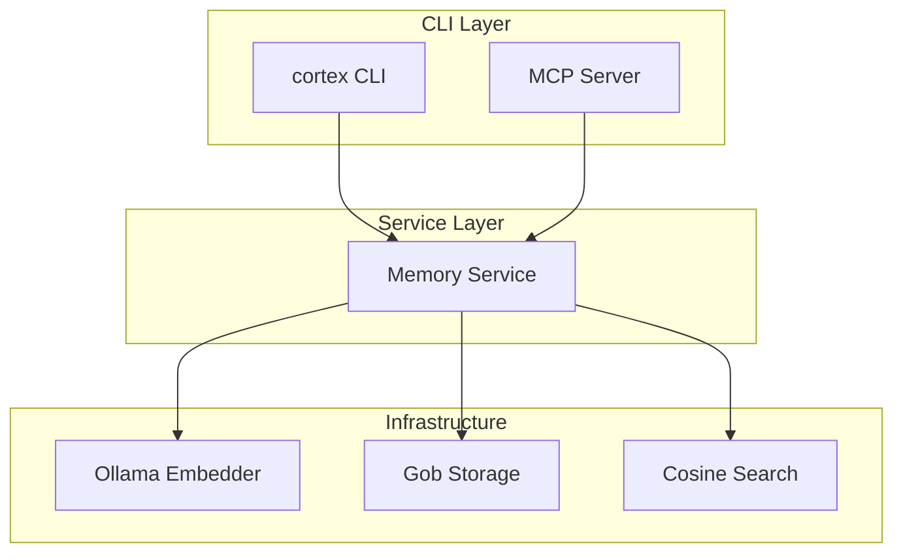

# Cortex AI - AI Agent Guidelines

This document provides essential information for AI coding assistants (Claude Code, Cursor, Windsurf, etc.) working on the Cortex AI codebase.

## Project Overview

**Cortex AI** is a Go CLI tool that provides persistent semantic memory for AI coding agents. It uses vector embeddings via Ollama for semantic search and stores memories locally using Gob encoding.

```
Module:     github.com/cortex-ai/cortex-ai
Language:   Go 1.24+
CLI:        Cobra
Config:     Viper
Embeddings: Ollama (local)
Storage:    Gob files
```

---

## Quick Reference

### Build Commands

```bash
make build          # Build to ./bin/cortex
make install        # Install to $GOBIN
make test           # Run tests
make test-race      # Run with race detector
make lint           # Run golangci-lint
make clean          # Remove artifacts
make deps           # Download dependencies
```

### Project Structure

```
cortex-ai/
├── cmd/cortex/main.go           # Entry point
├── internal/
│   ├── cli/                     # Cobra commands (create, search, list, etc.)
│   ├── memory/                  # Domain model & service
│   ├── storage/                 # Storage interface & Gob implementation
│   ├── embeddings/              # Embedder interface & Ollama client
│   ├── search/                  # Cosine similarity
│   ├── config/                  # Viper configuration
│   └── mcp/                     # MCP server (JSON-RPC 2.0)
├── pkg/
│   ├── markdown/                # Markdown import/export with YAML frontmatter
│   └── json/                    # JSON format handling
└── docs/                        # Documentation
```

---

## Architecture Overview



---

## Key Types

### Memory

```go
// internal/memory/memory.go
type Memory struct {
    ID        string            // UUID
    Title     string            // Required
    Content   string            // Required
    Types     []MemoryType      // Required: solution, issue, analysis, rule, any
    Tags      []string          // Optional
    Embedding []float64         // Vector (hidden from JSON)
    CreatedAt time.Time
    UpdatedAt time.Time
    Metadata  map[string]string
    Obsolete  bool              // Soft delete flag
}

type MemoryType string
const (
    MemoryTypeSolution MemoryType = "solution"
    MemoryTypeIssue    MemoryType = "issue"
    MemoryTypeAnalysis MemoryType = "analysis"
    MemoryTypeRule     MemoryType = "rule"
    MemoryTypeAny      MemoryType = "any"
)
```

### Service Interface

```go
// internal/memory/service.go
type Service interface {
    Create(ctx context.Context, input CreateInput) (*Memory, error)
    Search(ctx context.Context, query string, opts SearchOptions) ([]*SearchResult, error)
    List(ctx context.Context, opts ListOptions) ([]*Memory, error)
    Get(ctx context.Context, id string) (*Memory, error)
    Delete(ctx context.Context, id string) error
    MarkObsolete(ctx context.Context, id string) error
}
```

### Storage Interface

```go
// internal/storage/storage.go
type Storage interface {
    Save(ctx context.Context, memory *memory.Memory) error
    Get(ctx context.Context, id string) (*memory.Memory, error)
    List(ctx context.Context, opts ListOptions) ([]*memory.Memory, error)
    Delete(ctx context.Context, id string) error
    Update(ctx context.Context, memory *memory.Memory) error
    SearchByVector(ctx context.Context, vector []float64, topK int) ([]*VectorMatch, error)
    Close() error
}
```

### Embedder Interface

```go
// internal/embeddings/embedder.go
type Embedder interface {
    Embed(ctx context.Context, text string) ([]float64, error)
    EmbedBatch(ctx context.Context, texts []string) ([][]float64, error)
    Dimension() int
}
```

---

## CLI Commands

| Command | Purpose | Key File |
|---------|---------|----------|
| `create` | Create memory | `internal/cli/create.go` |
| `search` | Semantic search | `internal/cli/search.go` |
| `list` | List memories | `internal/cli/list.go` |
| `get` | Get by ID | `internal/cli/list.go` |
| `delete` | Delete memory | `internal/cli/delete.go` |
| `mark-obsolete` | Soft delete | `internal/cli/delete.go` |
| `export` | Export to Markdown | `internal/cli/export.go` |
| `import` | Import from Markdown | `internal/cli/import.go` |
| `config` | Manage config | `internal/cli/config.go` |
| `start-mcp-server` | MCP server | `internal/cli/mcp.go` |
| `completion` | Shell completions | `internal/cli/completion.go` |

---

## Important Patterns

### Dependency Injection

Services use constructor-based DI:

```go
func NewService(storage Storage, embedder Embedder) *DefaultService {
    return &DefaultService{
        storage:  storage,
        embedder: embedder,
    }
}
```

### Error Handling

Wrap errors with context:

```go
if err != nil {
    return fmt.Errorf("failed to save memory: %w", err)
}
```

### Thread Safety

Storage and index use `sync.RWMutex`:

```go
type GobStorage struct {
    mu sync.RWMutex
    // ...
}

func (s *GobStorage) Get(ctx context.Context, id string) (*memory.Memory, error) {
    s.mu.RLock()
    defer s.mu.RUnlock()
    // ...
}
```

---

## Data Flow

### Create Memory

1. Validate input (title, type, content required)
2. Prepare text: combine title + content + tags
3. Call Ollama API for embedding
4. Normalize vector to unit length
5. Generate UUID
6. Save memory (mode-dependent):
   - **single**: Add to in-memory store, persist to `cortex.gob`
   - **multi**: Write `{uuid}.gob` file, update `index.gob`

### Search Memory

1. Embed query via Ollama
2. Normalize query vector
3. For each stored vector: compute cosine similarity
4. Sort by score, take top K
5. Filter by min_score, type, obsolete flag
6. Load and return full Memory objects

---

## File Locations

### Runtime Data

The storage mode is configurable via `storage.mode` in the config file:

**Single mode (default)** - All memories in one file:
```
~/.local/share/cortex-ai/
└── cortex.gob          # Single file containing all memories and vector index
```

**Multi mode** - One file per memory (for team sharing):
```
~/.local/share/cortex-ai/
├── memories/
│   ├── <uuid-1>.gob    # Individual memory files
│   └── <uuid-2>.gob
└── index.gob           # Vector index
```

- **single**: Best for solo developers. All data in one portable file.
- **multi**: Best for teams. Individual memory files can be shared across projects or team members via version control.

### Configuration

```
~/.config/cortex-ai/config.yaml
```

---

## Testing

### Running Tests

```bash
# All tests
make test

# Specific package
go test ./internal/memory/...

# With coverage
go test -cover ./...

# Benchmarks
go test -bench=. ./internal/storage/...
```

### Test Files

Tests are colocated with source files:

```
internal/memory/
├── memory.go
├── memory_test.go
├── service.go
└── service_test.go
```

---

## Common Tasks

### Adding a CLI Command

1. Create `internal/cli/mycommand.go`
2. Define Cobra command and flags
3. Register with `rootCmd.AddCommand(myCmd)`
4. Add tests

### Adding a Storage Backend

1. Implement `Storage` interface in `internal/storage/`
2. Add factory function
3. Add configuration options
4. Add tests and benchmarks

### Adding an Embedding Provider

1. Implement `Embedder` interface in `internal/embeddings/`
2. Add configuration options
3. Add tests

---

## MCP Integration

The MCP server (`internal/mcp/`) exposes tools for AI agents:

| Tool | Purpose |
|------|---------|
| `cortex_search` | Semantic search |
| `cortex_create` | Create memory |
| `cortex_list` | List memories |
| `cortex_get` | Get by ID |

Protocol: JSON-RPC 2.0 over stdio

---

## Code Style

- Follow [Effective Go](https://golang.org/doc/effective_go)
- Use `gofmt` / `goimports`
- Run `golangci-lint` before committing
- Keep functions focused and testable
- Document exported types and functions

---

## External Dependencies

| Package | Purpose |
|---------|---------|
| `github.com/spf13/cobra` | CLI framework |
| `github.com/spf13/viper` | Configuration |
| `github.com/google/uuid` | UUID generation |
| `gopkg.in/yaml.v3` | YAML parsing |

---

## Useful Links

- [Architecture Documentation](docs/ARCHITECTURE.md)
- [Configuration Reference](docs/CONFIGURATION.md)
- [MCP Integration Guide](docs/MCP.md)
- [Contributing Guidelines](docs/CONTRIBUTING.md)
