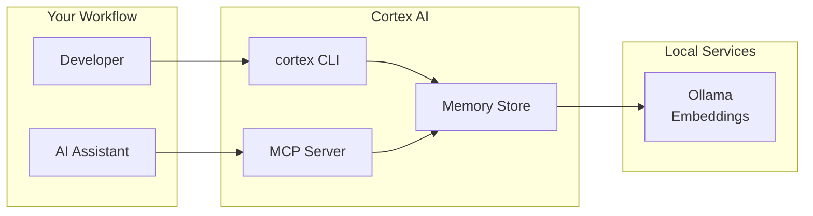

# Cortex AI

**Cortex AI** is a CLI tool written in Go that provides persistent semantic memory for AI coding assistants. It enables LLMs to recall past problems, solutions, and project-specific rules across sessions using vector embeddings from Ollama.



---

## Features

- **Memory Creation** - Store structured memories on user request (problems, solutions, project rules)
- **Semantic Search** - Query memories using natural language, not just keywords
- **Memory Types** - Classify memories as solution, issue, analysis, rule, or any
- **Markdown Export** - Export memories to Markdown with YAML frontmatter
- **Markdown Import** - Import memories from Markdown files
- **MCP Integration** - Use with Claude Code, Cursor, and other MCP-compatible tools
- **Local-First** - All data stays on your machine via Ollama

---

## How It Works

1. **Create** - Store memories with type, content, and tags
2. **Embed** - Content is converted to vector embeddings via Ollama
3. **Search** - Query memories semantically (by meaning, not keywords)
4. **Retrieve** - Memories ranked by relevance and returned to the AI agent

---

## Quick Start

### Installation

```bash
# Clone and build
git clone https://github.com/cortex-ai/cortex-ai.git
cd cortex-ai
make build

# Or install directly
make install
```

### Prerequisites

- Go 1.24+
- Ollama with an embedding model

```bash
# Install Ollama and pull embedding model
ollama pull nomic-embed-text
```

### Basic Usage

```bash
# Create a memory
cortex create \
  --title "JWT Token Refresh Fix" \
  --type solution \
  --content "When JWT tokens expire, implement refresh with exponential backoff..."

# Search memories semantically
cortex search "authentication token problems"

# List all memories
cortex list

# Export to Markdown
cortex export --all --output ./memories/
```

---

## Memory Types

Memories can be classified with one or more types:

| Type | Description |
|------|-------------|
| `solution` | Fix or workaround |
| `issue` | Bug or problem |
| `analysis` | Investigation findings |
| `rule` | Convention or guideline |
| `any` | Generic/uncategorized |

Types can be **combined**: `--type issue,solution,analysis`

---

## CLI Commands

```bash
# Create a memory
cortex create --title "..." --type solution --content "..."

# Search semantically
cortex search "your query"

# List memories
cortex list [--type solution]

# Get specific memory
cortex get <id>

# Delete
cortex delete <id>
cortex mark-obsolete <id>

# Export to Markdown
cortex export --all --output ./memories/

# Import from Markdown
cortex import memory.md
```

See [docs/CLI_REFERENCE.md](docs/CLI_REFERENCE.md) for detailed command reference.

---

## Markdown Format

Exported memories use YAML frontmatter with the memory content in the body. Required fields for import:
- `title` - Memory title
- `type` - One or more types
- Body content

See [docs/MARKDOWN_FORMAT.md](docs/MARKDOWN_FORMAT.md) for format details and examples.

---

## MCP Integration

Cortex AI works with Claude Code, Cursor, and other MCP-compatible editors.

```bash
cortex start-mcp-server
```

Available tools:
- `cortex_search` - Semantic search
- `cortex_create` - Create memory
- `cortex_list` - List memories
- `cortex_get` - Get memory by ID

See [docs/MCP.md](docs/MCP.md) for configuration and full details.

---

## Configuration

Configuration file: `~/.config/cortex-ai/config.yaml`

Default settings work out-of-the-box with Ollama. See [docs/CONFIGURATION.md](docs/CONFIGURATION.md) for detailed reference and environment variables.

---

## Storage

Cortex AI stores memories locally at `~/.local/share/cortex-ai/` using Go's Gob encoding. All data stays on your machine—no external services.

---

## Architecture

Built with a layered architecture: CLI/MCP layer → Memory service → Ollama embeddings & local storage.

See [docs/ARCHITECTURE.md](docs/ARCHITECTURE.md) for detailed design documentation.

---

## Privacy & Local-First

Cortex AI runs **entirely locally**:

- **Ollama** for embeddings - No data sent to external APIs
- **Local storage** - All memories stored on your machine
- **No telemetry** - Your project knowledge stays private
- **Offline capable** - Works without internet

---

## Development

```bash
# Build
make build

# Test
make test

# Lint
make lint

# Install
make install
```

See [docs/CONTRIBUTING.md](docs/CONTRIBUTING.md) for contribution guidelines.

---

## Documentation

For complete documentation, see **[docs/INDEX.md](docs/INDEX.md)** - the master guide to all documentation.

### Core Documentation

| Document | Purpose |
|----------|---------|
| [CLI_REFERENCE.md](docs/CLI_REFERENCE.md) | Complete command reference |
| [MEMORY_MODEL.md](docs/MEMORY_MODEL.md) | Memory structure and best practices |
| [MARKDOWN_FORMAT.md](docs/MARKDOWN_FORMAT.md) | Markdown import/export specification |
| [CONFIGURATION.md](docs/CONFIGURATION.md) | Configuration and setup |
| [MCP.md](docs/MCP.md) | MCP integration with AI editors |
| [TROUBLESHOOTING.md](docs/TROUBLESHOOTING.md) | Common issues and solutions |

### Technical Documentation

| Document | Purpose |
|----------|---------|
| [ARCHITECTURE.md](docs/ARCHITECTURE.md) | System design and internals |
| [STORAGE.md](docs/STORAGE.md) | Storage system documentation |
| [EMBEDDINGS.md](docs/EMBEDDINGS.md) | Vector generation and Ollama |
| [DEVELOPMENT.md](docs/DEVELOPMENT.md) | Development setup and workflow |
| [CONTRIBUTING.md](docs/CONTRIBUTING.md) | Contributing guidelines |

### Additional Resources

- [AGENTS.md](AGENTS.md) - Guide for AI coding assistants
- [DEVELOPMENT_PLAN.md](DEVELOPMENT_PLAN.md) - Implementation roadmap
- [CHANGELOG.md](CHANGELOG.md) - Version history

---

## License

MIT License - See [LICENSE](LICENSE) for details.
