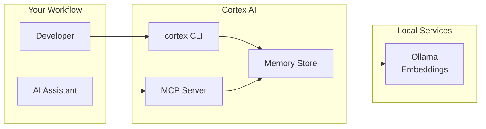
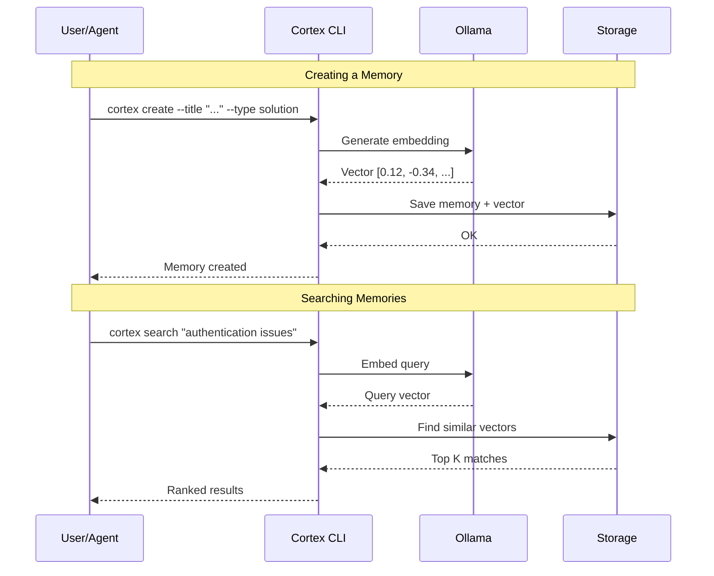
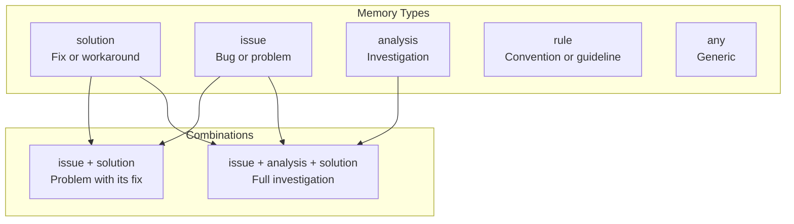
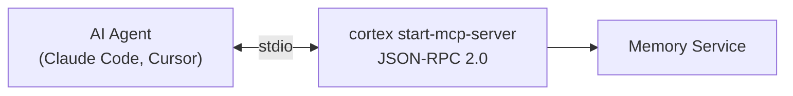
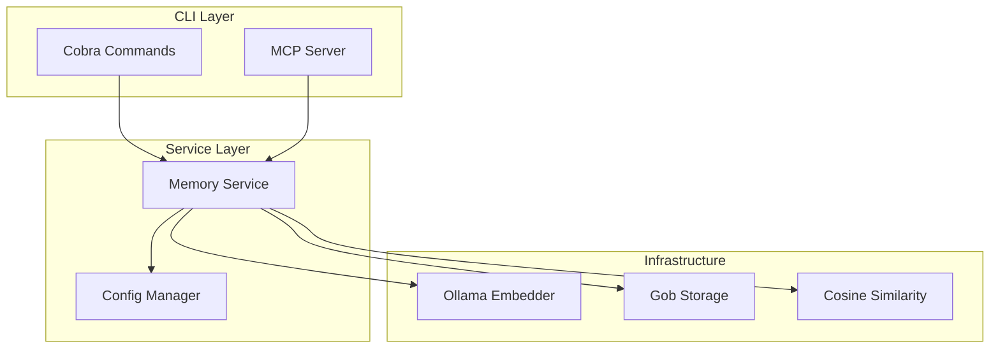

# Cortex AI

**Cortex AI** is a CLI tool written in Go that provides persistent semantic memory for AI coding assistants. It enables LLMs to recall past problems, solutions, and project-specific rules across sessions using vector embeddings.

## Overview

When working with AI coding assistants like Claude Code, Cursor, or Windsurf, context is often lost between sessions. Cortex AI solves this by providing a local vector database that stores "memories" - structured knowledge that can be retrieved semantically.

The tool follows a similar approach to [grepai](https://github.com/yoanbernabeu/grepai): **search by intent**, local operation via **Ollama**, and vector embeddings for semantic matching.



---

## Features

- **Memory Creation** - Store structured memories on user request (problems, solutions, project rules)
- **Semantic Search** - Query memories using natural language, not just keywords
- **Memory Types** - Classify memories as solution, issue, analysis, rule, or any
- **Markdown Export** - Export memories to Markdown with YAML frontmatter
- **Markdown Import** - Import memories from Markdown files
- **MCP Integration** - Use with Claude Code, Cursor, and other MCP-compatible tools
- **Local-First** - All data stays on your machine via Ollama

---

## How It Works



1. **Memory creation** - User asks LLM to remember something, a memory is created
2. **Embedding generation** - Content is converted to a vector embedding via Ollama
3. **Vector storage** - Embedding and metadata are stored locally
4. **Semantic retrieval** - LLM searches memories by meaning, not keywords

---

## Quick Start

### Installation

```bash
# Clone and build
git clone https://github.com/cortex-ai/cortex-ai.git
cd cortex-ai
make build

# Or install directly
make install
```

### Prerequisites

- Go 1.24+
- Ollama with an embedding model

```bash
# Install Ollama and pull embedding model
ollama pull nomic-embed-text
```

### Basic Usage

```bash
# Create a memory
cortex create \
  --title "JWT Token Refresh Fix" \
  --type solution \
  --content "When JWT tokens expire, implement refresh with exponential backoff..."

# Search memories semantically
cortex search "authentication token problems"

# List all memories
cortex list

# Export to Markdown
cortex export --all --output ./memories/
```

---

## Memory Types

Memories can be classified with one or more types:



| Type | Description | Example |
|------|-------------|---------|
| `solution` | Fix or workaround | "Add retry logic for flaky API" |
| `issue` | Bug or problem | "Race condition in auth middleware" |
| `analysis` | Investigation | "Memory leak root cause analysis" |
| `rule` | Convention | "Always use context for timeouts" |
| `any` | Generic | Uncategorized knowledge |

Types can be **combined**: `--type issue,solution,analysis`

---

## CLI Commands

### Create

```bash
# Required: title, type, content
cortex create --title "Auth fix" --type solution --content "JWT refresh tokens..."

# With multiple types and tags
cortex create \
  --title "JWT Bug Analysis" \
  --type issue,solution,analysis \
  --content "Investigation of token expiration..." \
  --tags "jwt,security,auth"
```

### Search

```bash
# Semantic search
cortex search "authentication issues"

# With options
cortex search "database optimization" --top 10 --min-score 0.7 --type solution
```

### List & Get

```bash
# List all
cortex list

# Filter by type
cortex list --type rule

# Get specific memory
cortex get <memory-id>
```

### Delete

```bash
# Delete by ID
cortex delete <memory-id>

# Soft delete (mark as obsolete)
cortex mark-obsolete <memory-id>
```

### Export

```bash
# Export single memory
cortex export <memory-id> --output ./memories/

# Export all memories
cortex export --all --output ./memories/

# Generate synthesis by intent
cortex export --intent "authentication patterns" --output auth-synthesis.md
```

### Import

```bash
# Import markdown files
cortex import memory1.md memory2.md

# Force overwrite existing
cortex import --force memory.md

# Validate without importing
cortex import --dry-run *.md
```

---

## Markdown Format

Exported memories use YAML frontmatter:

```markdown
---
id: a1b2c3d4-e5f6-7890-abcd-ef1234567890
title: JWT Token Refresh Fix
type:
  - issue
  - solution
tags:
  - authentication
  - jwt
created_at: 2024-01-10T14:22:00Z
updated_at: 2024-01-10T14:22:00Z
obsolete: false
metadata:
  project: api-gateway
---

When JWT tokens expire, the refresh mechanism was failing because...

## Root Cause

The middleware was checking token validity synchronously...

## Solution

Added a retry loop with exponential backoff...
```

**Required fields** (for import):
- `title` - Memory title
- `type` - One or more types
- Content (body of the markdown file)

---

## MCP Integration

Cortex AI provides an MCP server for AI agent integration:



### Configuration

**Claude Code** (`~/.config/claude-code/mcp.json`):

```json
{
  "mcpServers": {
    "cortex": {
      "command": "cortex",
      "args": ["start-mcp-server"]
    }
  }
}
```

**Cursor** (MCP settings):

```json
{
  "mcp": {
    "servers": {
      "cortex": {
        "command": "cortex",
        "args": ["start-mcp-server"]
      }
    }
  }
}
```

### Available Tools

| Tool | Description |
|------|-------------|
| `cortex_search` | Semantic search for memories |
| `cortex_create` | Create a new memory |
| `cortex_list` | List all memories |
| `cortex_get` | Get memory by ID |

See [docs/MCP.md](docs/MCP.md) for full documentation.

---

## Configuration

```yaml
# ~/.config/cortex-ai/config.yaml
storage:
  backend: gob
  path: ~/.local/share/cortex-ai

embeddings:
  provider: ollama
  model: nomic-embed-text
  endpoint: http://localhost:11434
  timeout: 30s

search:
  top_k: 5
  min_score: 0.5
  include_obsolete: false

output:
  format: text
  colors: true
```

### Environment Variables

```bash
CORTEX_STORAGE_BACKEND=gob
CORTEX_EMBEDDINGS_ENDPOINT=http://localhost:11434
CORTEX_EMBEDDINGS_MODEL=nomic-embed-text
CORTEX_SEARCH_TOP_K=5
```

See [docs/CONFIGURATION.md](docs/CONFIGURATION.md) for full reference.

---

## Storage Backends

| Backend | Description | Use Case |
|---------|-------------|----------|
| **Gob** (default) | File-based Go encoding | Simple, single user |
| **SQLite** (planned) | Embedded SQL database | Larger datasets |

### File Structure

```
~/.local/share/cortex-ai/
├── memories/
│   ├── <uuid-1>.gob
│   └── <uuid-2>.gob
└── index.gob
```

---

## Architecture



See [docs/ARCHITECTURE.md](docs/ARCHITECTURE.md) for detailed documentation.

---

## Privacy & Local-First

Cortex AI runs **entirely locally**:

- **Ollama** for embeddings - No data sent to external APIs
- **Local storage** - All memories stored on your machine
- **No telemetry** - Your project knowledge stays private
- **Offline capable** - Works without internet

---

## Development

```bash
# Build
make build

# Test
make test

# Lint
make lint

# Install
make install
```

See [docs/CONTRIBUTING.md](docs/CONTRIBUTING.md) for contribution guidelines.

---

## Documentation

| Document | Description |
|----------|-------------|
| [ARCHITECTURE.md](docs/ARCHITECTURE.md) | System design with diagrams |
| [CONFIGURATION.md](docs/CONFIGURATION.md) | Configuration reference |
| [CONTRIBUTING.md](docs/CONTRIBUTING.md) | Contribution guidelines |
| [MCP.md](docs/MCP.md) | MCP integration guide |
| [AGENTS.md](AGENTS.md) | Guide for AI coding assistants |
| [DEVELOPMENT_PLAN.md](DEVELOPMENT_PLAN.md) | Implementation roadmap |

---

## License

MIT License - See [LICENSE](LICENSE) for details.
