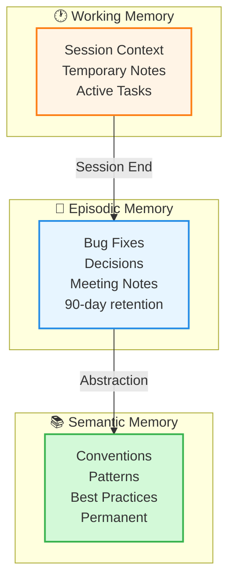
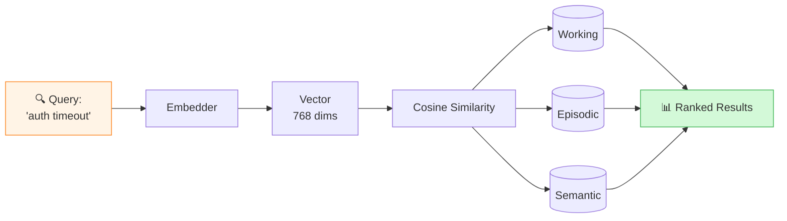
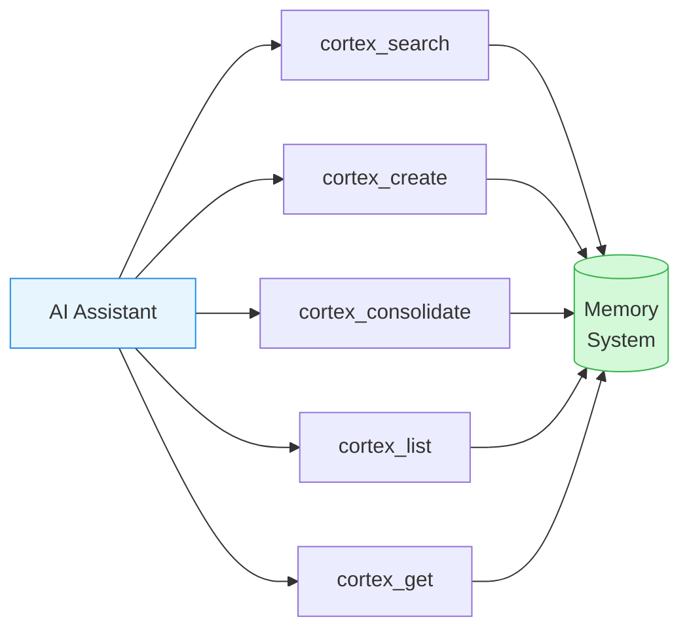
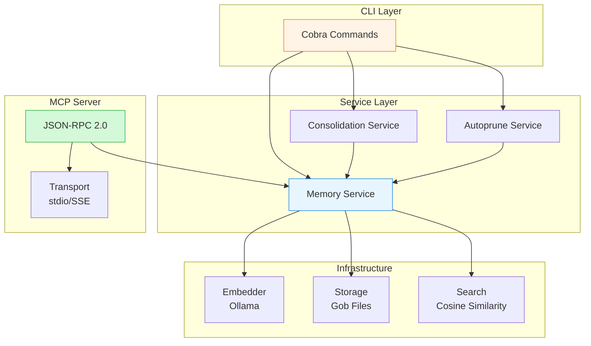

<div align="center">

# 🧠 Cortex

**AI-Powered Memory Management for Developers**

[](https://golang.org)
[](LICENSE)
[](docs/MCP.md)

*Never forget what your AI learned. Build persistent memory for your development workflow.*

[Quick Start](#-quick-start) • [Documentation](#-documentation) • [Features](#-features) • [MCP Integration](#-mcp-integration)

</div>

---

## 🎯 What is Cortex?

Cortex is a **semantic memory system** designed for AI assistants and developers. It stores, organizes, and retrieves knowledge using **vector embeddings** and **semantic search**, making past solutions, patterns, and insights instantly accessible.

Think of it as **long-term memory** for your AI coding assistant—helping it remember bug fixes, coding conventions, and architectural decisions across sessions.

> **💡 Tip:** Cortex integrates seamlessly with **Claude Code** and **Cursor** via the Model Context Protocol (MCP).

---

## ✨ Features

### 🏗️ Three-Layer Memory Architecture

Cortex organizes memories into three levels, mimicking human memory systems:



| Level | Scope | Retention | Use Case |
|-------|-------|-----------|----------|
| **Working** | Session-scoped | Until transferred | Current task context, debugging notes |
| **Episodic** | Time-bound events | 90 days (configurable) | Bug fixes, incidents, decisions |
| **Semantic** | Permanent knowledge | Forever | Coding conventions, patterns, architecture |

### 🔍 Semantic Search

Find memories by **meaning**, not just keywords:



### 🤖 MCP Integration

**Native integration** with AI coding assistants:

- **Claude Code** - Use Cortex tools directly in your CLI workflow
- **Cursor** - Access memories from your IDE
- **Custom MCP Clients** - Build your own integrations

### 🧹 Intelligent Management

- **Automatic Deduplication** - Merges similar memories (configurable threshold)
- **Auto-Pruning** - Archives old episodic memories automatically
- **Consolidation** - Combines related memories to reduce redundancy
- **Session Tracking** - Groups working memories by development session

### 📦 Import/Export

- **Markdown Format** - Human-readable, version-control friendly
- **Batch Operations** - Import/export multiple memories at once
- **Synthesis Export** - Combine multiple memories into a single document

---

## 🚀 Quick Start

### Prerequisites

1. **Go 1.24+** - [Install Go](https://go.dev/doc/install)
2. **Ollama** - For local embeddings
   ```bash
   # Install Ollama: https://ollama.ai
   ollama serve

   # Pull embedding model
   ollama pull nomic-embed-text
   ```

### Installation

```bash
# Install from source
go install github.com/cortex-ai/cortex-ai/cmd/cortex@latest

# Or build locally
git clone https://github.com/cortex-ai/cortex-ai.git
cd cortex-ai
make install
```

### Basic Usage

```bash
# Create memories at different levels
cortex create \
  --title "Fixed auth timeout bug" \
  --level episodic \
  --content "Added retry logic with exponential backoff" \
  --tags "bugfix,auth,networking"

cortex create \
  --title "Network request convention" \
  --level semantic \
  --content "Always use context with timeout for network calls to prevent hangs"

# Search semantically
cortex search "authentication timeout issues" --top 3

# List all semantic memories
cortex list --level semantic

# Export to Markdown
cortex export --all --output ./memories/
```

---

## 🎮 Core Commands

### Memory Operations

| Command | Description |
|---------|-------------|
| `create` | Create a new memory with embeddings |
| `search` | Semantic search across all layers |
| `list` | List memories with filtering |
| `get` | Get a specific memory by ID |
| `delete` | Delete a memory permanently |
| `mark-obsolete` | Soft-delete a memory |

### Advanced Operations

| Command | Description |
|---------|-------------|
| `transfer-working` | Transfer working memories to episodic (by session) |
| `consolidate` | Create memory with duplicate detection and merging |
| `autoprune` | Clean duplicates, archive old episodic, merge semantic |
| `export` | Export memories to Markdown (single/batch/synthesis) |
| `import` | Import memories from Markdown files |

### System Commands

| Command | Description |
|---------|-------------|
| `config` | View or edit configuration |
| `stats` | Display database statistics |
| `completion` | Generate shell completions (bash/zsh/fish/powershell) |
| `start-mcp-server` | Start MCP server for AI assistant integration |

> **📖 Full Reference:** See [CLI Reference](docs/CLI_REFERENCE.md) for detailed command documentation.

---

## 🔌 MCP Integration

### Setup for Claude Code

Add to `~/.config/claude-code/mcp.json`:

```json
{
  "mcpServers": {
    "cortex": {
      "command": "cortex",
      "args": ["start-mcp-server"]
    }
  }
}
```

### Setup for Cursor

Add to Cursor MCP settings:

```json
{
  "mcp": {
    "servers": {
      "cortex": {
        "command": "cortex",
        "args": ["start-mcp-server"]
      }
    }
  }
}
```

### Available MCP Tools



> **📖 Full Guide:** See [MCP Integration](docs/MCP.md) for complete setup and usage.

---

## 📚 Documentation

### Getting Started

- **[Documentation Index](docs/INDEX.md)** - Complete documentation guide
- **[CLI Reference](docs/CLI_REFERENCE.md)** - All commands and options
- **[Memory Model](docs/MEMORY_MODEL.md)** - Understanding memory layers and best practices

### Integration & Configuration

- **[MCP Integration](docs/MCP.md)** - Connect with Claude Code/Cursor
- **[Configuration](docs/CONFIGURATION.md)** - Configuration reference
- **[Markdown Format](docs/MARKDOWN_FORMAT.md)** - Import/export format specification

### Architecture & Development

- **[Architecture](docs/ARCHITECTURE.md)** - System design and components
- **[Storage](docs/STORAGE.md)** - Storage implementation details
- **[Embeddings](docs/EMBEDDINGS.md)** - Vector generation and Ollama integration
- **[Development](docs/DEVELOPMENT.md)** - Development setup and contribution guide

### Help & Troubleshooting

- **[Troubleshooting](docs/TROUBLESHOOTING.md)** - Common issues and solutions
- **[Contributing](docs/CONTRIBUTING.md)** - How to contribute

---

## 💡 Example Workflows

### Bug Fix Documentation

```bash
# 1. Track the bug in working memory
cortex create \
  --level working \
  --session bug-auth-2024 \
  --title "Investigating auth timeout" \
  --content "Reproduced timeout after 30s. Checking middleware."

# 2. After fixing, store in episodic
cortex create \
  --level episodic \
  --title "Fixed auth timeout" \
  --content "Race condition in token refresh. Added mutex lock." \
  --tags "bugfix,auth,concurrency"

# 3. Extract general pattern to semantic
cortex create \
  --level semantic \
  --title "Token refresh concurrency pattern" \
  --content "Always protect token refresh operations with mutex to prevent race conditions"
```

### Convention Management

```bash
# Store a coding convention
cortex create \
  --level semantic \
  --title "Database query timeout convention" \
  --content "All database queries must use context with timeout to enable cancellation" \
  --tags "convention,database,context"

# Later, search for it
cortex search "database timeout pattern" --level semantic
```

### Session Management

```bash
# Track work during a feature development session
cortex create \
  --level working \
  --session feature-oauth-2024 \
  --title "OAuth implementation notes" \
  --content "Using auth0 library. Need to handle refresh tokens."

# Transfer all session memories to episodic at end
cortex transfer-working --session feature-oauth-2024
```

---

## 🏗️ Architecture



---

## 🗄️ Storage Structure

```bash
~/.local/share/cortex-ai/
├── memories.gob              # Episodic + Semantic memories
├── working/
│   ├── session-abc123.gob    # Working memory for session ABC123
│   ├── session-def456.gob    # Working memory for session DEF456
│   └── ...
└── config.yaml               # Local configuration
```

---

## ⚙️ Configuration

### Quick Configuration

```yaml
# ~/.config/cortex-ai/config.yaml
storage:
  path: ~/.local/share/cortex-ai

embeddings:
  provider: ollama
  endpoint: http://localhost:11434
  model: nomic-embed-text

search:
  top_k: 5
  min_score: 0.5

consolidation:
  similarity_threshold: 0.85
  auto_transfer_on_session_end: true

autoprune:
  episodic_retention_days: 90
  duplicates_threshold: 0.92
```

> **📖 Full Reference:** See [Configuration](docs/CONFIGURATION.md) for all options.

---

## 🎯 Use Cases

### For Individual Developers

- **Bug Fix History** - Never forget how you solved a problem
- **Convention Tracking** - Document and search coding standards
- **Session Context** - Track debugging notes across sessions
- **Pattern Library** - Build a personal knowledge base

### For Teams

- **Shared Knowledge Base** - Document solutions and patterns
- **Onboarding** - Help new team members find answers
- **Post-Mortems** - Store incident learnings
- **Architecture Decisions** - Document why choices were made

### For AI Assistants

- **Context Retention** - Remember past conversations
- **Solution Reuse** - Apply previous fixes to new problems
- **Learning** - Build knowledge over time
- **Consistency** - Follow established patterns

---

## 🛠️ Development

```bash
# Clone repository
git clone https://github.com/cortex-ai/cortex-ai.git
cd cortex-ai

# Install dependencies
make deps

# Run tests
make test

# Build
make build

# Run linter
make lint
```

See [Development Guide](docs/DEVELOPMENT.md) for complete setup instructions.

---

## 🤝 Contributing

We welcome contributions! Please see:

- **[Contributing Guide](docs/CONTRIBUTING.md)** - How to contribute
- **[Architecture](docs/ARCHITECTURE.md)** - System design
- **[Development](docs/DEVELOPMENT.md)** - Development setup

---

## 📝 License

Apache License 2.0 - See [LICENSE](LICENSE) for details.

---

## 🙏 Acknowledgments

- **[Ollama](https://ollama.ai)** - Local embedding model serving
- **[Cobra](https://github.com/spf13/cobra)** - CLI framework
- **[Viper](https://github.com/spf13/viper)** - Configuration management

---

<div align="center">

**Built with ❤️ by the Cortex team**

[⭐ Star us on GitHub](https://github.com/cortex-ai/cortex-ai) • [📖 Read the Docs](docs/INDEX.md) • [🐛 Report Issues](https://github.com/cortex-ai/cortex-ai/issues)

</div>
