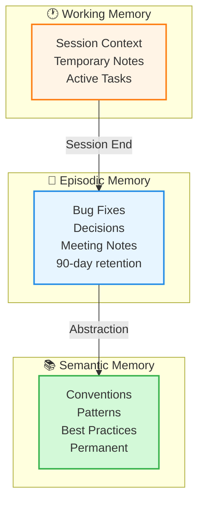
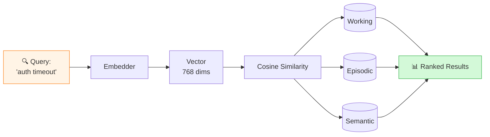
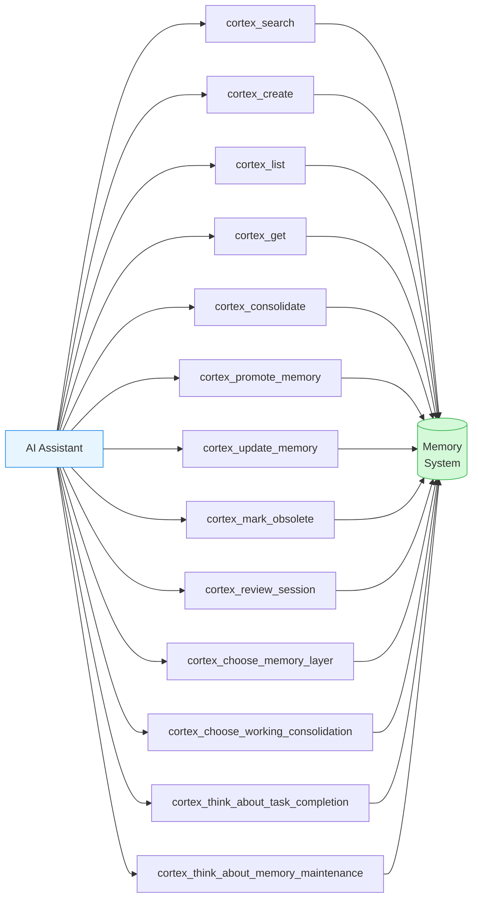
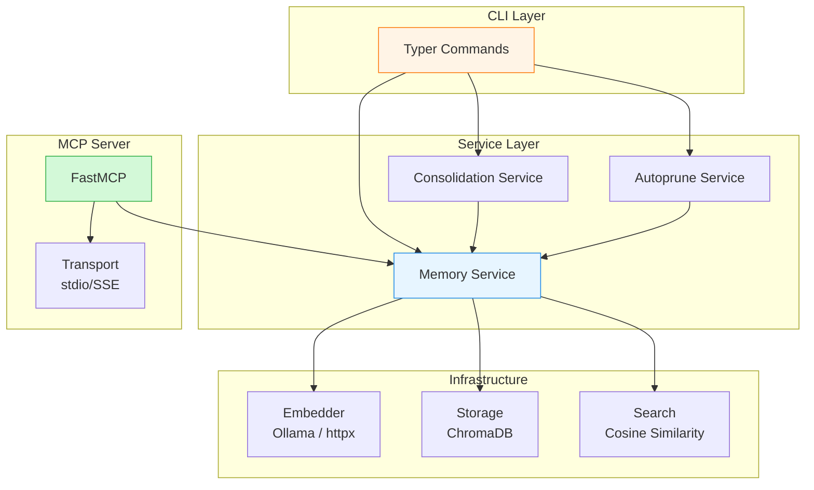

<div align="center">

# 🧠 Cortex

**AI-Powered Memory Management for Developers**

[](https://python.org)
[](LICENSE)
[](docs/cli/mcp.md)

*Never forget what your AI learned. Build persistent memory for your development workflow.*

[Quick Start](#-quick-start) • [Documentation](#-documentation) • [Features](#-features) • [MCP Integration](#-mcp-integration)

</div>

---

## 🎯 What is Cortex?

Cortex is a **semantic memory system** designed for AI assistants and developers. It stores, organizes, and retrieves knowledge using **vector embeddings** and **semantic search**, making past solutions, patterns, and insights instantly accessible.

Think of it as **long-term memory** for your AI coding assistant—helping it remember bug fixes, coding conventions, and architectural decisions across sessions.

> **💡 Tip:** Cortex integrates seamlessly with **Claude Code** and **Cursor** via the Model Context Protocol (MCP).

---

## ✨ Features

### 🏗️ Three-Layer Memory Architecture

Cortex organizes memories into three levels, mimicking human memory systems:



| Level | Scope | Retention | Use Case |
|-------|-------|-----------|----------|
| **Working** | Session-scoped | Until transferred | Current task context, debugging notes |
| **Episodic** | Time-bound events | 90 days (configurable) | Bug fixes, incidents, decisions |
| **Semantic** | Permanent knowledge | Forever | Coding conventions, patterns, architecture |

### 🔍 Semantic Search

Find memories by **meaning**, not just keywords:



### 🤖 MCP Integration

**Native integration** with AI coding assistants:

- **Claude Code** - Use Cortex tools directly in your CLI workflow
- **Cursor** - Access memories from your IDE
- **Custom MCP Clients** - Build your own integrations

### 🧹 Intelligent Management

- **Automatic Deduplication** - Merges similar memories (configurable threshold)
- **Auto-Pruning** - Archives old episodic memories automatically
- **Consolidation** - Combines related memories to reduce redundancy
- **Session Tracking** - Groups working memories by development session

### 📦 Import/Export

- **Markdown Format** - Human-readable, version-control friendly
- **Batch Operations** - Import/export multiple memories at once
- **Synthesis Export** - Combine multiple memories into a single document

---

## 🚀 Quick Start

### Prerequisites

1. **Python 3.12+** - [Install Python](https://python.org/downloads/)
2. **Ollama** - For local embeddings
   ```bash
   # Install Ollama: https://ollama.ai
   ollama serve

   # Pull embedding model
   ollama pull nomic-embed-text
   ```

### Installation

```bash
# Run directly without installing (recommended)
uvx cortex --help

# Or install permanently
pip install cortex-memory

# Or install with uv
uv tool install cortex-memory
```

### Basic Usage

```bash
# Create memories at different levels
cortex create \
  --title "Fixed auth timeout bug" \
  --level episodic \
  --content "Added retry logic with exponential backoff" \
  --tags "bugfix,auth,networking"

cortex create \
  --title "Network request convention" \
  --level semantic \
  --content "Always use context with timeout for network calls to prevent hangs"

# Search semantically
cortex search "authentication timeout issues" --top 3

# List all semantic memories
cortex list --level semantic

# Export to Markdown
cortex export --all --output ./memories/
```

---

## 🎮 Core Commands

### Memory Operations

| Command | Description |
|---------|-------------|
| `create` | Create a new memory with embeddings |
| `search` | Semantic search across all layers |
| `list` | List memories with filtering |
| `get` | Get a specific memory by ID |
| `delete` | Delete a memory permanently |

### Advanced Operations

| Command | Description |
|---------|-------------|
| `transfer-working` | Transfer working memories to episodic (by session) |
| `consolidate` | Create memory with duplicate detection and merging |
| `autoprune` | Clean duplicates, archive old episodic, merge semantic |
| `export` | Export memories to Markdown (single/batch/synthesis) |
| `import` | Import memories from Markdown files |

### System Commands

| Command | Description |
|---------|-------------|
| `config` | View or edit configuration |
| `stats` | Display database statistics |
| `start-mcp-server` | Start MCP server for AI assistant integration |

> **📖 Full Reference:** See [CLI Reference](docs/cli/reference.md) for detailed command documentation.

---

## 🔌 MCP Integration

### Setup for Claude Code

Add to `~/.config/claude-code/mcp.json`:

```json
{
  "mcpServers": {
    "cortex": {
      "command": "cortex",
      "args": ["start-mcp-server"]
    }
  }
}
```

### Setup for Cursor

Add to Cursor MCP settings:

```json
{
  "mcp": {
    "servers": {
      "cortex": {
        "command": "cortex",
        "args": ["start-mcp-server"]
      }
    }
  }
}
```

### Available MCP Tools



| Tool | Category | Description |
|------|----------|-------------|
| `cortex_search` | Query | Semantic similarity search across all memories |
| `cortex_create` | Write | Create a new memory at any level |
| `cortex_list` | Query | List memories with optional filters and pagination |
| `cortex_get` | Query | Retrieve a specific memory by ID |
| `cortex_consolidate` | Write | Consolidate a synthesis into memory with dedup |
| `cortex_promote_memory` | Write | Promote a memory to a higher layer |
| `cortex_update_memory` | Write | Update an existing memory's content or tags |
| `cortex_mark_obsolete` | Write | Soft-delete a memory (mark as obsolete) |
| `cortex_review_session` | Workflow | End-of-session review of working memories |
| `cortex_choose_memory_layer` | Workflow | Decide which memory layer to target |
| `cortex_choose_working_consolidation` | Workflow | Select which working memories to consolidate |
| `cortex_think_about_task_completion` | Workflow | Post-task reflection checkpoint |
| `cortex_think_about_memory_maintenance` | Workflow | Periodic memory health checkpoint |

> **📖 Full Guide:** See [MCP Integration](docs/cli/mcp.md) for complete setup and usage.

---

## 📚 Documentation

### Getting Started

- **[Documentation Index](docs/INDEX.md)** - Complete documentation guide
- **[CLI Reference](docs/cli/reference.md)** - All commands and options
- **[Memory Model](docs/architecture/memory-model.md)** - Understanding memory layers and best practices

### Integration & Configuration

- **[MCP Integration](docs/cli/mcp.md)** - Connect with Claude Code/Cursor
- **[Configuration](docs/guides/configuration.md)** - Configuration reference
- **[Markdown Format](docs/guides/markdown-format.md)** - Import/export format specification

### Architecture & Development

- **[Architecture](docs/architecture/overview.md)** - System design and components
- **[Storage](docs/architecture/storage.md)** - Storage implementation details
- **[Embeddings](docs/architecture/embeddings.md)** - Vector generation and Ollama integration
- **[Development](docs/contributing/development.md)** - Development setup and contribution guide

### Help & Troubleshooting

- **[Troubleshooting](docs/guides/troubleshooting.md)** - Common issues and solutions
- **[Contributing](docs/contributing/contributing.md)** - How to contribute

---

## 💡 Example Workflows

### Bug Fix Documentation

```bash
# 1. Track the bug in working memory
cortex create \
  --level working \
  --session bug-auth-2024 \
  --title "Investigating auth timeout" \
  --content "Reproduced timeout after 30s. Checking middleware."

# 2. After fixing, store in episodic
cortex create \
  --level episodic \
  --title "Fixed auth timeout" \
  --content "Race condition in token refresh. Added mutex lock." \
  --tags "bugfix,auth,concurrency"

# 3. Extract general pattern to semantic
cortex create \
  --level semantic \
  --title "Token refresh concurrency pattern" \
  --content "Always protect token refresh operations with mutex to prevent race conditions"
```

### Convention Management

```bash
# Store a coding convention
cortex create \
  --level semantic \
  --title "Database query timeout convention" \
  --content "All database queries must use context with timeout to enable cancellation" \
  --tags "convention,database,context"

# Later, search for it
cortex search "database timeout pattern" --level semantic
```

### Session Management

Cortex can **automatically derive session IDs** from your git branch name, making it easy to track work across development sessions without manual session ID management.

```bash
# With auto-derivation enabled (default), session ID is derived from git branch
# Branch: fix/sil-123/auth-timeout → Session: session-fix-sil-123
cortex create \
  --level working \
  --title "OAuth implementation notes" \
  --content "Using auth0 library. Need to handle refresh tokens."

# Or manually specify a session ID
cortex create \
  --level working \
  --session feature-oauth-2024 \
  --title "OAuth implementation notes" \
  --content "Using auth0 library. Need to handle refresh tokens."

# Transfer all session memories to episodic at end
cortex transfer-working --session session-fix-sil-123
```

**Auto-Derivation Patterns:**

| Git Branch | Pattern Type | Session ID |
|------------|--------------|------------|
| `fix/sil-123/auth-timeout` | `prefix` (default, 2 segments) | `session-fix-sil-123` |
| `feature/JIRA-456/oauth` | `regex: ([A-Z]+-\d+)` | `session-JIRA-456` |
| `hotfix/prod/db-leak` | `full` | `session-hotfix-prod-db-leak` |

Configure via `.agents/cortex/config.yaml`:

```yaml
session:
  auto_derive: true          # Enable auto-derivation
  pattern_type: prefix       # prefix, regex, or full
  max_segments: 2           # First 2 segments for prefix mode
  prefix: "session-"        # Prefix for session IDs
  separator: "-"            # Separator for branch parts
```

> **📖 Details:** See [Configuration Reference](docs/guides/configuration.md#session-section) for all session options.

---

## 🏗️ Architecture



---

## 🗄️ Storage Structure

ChromaDB stores memories in three collections, persisted under `.agents/cortex/`:

```bash
.agents/cortex/                   # project-local (relative to CWD)
├── chroma.sqlite3            # ChromaDB persistence file
├── <uuid>/                   # ChromaDB segment data
│   └── ...
└── config.yaml               # Local configuration
```

Collections:
- `cortex_working` — Session-scoped working memories
- `cortex_episodic` — Time-bound episodic memories
- `cortex_semantic` — Permanent semantic memories

---

## ⚙️ Configuration

### Quick Configuration

```yaml
# .agents/cortex/config.yaml
storage:
  path: .agents/cortex

embeddings:
  provider: ollama
  endpoint: http://localhost:11434
  model: nomic-embed-text
  timeout: 30

search:
  top_k: 5
  min_score: 0.5

consolidation:
  similarity_threshold: 0.85
  auto_transfer_on_session_end: true

autoprune:
  episodic_retention_days: 90
  duplicates_threshold: 0.92
```

Environment variables use `CORTEX_` prefix with `__` as nested delimiter:

```bash
export CORTEX_EMBEDDINGS__MODEL=mxbai-embed-large
export CORTEX_EMBEDDINGS__ENDPOINT=http://localhost:11434
export CORTEX_SEARCH__TOP_K=10
```

> **📖 Full Reference:** See [Configuration](docs/guides/configuration.md) for all options.

---

## 🎯 Use Cases

### For Individual Developers

- **Bug Fix History** - Never forget how you solved a problem
- **Convention Tracking** - Document and search coding standards
- **Session Context** - Track debugging notes across sessions
- **Pattern Library** - Build a personal knowledge base

### For Teams

- **Shared Knowledge Base** - Document solutions and patterns
- **Onboarding** - Help new team members find answers
- **Post-Mortems** - Store incident learnings
- **Architecture Decisions** - Document why choices were made

### For AI Assistants

- **Context Retention** - Remember past conversations
- **Solution Reuse** - Apply previous fixes to new problems
- **Learning** - Build knowledge over time
- **Consistency** - Follow established patterns

---

## 🛠️ Development

```bash
# Clone repository
git clone https://github.com/fmatsos/cortex.git
cd cortex

# Install dependencies (requires uv)
uv sync --all-groups

# Run tests
uv run pytest tests/ -v

# Format and lint
uv run ruff format src/ tests/
uv run ruff check src/ tests/
```

See [Development Guide](docs/contributing/development.md) for complete setup instructions.

---

## 🤝 Contributing

We welcome contributions! Please see:

- **[Contributing Guide](docs/contributing/contributing.md)** - How to contribute
- **[Architecture](docs/architecture/overview.md)** - System design
- **[Development](docs/contributing/development.md)** - Development setup

---

## 📝 License

Apache License 2.0 - See [LICENSE](LICENSE) for details.

---

## 🙏 Acknowledgments

- **[Ollama](https://ollama.ai)** - Local embedding model serving
- **[ChromaDB](https://www.trychroma.com)** - Vector database
- **[Typer](https://typer.tiangolo.com)** - CLI framework
- **[pydantic-settings](https://docs.pydantic.dev/latest/concepts/pydantic_settings/)** - Configuration management
- **[MCP Python SDK](https://github.com/modelcontextprotocol/python-sdk)** - Model Context Protocol

---

<div align="center">

**Built with ❤️ by the Cortex team**

[⭐ Star us on GitHub](https://github.com/fmatsos/cortex) • [📖 Read the Docs](docs/INDEX.md) • [🐛 Report Issues](https://github.com/fmatsos/cortex/issues)

</div>
