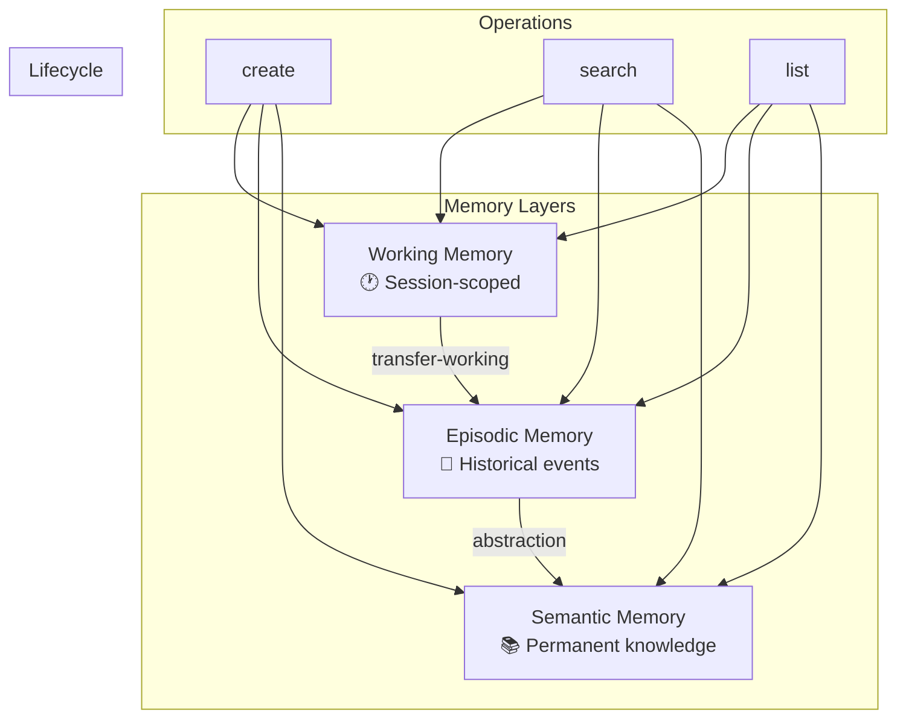

# Cortex

AI-powered memory management for developers.

## Overview

Cortex provides a three-layer memory system for AI assistants:



## Quick Start

```bash
# Install
go install github.com/cortex-ai/cortex-ai/cmd/cortex@latest

# Create memories at different levels
cortex create --title "Current task" --level working --session dev-123 \
  --content "Debugging authentication timeout"

cortex create --title "Fixed auth bug" --level episodic \
  --content "Race condition in middleware" --tags "bugfix,auth"

cortex create --title "Auth convention" --level semantic \
  --content "Always use context with timeout for auth calls"

# Search across all layers
cortex search "authentication issues"

# Search specific layer
cortex search "conventions" --level semantic
```

## Memory Levels

| Level | Scope | Retention | Use Case |
|-------|-------|-----------|----------|
| `working` | Session | Temporary | Current task context |
| `episodic` | Time-bound | 90 days | Bug fixes, decisions |
| `semantic` | Permanent | Forever | Conventions, patterns |

## Commands

- `create` - Create a new memory
- `search` - Search memories semantically
- `list` - List memories with filtering
- `get` - Get a specific memory
- `delete` - Delete a memory
- `mark-obsolete` - Soft delete a memory
- `transfer-working` - Transfer working memories to episodic
- `autoprune` - Clean and optimize memory database
- `export` - Export memories to Markdown
- `import` - Import memories from Markdown

## Documentation

- [CLI Reference](docs/CLI_REFERENCE.md)
- [Memory Model](docs/MEMORY_MODEL.md)
- [Architecture](docs/ARCHITECTURE.md)
- [Storage](docs/STORAGE.md)
- [Contributing](docs/CONTRIBUTING.md)
