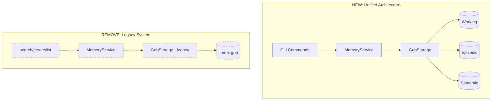
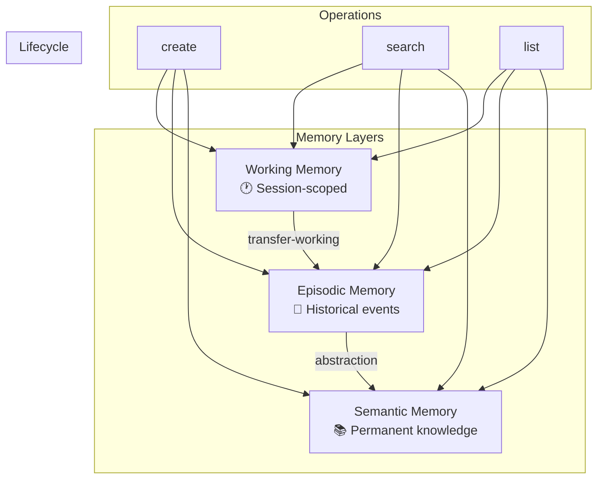
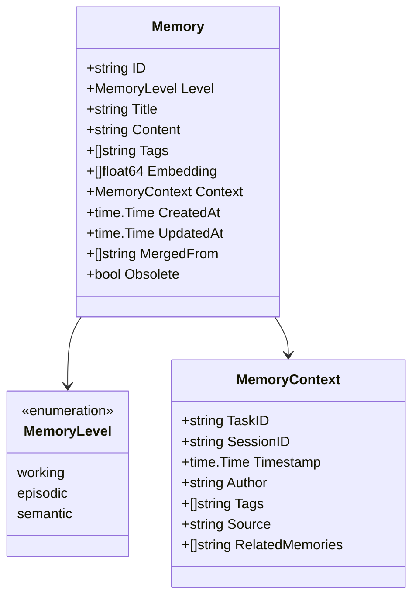
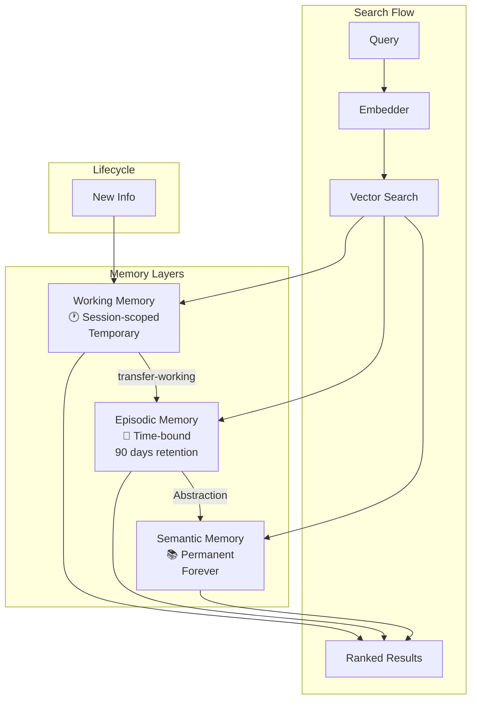
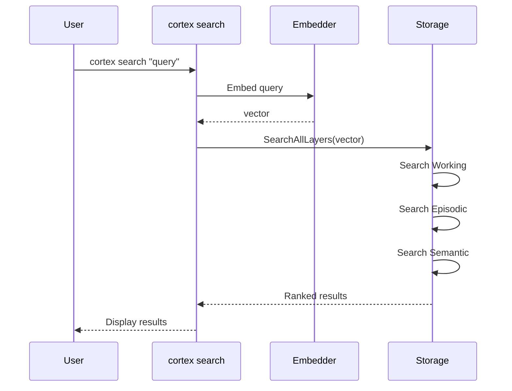
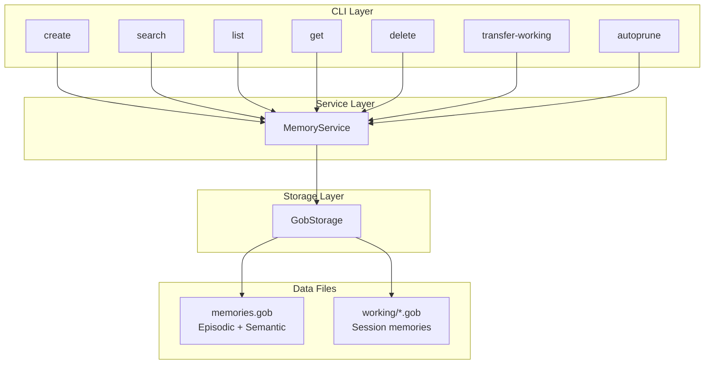
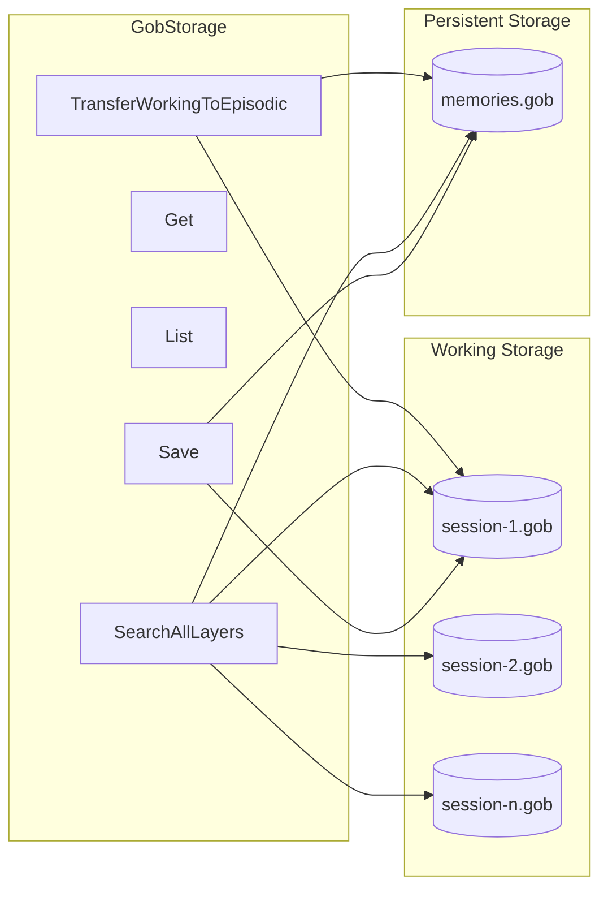
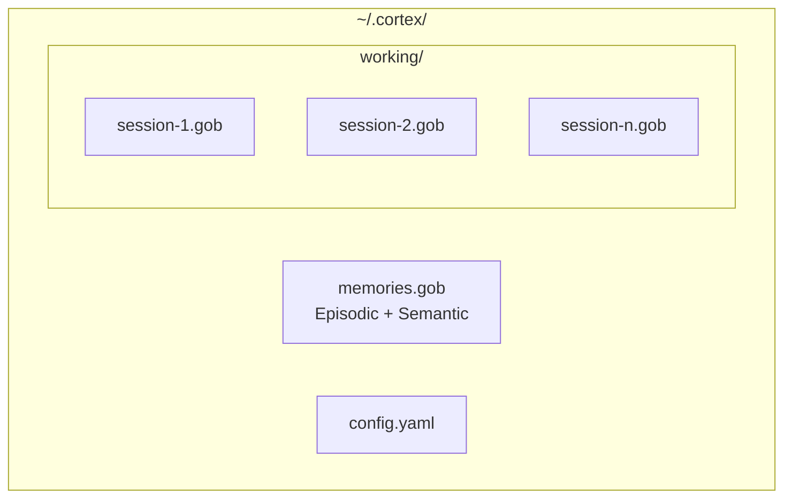

# Cortex Refactoring Plan: Unified Three-Layer Memory Architecture

## Codex Prompt for OpenAI

---

## TASK
Refactor Cortex to use unified three-layer memory architecture.

## CONTEXT
Cortex is a Go CLI tool for AI memory management. Currently it has TWO separate memory systems:
1. **Legacy `Memory` type** with `MemoryType` (solution, issue, analysis, rule, any) - stored via `GobStorage`
2. **`ConsolidatedMemory` type** with `MemoryLevel` (working, episodic, semantic) - stored via `GobConsolidatedStorage`

The `search` command currently only searches the legacy Memory system. We need to:
1. Remove the legacy Memory/GobStorage system entirely
2. Rename `ConsolidatedMemory` → `Memory` (remove "Consolidated" suffix everywhere)
3. Update `search` command to search across all three layers (working, episodic, semantic)
4. Update all documentation with MermaidJS diagrams

---

## ARCHITECTURE OVERVIEW



---

## PHASE 1: Remove Legacy Memory System & Rename Types

### 1.1 Delete Files
```
DELETE: internal/memory/memory.go           # Legacy Memory struct, MemoryType
DELETE: internal/memory/memory_test.go      # Legacy tests
DELETE: internal/storage/gob.go             # Legacy GobStorage
DELETE: internal/storage/gob_test.go        # Legacy tests
DELETE: internal/storage/gob_bench_test.go  # Legacy benchmarks
DELETE: internal/storage/storage.go         # Legacy Storage interface
```

### 1.2 Rename Files
```
RENAME: internal/storage/gob_consolidated.go      → internal/storage/gob.go
RENAME: internal/storage/gob_consolidated_test.go → internal/storage/gob_test.go
RENAME: internal/storage/consolidated.go          → internal/storage/storage.go
```

### 1.3 Update `internal/memory/types.go`
Rename `ConsolidatedMemory` → `Memory`, `ConsolidationContext` → `MemoryContext`:

```go
package memory

import (
    "fmt"
    "time"
)

// MemoryLevel represents the three-tier memory system
type MemoryLevel string

const (
    MemoryLevelWorking  MemoryLevel = "working"
    MemoryLevelEpisodic MemoryLevel = "episodic"
    MemoryLevelSemantic MemoryLevel = "semantic"
)

// IsValidLevel checks if a string is a valid memory level
func IsValidLevel(s string) bool {
    switch MemoryLevel(s) {
    case MemoryLevelWorking, MemoryLevelEpisodic, MemoryLevelSemantic:
        return true
    }
    return false
}

// MemoryContext holds contextual information about a memory
type MemoryContext struct {
    TaskID          string    `json:"task_id,omitempty"`
    SessionID       string    `json:"session_id,omitempty"`
    Timestamp       time.Time `json:"timestamp"`
    Author          string    `json:"author,omitempty"`
    Tags            []string  `json:"tags,omitempty"`
    Source          string    `json:"source,omitempty"` // manual, auto, llm
    RelatedMemories []string  `json:"related_memories,omitempty"`
}

// Memory represents a memory entry in the three-layer system
type Memory struct {
    ID         string        `json:"id"`
    Level      MemoryLevel   `json:"level"`
    Title      string        `json:"title"`
    Content    string        `json:"content"`
    Tags       []string      `json:"tags,omitempty"`
    Embedding  []float64     `json:"-"`
    Context    MemoryContext `json:"context"`
    CreatedAt  time.Time     `json:"created_at"`
    UpdatedAt  time.Time     `json:"updated_at"`
    MergedFrom []string      `json:"merged_from,omitempty"`
    Obsolete   bool          `json:"obsolete"`
}

// Validate validates the memory fields
func (m *Memory) Validate() error {
    if m.Title == "" || len(m.Title) < 3 {
        return fmt.Errorf("title must be at least 3 characters")
    }
    if m.Content == "" || len(m.Content) < 10 {
        return fmt.Errorf("content must be at least 10 characters")
    }
    if !IsValidLevel(string(m.Level)) {
        return fmt.Errorf("invalid level: %s", m.Level)
    }
    if m.Level == MemoryLevelWorking && m.Context.SessionID == "" {
        return fmt.Errorf("session_id required for working memory")
    }
    return nil
}
```

### 1.4 Update `internal/memory/service.go`
Complete rewrite for unified Memory type:

```go
package memory

import (
    "context"
    "fmt"
    "time"

    "github.com/google/uuid"
)

// Embedder generates vector embeddings for text
type Embedder interface {
    Embed(ctx context.Context, text string) ([]float64, error)
    EmbedBatch(ctx context.Context, texts []string) ([][]float64, error)
    Dimension() int
}

// Storage interface for memory persistence
type Storage interface {
    Save(ctx context.Context, m *Memory) error
    Get(ctx context.Context, id string) (*Memory, error)
    List(ctx context.Context, opts ListOptions) ([]*Memory, error)
    Delete(ctx context.Context, id string) error
    Update(ctx context.Context, m *Memory) error
    SearchAllLayers(ctx context.Context, vector []float64, opts SearchOptions) ([]*SearchResult, error)
    TransferWorkingToEpisodic(ctx context.Context, sessionID string) (int, error)
    Close() error
}

// SearchOptions configures search behavior
type SearchOptions struct {
    TopK            int
    MinScore        float64
    FilterLevels    []MemoryLevel
    IncludeObsolete bool
    SessionID       string
}

// SearchResult contains a memory and its similarity score
type SearchResult struct {
    Memory *Memory
    Score  float64
}

// ListOptions configures list behavior
type ListOptions struct {
    FilterLevels    []MemoryLevel
    IncludeObsolete bool
    Limit           int
    SortBy          string
    Reverse         bool
}

// CreateInput for creating new memories
type CreateInput struct {
    Title     string
    Content   string
    Level     MemoryLevel
    Tags      []string
    SessionID string
    Source    string
    TaskID    string
    Author    string
}

// MemoryService provides memory operations
type MemoryService struct {
    storage  Storage
    embedder Embedder
}

// NewMemoryService creates a new memory service
func NewMemoryService(storage Storage, embedder Embedder) *MemoryService {
    return &MemoryService{storage: storage, embedder: embedder}
}

// Create creates a new memory
func (s *MemoryService) Create(ctx context.Context, input CreateInput) (*Memory, error) {
    now := time.Now()
    m := &Memory{
        ID:      uuid.New().String(),
        Level:   input.Level,
        Title:   input.Title,
        Content: input.Content,
        Tags:    input.Tags,
        Context: MemoryContext{
            TaskID:    input.TaskID,
            SessionID: input.SessionID,
            Timestamp: now,
            Author:    input.Author,
            Tags:      input.Tags,
            Source:    input.Source,
        },
        CreatedAt: now,
        UpdatedAt: now,
        Obsolete:  false,
    }

    if err := m.Validate(); err != nil {
        return nil, err
    }

    text := fmt.Sprintf("Title: %s\n\nContent: %s", m.Title, m.Content)
    if len(m.Tags) > 0 {
        text += fmt.Sprintf("\n\nTags: %v", m.Tags)
    }
    embedding, err := s.embedder.Embed(ctx, text)
    if err != nil {
        return nil, fmt.Errorf("failed to generate embedding: %w", err)
    }
    m.Embedding = embedding

    if err := s.storage.Save(ctx, m); err != nil {
        return nil, fmt.Errorf("failed to save: %w", err)
    }
    return m, nil
}

// Search searches memories across all layers
func (s *MemoryService) Search(ctx context.Context, query string, opts SearchOptions) ([]*SearchResult, error) {
    embedding, err := s.embedder.Embed(ctx, query)
    if err != nil {
        return nil, fmt.Errorf("failed to embed query: %w", err)
    }
    return s.storage.SearchAllLayers(ctx, embedding, opts)
}

// List lists memories with filtering
func (s *MemoryService) List(ctx context.Context, opts ListOptions) ([]*Memory, error) {
    return s.storage.List(ctx, opts)
}

// Get retrieves a memory by ID
func (s *MemoryService) Get(ctx context.Context, id string) (*Memory, error) {
    return s.storage.Get(ctx, id)
}

// Delete permanently deletes a memory
func (s *MemoryService) Delete(ctx context.Context, id string) error {
    return s.storage.Delete(ctx, id)
}

// MarkObsolete soft-deletes a memory
func (s *MemoryService) MarkObsolete(ctx context.Context, id string) error {
    m, err := s.storage.Get(ctx, id)
    if err != nil {
        return err
    }
    m.Obsolete = true
    m.UpdatedAt = time.Now()
    return s.storage.Update(ctx, m)
}

// TransferWorking transfers working memories to episodic
func (s *MemoryService) TransferWorking(ctx context.Context, sessionID string) (int, error) {
    return s.storage.TransferWorkingToEpisodic(ctx, sessionID)
}
```

---

## PHASE 2: Update Storage Layer

### 2.1 Update `internal/storage/storage.go` (renamed from consolidated.go)

```go
package storage

import (
    "context"

    "github.com/cortex-ai/cortex-ai/internal/memory"
)

// Storage defines the interface for memory persistence
type Storage interface {
    Save(ctx context.Context, m *memory.Memory) error
    Get(ctx context.Context, id string) (*memory.Memory, error)
    List(ctx context.Context, opts memory.ListOptions) ([]*memory.Memory, error)
    Delete(ctx context.Context, id string) error
    Update(ctx context.Context, m *memory.Memory) error
    SearchAllLayers(ctx context.Context, vector []float64, opts memory.SearchOptions) ([]*memory.SearchResult, error)
    TransferWorkingToEpisodic(ctx context.Context, sessionID string) (int, error)
    Close() error
}
```

### 2.2 Update `internal/storage/gob.go` (renamed from gob_consolidated.go)

```go
package storage

import (
    "context"
    "encoding/gob"
    "fmt"
    "os"
    "path/filepath"
    "sort"
    "sync"

    "github.com/cortex-ai/cortex-ai/internal/memory"
    "github.com/cortex-ai/cortex-ai/internal/search"
)

func init() {
    gob.Register(&memory.Memory{})
    gob.Register(&memory.MemoryContext{})
}

type persistentData struct {
    Memories map[string]*memory.Memory
    Index    map[string][]float64
}

type workingData struct {
    SessionID string
    Memories  map[string]*memory.Memory
    Index     map[string][]float64
}

// GobStorage implements Storage using Gob encoding
type GobStorage struct {
    basePath    string
    data        *persistentData
    mu          sync.RWMutex
    workingDir  string
    workingMu   sync.RWMutex
    workingData map[string]*workingData
}

// NewGobStorage creates a new GobStorage
func NewGobStorage(basePath string) (*GobStorage, error) {
    gs := &GobStorage{
        basePath:    basePath,
        workingDir:  filepath.Join(filepath.Dir(basePath), "working"),
        data:        &persistentData{Memories: make(map[string]*memory.Memory), Index: make(map[string][]float64)},
        workingData: make(map[string]*workingData),
    }

    if err := os.MkdirAll(gs.workingDir, 0755); err != nil {
        return nil, fmt.Errorf("failed to create working dir: %w", err)
    }

    if err := gs.loadPersistent(); err != nil && !os.IsNotExist(err) {
        return nil, err
    }

    if err := gs.loadAllWorking(); err != nil {
        return nil, err
    }

    return gs, nil
}

// Save saves a memory to the appropriate storage
func (gs *GobStorage) Save(ctx context.Context, m *memory.Memory) error {
    if m.Level == memory.MemoryLevelWorking {
        return gs.saveWorking(m)
    }
    return gs.savePersistent(m)
}

func (gs *GobStorage) savePersistent(m *memory.Memory) error {
    gs.mu.Lock()
    defer gs.mu.Unlock()
    gs.data.Memories[m.ID] = m
    gs.data.Index[m.ID] = m.Embedding
    return gs.flushPersistent()
}

func (gs *GobStorage) saveWorking(m *memory.Memory) error {
    gs.workingMu.Lock()
    defer gs.workingMu.Unlock()

    sessionID := m.Context.SessionID
    if _, ok := gs.workingData[sessionID]; !ok {
        gs.workingData[sessionID] = &workingData{
            SessionID: sessionID,
            Memories:  make(map[string]*memory.Memory),
            Index:     make(map[string][]float64),
        }
    }

    gs.workingData[sessionID].Memories[m.ID] = m
    gs.workingData[sessionID].Index[m.ID] = m.Embedding
    return gs.flushWorking(sessionID)
}

// Get retrieves a memory by ID
func (gs *GobStorage) Get(ctx context.Context, id string) (*memory.Memory, error) {
    gs.mu.RLock()
    if m, ok := gs.data.Memories[id]; ok {
        gs.mu.RUnlock()
        return m, nil
    }
    gs.mu.RUnlock()

    gs.workingMu.RLock()
    defer gs.workingMu.RUnlock()
    for _, wd := range gs.workingData {
        if m, ok := wd.Memories[id]; ok {
            return m, nil
        }
    }
    return nil, fmt.Errorf("memory not found: %s", id)
}

// List lists memories with filtering
func (gs *GobStorage) List(ctx context.Context, opts memory.ListOptions) ([]*memory.Memory, error) {
    var memories []*memory.Memory

    includeWorking := len(opts.FilterLevels) == 0 || containsLevel(opts.FilterLevels, memory.MemoryLevelWorking)
    includeEpisodic := len(opts.FilterLevels) == 0 || containsLevel(opts.FilterLevels, memory.MemoryLevelEpisodic)
    includeSemantic := len(opts.FilterLevels) == 0 || containsLevel(opts.FilterLevels, memory.MemoryLevelSemantic)

    if includeWorking {
        gs.workingMu.RLock()
        for _, wd := range gs.workingData {
            for _, m := range wd.Memories {
                if !opts.IncludeObsolete && m.Obsolete {
                    continue
                }
                memories = append(memories, m)
            }
        }
        gs.workingMu.RUnlock()
    }

    gs.mu.RLock()
    for _, m := range gs.data.Memories {
        if m.Level == memory.MemoryLevelEpisodic && !includeEpisodic {
            continue
        }
        if m.Level == memory.MemoryLevelSemantic && !includeSemantic {
            continue
        }
        if !opts.IncludeObsolete && m.Obsolete {
            continue
        }
        memories = append(memories, m)
    }
    gs.mu.RUnlock()

    sort.Slice(memories, func(i, j int) bool {
        if opts.Reverse {
            return memories[i].CreatedAt.Before(memories[j].CreatedAt)
        }
        return memories[i].CreatedAt.After(memories[j].CreatedAt)
    })

    if opts.Limit > 0 && len(memories) > opts.Limit {
        memories = memories[:opts.Limit]
    }

    return memories, nil
}

// Delete permanently deletes a memory
func (gs *GobStorage) Delete(ctx context.Context, id string) error {
    gs.mu.Lock()
    if _, ok := gs.data.Memories[id]; ok {
        delete(gs.data.Memories, id)
        delete(gs.data.Index, id)
        gs.mu.Unlock()
        return gs.flushPersistent()
    }
    gs.mu.Unlock()

    gs.workingMu.Lock()
    defer gs.workingMu.Unlock()
    for sessionID, wd := range gs.workingData {
        if _, ok := wd.Memories[id]; ok {
            delete(wd.Memories, id)
            delete(wd.Index, id)
            return gs.flushWorking(sessionID)
        }
    }
    return fmt.Errorf("memory not found: %s", id)
}

// Update updates a memory
func (gs *GobStorage) Update(ctx context.Context, m *memory.Memory) error {
    return gs.Save(ctx, m)
}

// SearchAllLayers searches across all memory layers
func (gs *GobStorage) SearchAllLayers(ctx context.Context, vector []float64, opts memory.SearchOptions) ([]*memory.SearchResult, error) {
    var results []*memory.SearchResult

    searchLevels := opts.FilterLevels
    if len(searchLevels) == 0 {
        searchLevels = []memory.MemoryLevel{
            memory.MemoryLevelWorking,
            memory.MemoryLevelEpisodic,
            memory.MemoryLevelSemantic,
        }
    }

    if containsLevel(searchLevels, memory.MemoryLevelWorking) {
        gs.workingMu.RLock()
        for _, wd := range gs.workingData {
            if opts.SessionID != "" && wd.SessionID != opts.SessionID {
                continue
            }
            for id, stored := range wd.Index {
                score := search.CosineSimilarity(vector, stored)
                if score >= opts.MinScore {
                    m := wd.Memories[id]
                    if !opts.IncludeObsolete && m.Obsolete {
                        continue
                    }
                    results = append(results, &memory.SearchResult{Memory: m, Score: score})
                }
            }
        }
        gs.workingMu.RUnlock()
    }

    gs.mu.RLock()
    for id, m := range gs.data.Memories {
        if !containsLevel(searchLevels, m.Level) {
            continue
        }
        if !opts.IncludeObsolete && m.Obsolete {
            continue
        }
        stored := gs.data.Index[id]
        score := search.CosineSimilarity(vector, stored)
        if score >= opts.MinScore {
            results = append(results, &memory.SearchResult{Memory: m, Score: score})
        }
    }
    gs.mu.RUnlock()

    sort.Slice(results, func(i, j int) bool {
        return results[i].Score > results[j].Score
    })

    if opts.TopK > 0 && len(results) > opts.TopK {
        results = results[:opts.TopK]
    }

    return results, nil
}

// TransferWorkingToEpisodic transfers working memories to episodic level
func (gs *GobStorage) TransferWorkingToEpisodic(ctx context.Context, sessionID string) (int, error) {
    gs.workingMu.Lock()
    wd, ok := gs.workingData[sessionID]
    if !ok {
        gs.workingMu.Unlock()
        return 0, fmt.Errorf("session not found: %s", sessionID)
    }

    toTransfer := make([]*memory.Memory, 0, len(wd.Memories))
    for _, m := range wd.Memories {
        m.Level = memory.MemoryLevelEpisodic
        toTransfer = append(toTransfer, m)
    }

    delete(gs.workingData, sessionID)
    gs.workingMu.Unlock()

    workingPath := filepath.Join(gs.workingDir, sessionID+".gob")
    _ = os.Remove(workingPath)

    gs.mu.Lock()
    for _, m := range toTransfer {
        gs.data.Memories[m.ID] = m
        gs.data.Index[m.ID] = m.Embedding
    }
    gs.mu.Unlock()

    if err := gs.flushPersistent(); err != nil {
        return 0, err
    }

    return len(toTransfer), nil
}

// Close closes the storage
func (gs *GobStorage) Close() error {
    return nil
}

func (gs *GobStorage) loadPersistent() error {
    f, err := os.Open(gs.basePath)
    if err != nil {
        return err
    }
    defer f.Close()
    return gob.NewDecoder(f).Decode(&gs.data)
}

func (gs *GobStorage) flushPersistent() error {
    f, err := os.Create(gs.basePath)
    if err != nil {
        return err
    }
    defer f.Close()
    return gob.NewEncoder(f).Encode(gs.data)
}

func (gs *GobStorage) loadAllWorking() error {
    entries, err := os.ReadDir(gs.workingDir)
    if err != nil {
        if os.IsNotExist(err) {
            return nil
        }
        return err
    }
    for _, entry := range entries {
        if filepath.Ext(entry.Name()) != ".gob" {
            continue
        }
        sessionID := entry.Name()[:len(entry.Name())-4]
        if err := gs.loadWorking(sessionID); err != nil {
            return err
        }
    }
    return nil
}

func (gs *GobStorage) loadWorking(sessionID string) error {
    path := filepath.Join(gs.workingDir, sessionID+".gob")
    f, err := os.Open(path)
    if err != nil {
        return err
    }
    defer f.Close()
    wd := &workingData{}
    if err := gob.NewDecoder(f).Decode(wd); err != nil {
        return err
    }
    gs.workingData[sessionID] = wd
    return nil
}

func (gs *GobStorage) flushWorking(sessionID string) error {
    wd := gs.workingData[sessionID]
    path := filepath.Join(gs.workingDir, sessionID+".gob")
    f, err := os.Create(path)
    if err != nil {
        return err
    }
    defer f.Close()
    return gob.NewEncoder(f).Encode(wd)
}

func containsLevel(levels []memory.MemoryLevel, target memory.MemoryLevel) bool {
    for _, l := range levels {
        if l == target {
            return true
        }
    }
    return false
}
```

---

## PHASE 3: Update CLI Commands

### 3.1 Update `internal/cli/search.go`

```go
package cli

import (
    "context"
    "encoding/json"
    "fmt"
    "strings"
    "text/tabwriter"

    "github.com/cortex-ai/cortex-ai/internal/cli/output"
    "github.com/cortex-ai/cortex-ai/internal/memory"
    "github.com/spf13/cobra"
)

var searchCmd = &cobra.Command{
    Use:   "search [query]",
    Short: "Search memories semantically across all layers",
    Long: `Search memories by semantic similarity across working, episodic, and semantic layers.

Examples:
  cortex search "authentication issues" --top 5
  cortex search "JWT tokens" --min-score 0.7
  cortex search "bug fix" --level episodic
  cortex search "conventions" --level semantic,episodic`,
    Args: cobra.ExactArgs(1),
    RunE: runSearch,
}

var (
    searchTop        int
    searchMinScore   float64
    searchLevel      string
    searchJSON       bool
    searchIncludeObs bool
    searchSession    string
)

func init() {
    searchCmd.Flags().IntVarP(&searchTop, "top", "n", 5, "Number of results to return")
    searchCmd.Flags().Float64Var(&searchMinScore, "min-score", 0.5, "Minimum similarity score")
    searchCmd.Flags().StringVarP(&searchLevel, "level", "l", "", "Filter by level(s): working,episodic,semantic (comma-separated)")
    searchCmd.Flags().BoolVar(&searchJSON, "json", false, "Output as JSON")
    searchCmd.Flags().BoolVar(&searchIncludeObs, "include-obsolete", false, "Include obsolete memories")
    searchCmd.Flags().StringVar(&searchSession, "session", "", "Filter working memories by session ID")
    rootCmd.AddCommand(searchCmd)
}

func runSearch(cmd *cobra.Command, args []string) error {
    ctx := context.Background()
    query := args[0]

    embedder, err := initEmbedder()
    if err != nil {
        return fmt.Errorf("failed to initialize embedder: %w", err)
    }

    storage, err := initStorage()
    if err != nil {
        return fmt.Errorf("failed to initialize storage: %w", err)
    }
    defer func() { _ = storage.Close() }()

    svc := memory.NewMemoryService(storage, embedder)

    var filterLevels []memory.MemoryLevel
    if searchLevel != "" {
        for _, l := range strings.Split(searchLevel, ",") {
            l = strings.TrimSpace(l)
            if !memory.IsValidLevel(l) {
                return fmt.Errorf("invalid level: %s (must be working, episodic, or semantic)", l)
            }
            filterLevels = append(filterLevels, memory.MemoryLevel(l))
        }
    }

    opts := memory.SearchOptions{
        TopK:            searchTop,
        MinScore:        searchMinScore,
        FilterLevels:    filterLevels,
        IncludeObsolete: searchIncludeObs,
        SessionID:       searchSession,
    }

    results, err := svc.Search(ctx, query, opts)
    if err != nil {
        return fmt.Errorf("search failed: %w", err)
    }

    if searchJSON {
        items := make([]output.SearchItem, len(results))
        for i, r := range results {
            items[i] = output.SearchItem{
                ID:    r.Memory.ID,
                Title: r.Memory.Title,
                Level: string(r.Memory.Level),
                Score: r.Score,
                Tags:  r.Memory.Tags,
            }
        }
        jsonBytes, _ := json.MarshalIndent(items, "", "  ")
        fmt.Println(string(jsonBytes))
    } else {
        if len(results) == 0 {
            fmt.Println("No memories found")
            return nil
        }
        w := tabwriter.NewWriter(cmd.OutOrStdout(), 0, 0, 2, ' ', 0)
        _, _ = fmt.Fprintln(w, "SCORE\tLEVEL\tID\tTITLE")
        for _, r := range results {
            _, _ = fmt.Fprintf(w, "%.2f\t%s\t%s\t%s\n",
                r.Score, r.Memory.Level, r.Memory.ID[:8]+"...", r.Memory.Title)
        }
        _ = w.Flush()
    }
    return nil
}
```

### 3.2 Update `internal/cli/create.go`

```go
package cli

import (
    "context"
    "encoding/json"
    "fmt"
    "strings"

    "github.com/cortex-ai/cortex-ai/internal/memory"
    "github.com/spf13/cobra"
)

var createCmd = &cobra.Command{
    Use:   "create",
    Short: "Create a new memory",
    Long: `Create a new memory with title, content, and level.

Examples:
  cortex create --title "JWT Fix" --level semantic --content "Use refresh tokens..."
  cortex create --title "Current task" --level working --session dev-123 --content "Debugging auth"
  cortex create --title "Bug fix" --level episodic --content "Fixed race condition" --tags "bugfix,auth"`,
    RunE: runCreate,
}

var (
    createTitle   string
    createContent string
    createLevel   string
    createTags    string
    createSession string
    createSource  string
    createJSON    bool
)

func init() {
    createCmd.Flags().StringVarP(&createTitle, "title", "t", "", "Memory title (required)")
    createCmd.Flags().StringVarP(&createContent, "content", "c", "", "Memory content (required)")
    createCmd.Flags().StringVarP(&createLevel, "level", "l", "", "Memory level: working, episodic, semantic (required)")
    createCmd.Flags().StringVar(&createTags, "tags", "", "Comma-separated tags")
    createCmd.Flags().StringVar(&createSession, "session", "", "Session ID (required for working level)")
    createCmd.Flags().StringVar(&createSource, "source", "manual", "Source: manual, auto, llm")
    createCmd.Flags().BoolVar(&createJSON, "json", false, "Output as JSON")
    _ = createCmd.MarkFlagRequired("title")
    _ = createCmd.MarkFlagRequired("content")
    _ = createCmd.MarkFlagRequired("level")
    rootCmd.AddCommand(createCmd)
}

func runCreate(cmd *cobra.Command, args []string) error {
    ctx := context.Background()

    if !memory.IsValidLevel(createLevel) {
        return fmt.Errorf("invalid level: %s (must be working, episodic, or semantic)", createLevel)
    }
    if memory.MemoryLevel(createLevel) == memory.MemoryLevelWorking && createSession == "" {
        return fmt.Errorf("--session is required for working level")
    }

    embedder, err := initEmbedder()
    if err != nil {
        return fmt.Errorf("failed to initialize embedder: %w", err)
    }

    storage, err := initStorage()
    if err != nil {
        return fmt.Errorf("failed to initialize storage: %w", err)
    }
    defer func() { _ = storage.Close() }()

    svc := memory.NewMemoryService(storage, embedder)

    var tags []string
    if createTags != "" {
        for _, t := range strings.Split(createTags, ",") {
            tags = append(tags, strings.TrimSpace(t))
        }
    }

    input := memory.CreateInput{
        Title:     createTitle,
        Content:   createContent,
        Level:     memory.MemoryLevel(createLevel),
        Tags:      tags,
        SessionID: createSession,
        Source:    createSource,
    }

    m, err := svc.Create(ctx, input)
    if err != nil {
        return fmt.Errorf("failed to create memory: %w", err)
    }

    if createJSON {
        jsonBytes, _ := json.MarshalIndent(m, "", "  ")
        fmt.Println(string(jsonBytes))
    } else {
        fmt.Printf("Created memory: %s\n", m.ID)
        fmt.Printf("  Title: %s\n", m.Title)
        fmt.Printf("  Level: %s\n", m.Level)
        if len(m.Tags) > 0 {
            fmt.Printf("  Tags: %v\n", m.Tags)
        }
    }
    return nil
}
```

### 3.3 Update `internal/cli/list.go`

```go
package cli

import (
    "context"
    "encoding/json"
    "fmt"
    "strings"
    "text/tabwriter"

    "github.com/cortex-ai/cortex-ai/internal/cli/output"
    "github.com/cortex-ai/cortex-ai/internal/memory"
    "github.com/spf13/cobra"
)

var listCmd = &cobra.Command{
    Use:   "list",
    Short: "List all memories",
    Long: `List all memories with optional filtering by level.

Examples:
  cortex list
  cortex list --level semantic
  cortex list --level working,episodic --limit 20`,
    RunE: runList,
}

var (
    listLevel      string
    listLimit      int
    listJSON       bool
    listIncludeObs bool
    listReverse    bool
)

func init() {
    listCmd.Flags().StringVarP(&listLevel, "level", "l", "", "Filter by level(s): working,episodic,semantic")
    listCmd.Flags().IntVar(&listLimit, "limit", 0, "Limit number of results")
    listCmd.Flags().BoolVar(&listJSON, "json", false, "Output as JSON")
    listCmd.Flags().BoolVar(&listIncludeObs, "include-obsolete", false, "Include obsolete memories")
    listCmd.Flags().BoolVar(&listReverse, "reverse", false, "Reverse sort order")
    rootCmd.AddCommand(listCmd)
}

func runList(cmd *cobra.Command, args []string) error {
    ctx := context.Background()

    storage, err := initStorage()
    if err != nil {
        return fmt.Errorf("failed to initialize storage: %w", err)
    }
    defer func() { _ = storage.Close() }()

    var filterLevels []memory.MemoryLevel
    if listLevel != "" {
        for _, l := range strings.Split(listLevel, ",") {
            l = strings.TrimSpace(l)
            if !memory.IsValidLevel(l) {
                return fmt.Errorf("invalid level: %s", l)
            }
            filterLevels = append(filterLevels, memory.MemoryLevel(l))
        }
    }

    opts := memory.ListOptions{
        FilterLevels:    filterLevels,
        IncludeObsolete: listIncludeObs,
        Limit:           listLimit,
        Reverse:         listReverse,
    }

    memories, err := storage.List(ctx, opts)
    if err != nil {
        return fmt.Errorf("failed to list memories: %w", err)
    }

    if listJSON {
        items := make([]output.ListItem, len(memories))
        for i, m := range memories {
            items[i] = output.ListItem{
                ID:        m.ID,
                Title:     m.Title,
                Level:     string(m.Level),
                Tags:      m.Tags,
                CreatedAt: m.CreatedAt,
                Obsolete:  m.Obsolete,
            }
        }
        jsonBytes, _ := json.MarshalIndent(items, "", "  ")
        fmt.Println(string(jsonBytes))
    } else {
        if len(memories) == 0 {
            fmt.Println("No memories found")
            return nil
        }
        w := tabwriter.NewWriter(cmd.OutOrStdout(), 0, 0, 2, ' ', 0)
        _, _ = fmt.Fprintln(w, "LEVEL\tID\tTITLE\tCREATED")
        for _, m := range memories {
            _, _ = fmt.Fprintf(w, "%s\t%s\t%s\t%s\n",
                m.Level, m.ID[:8]+"...", m.Title, m.CreatedAt.Format("2006-01-02 15:04"))
        }
        _ = w.Flush()
    }
    return nil
}
```

### 3.4 Update `internal/cli/root.go`

```go
// REMOVE: func initStorage() (*storage.GobStorage, error) - the old legacy one
// RENAME: initConsolidatedStorage → initStorage

func initStorage() (*storage.GobStorage, error) {
    cfg, err := config.Load()
    if err != nil {
        return nil, err
    }
    return storage.NewGobStorage(cfg.Storage.Path)
}
```

### 3.5 Update `internal/cli/output/types.go`

```go
package output

import "time"

type SearchItem struct {
    ID    string   `json:"id"`
    Title string   `json:"title"`
    Level string   `json:"level"`
    Score float64  `json:"score"`
    Tags  []string `json:"tags,omitempty"`
}

type ListItem struct {
    ID        string    `json:"id"`
    Title     string    `json:"title"`
    Level     string    `json:"level"`
    Tags      []string  `json:"tags,omitempty"`
    CreatedAt time.Time `json:"created_at"`
    Obsolete  bool      `json:"obsolete"`
}

type MemoryDetail struct {
    ID        string    `json:"id"`
    Title     string    `json:"title"`
    Level     string    `json:"level"`
    Content   string    `json:"content"`
    Tags      []string  `json:"tags,omitempty"`
    CreatedAt time.Time `json:"created_at"`
    UpdatedAt time.Time `json:"updated_at"`
    Obsolete  bool      `json:"obsolete"`
}
```

---

## PHASE 4: Update Other Components

### 4.1 Update `internal/mcp/server.go`
Replace all `MemoryType` references with `MemoryLevel`:
- cortex_create: replace "type" param with "level" param
- cortex_search: replace "type" filter with "level" filter
- cortex_list: replace "type" filter with "level" filter

### 4.2 Update `internal/consolidation/service.go`
- Replace `memory.ConsolidatedMemory` → `memory.Memory`
- Replace `memory.ConsolidationContext` → `memory.MemoryContext`
- Replace `storage.ConsolidatedStorage` → `storage.Storage`

### 4.3 Update `pkg/json/*.go` and `pkg/markdown/*.go`
- Update import/export for new Memory structure
- Replace MemoryType handling with MemoryLevel handling

---

## PHASE 5: Update Documentation

### 5.1 Update `README.md`

```markdown
# Cortex

AI-powered memory management for developers.

## Overview

Cortex provides a three-layer memory system for AI assistants:



## Quick Start

```bash
# Install
go install github.com/cortex-ai/cortex-ai/cmd/cortex@latest

# Create memories at different levels
cortex create --title "Current task" --level working --session dev-123 \
  --content "Debugging authentication timeout"

cortex create --title "Fixed auth bug" --level episodic \
  --content "Race condition in middleware" --tags "bugfix,auth"

cortex create --title "Auth convention" --level semantic \
  --content "Always use context with timeout for auth calls"

# Search across all layers
cortex search "authentication issues"

# Search specific layer
cortex search "conventions" --level semantic
```

## Memory Levels

| Level | Scope | Retention | Use Case |
|-------|-------|-----------|----------|
| `working` | Session | Temporary | Current task context |
| `episodic` | Time-bound | 90 days | Bug fixes, decisions |
| `semantic` | Permanent | Forever | Conventions, patterns |

## Commands

- `create` - Create a new memory
- `search` - Search memories semantically
- `list` - List memories with filtering
- `get` - Get a specific memory
- `delete` - Delete a memory
- `mark-obsolete` - Soft delete a memory
- `transfer-working` - Transfer working memories to episodic
- `autoprune` - Clean and optimize memory database
- `export` - Export memories to Markdown
- `import` - Import memories from Markdown

## Documentation

- [CLI Reference](docs/CLI_REFERENCE.md)
- [Memory Model](docs/MEMORY_MODEL.md)
- [Architecture](docs/ARCHITECTURE.md)
- [Storage](docs/STORAGE.md)
- [Contributing](docs/CONTRIBUTING.md)
```

### 5.2 Update `docs/MEMORY_MODEL.md`

```markdown
# Cortex - Memory Model

## Memory Structure



## Three-Layer Architecture



## Layer Characteristics

### Working Memory
- **Scope**: Session-specific
- **Retention**: Until session ends or explicit transfer
- **Use case**: Current task context, temporary notes
- **Requires**: `--session` flag

### Episodic Memory
- **Scope**: Time-bound events
- **Retention**: Configurable (default 90 days)
- **Use case**: Bug fixes, decisions, completed tasks
- **Auto-cleanup**: Via `autoprune --archive-episodic`

### Semantic Memory
- **Scope**: Permanent knowledge
- **Retention**: Forever (unless manually deleted)
- **Use case**: Conventions, patterns, best practices
- **Optimization**: Via `autoprune --merge-semantic`
```

### 5.3 Update `docs/CLI_REFERENCE.md`

```markdown
# Cortex - CLI Reference

## search

Search memories semantically across all layers.



**Usage:**
```bash
cortex search "<query>" [flags]
```

**Flags:**
| Flag | Description |
|------|-------------|
| `--top, -n <int>` | Top K results (default: 5) |
| `--min-score <float>` | Minimum similarity 0-1 (default: 0.5) |
| `--level, -l <levels>` | Filter by level(s): working,episodic,semantic |
| `--session <id>` | Filter working by session ID |
| `--include-obsolete` | Include soft-deleted memories |
| `--json` | Output as JSON |

**Examples:**
```bash
# Search all layers
cortex search "authentication issues"

# Search only semantic layer
cortex search "coding conventions" --level semantic

# Search episodic and semantic
cortex search "bug fixes" --level episodic,semantic

# Search working memories for session
cortex search "current task" --level working --session dev-123
```

---

## create

Create a new memory.

**Usage:**
```bash
cortex create --title "..." --level <level> --content "..."
```

**Required Flags:**
| Flag | Description |
|------|-------------|
| `--title, -t <string>` | Memory title (min 3 chars) |
| `--content, -c <string>` | Memory content (min 10 chars) |
| `--level, -l <level>` | Memory level: working, episodic, semantic |

**Optional Flags:**
| Flag | Description |
|------|-------------|
| `--session <id>` | Session ID (required for working level) |
| `--tags <tags>` | Comma-separated tags |
| `--source <source>` | Source: manual, auto, llm (default: manual) |
| `--json` | Output as JSON |

---

## list

List memories with optional filtering.

**Usage:**
```bash
cortex list [flags]
```

**Flags:**
| Flag | Description |
|------|-------------|
| `--level, -l <levels>` | Filter by level(s) |
| `--limit <int>` | Limit number of results |
| `--include-obsolete` | Include soft-deleted |
| `--reverse` | Reverse sort order |
| `--json` | Output as JSON |
```

### 5.4 Update `docs/ARCHITECTURE.md`

```markdown
# Cortex - Architecture

## System Overview



## Storage Architecture


```

### 5.5 Update `docs/STORAGE.md`

```markdown
# Cortex - Storage

## Overview

Cortex uses Gob-encoded files for persistent storage with separate handling for working (session) and persistent (episodic/semantic) memories.

## Storage Structure



## GobStorage

The `GobStorage` struct implements the `Storage` interface:

```go
type Storage interface {
    Save(ctx context.Context, m *Memory) error
    Get(ctx context.Context, id string) (*Memory, error)
    List(ctx context.Context, opts ListOptions) ([]*Memory, error)
    Delete(ctx context.Context, id string) error
    Update(ctx context.Context, m *Memory) error
    SearchAllLayers(ctx context.Context, vector []float64, opts SearchOptions) ([]*SearchResult, error)
    TransferWorkingToEpisodic(ctx context.Context, sessionID string) (int, error)
    Close() error
}
```
```

---

## PHASE 6: Update Tests

### 6.1 Delete Legacy Tests
```
DELETE: internal/memory/memory_test.go
DELETE: internal/storage/gob_test.go (old legacy)
DELETE: internal/storage/gob_bench_test.go
```

### 6.2 Rename Test Files
```
RENAME: internal/storage/gob_consolidated_test.go → internal/storage/gob_test.go
```

### 6.3 Update Test Files
Update all test files to use new type names.

---

## FILE CHANGE SUMMARY

| Action | File | Description |
|--------|------|-------------|
| DELETE | `internal/memory/memory.go` | Legacy Memory struct |
| DELETE | `internal/memory/memory_test.go` | Legacy tests |
| DELETE | `internal/storage/gob.go` | Legacy GobStorage |
| DELETE | `internal/storage/gob_test.go` | Legacy tests |
| DELETE | `internal/storage/gob_bench_test.go` | Legacy benchmarks |
| DELETE | `internal/storage/storage.go` | Legacy interface |
| RENAME | `internal/storage/gob_consolidated.go` → `gob.go` | Main storage |
| RENAME | `internal/storage/gob_consolidated_test.go` → `gob_test.go` | Tests |
| RENAME | `internal/storage/consolidated.go` → `storage.go` | Interface |
| MODIFY | `internal/memory/types.go` | Rename Consolidated* → Memory* |
| MODIFY | `internal/memory/service.go` | Rewrite for unified Memory |
| MODIFY | `internal/cli/search.go` | Replace --type with --level |
| MODIFY | `internal/cli/create.go` | Replace --type with --level |
| MODIFY | `internal/cli/list.go` | Replace --type with --level |
| MODIFY | `internal/cli/root.go` | Rename initConsolidatedStorage → initStorage |
| MODIFY | `internal/cli/output/types.go` | Replace Types with Level |
| MODIFY | `internal/mcp/server.go` | Update tool schemas |
| MODIFY | `internal/consolidation/service.go` | Use renamed types |
| MODIFY | `pkg/json/*.go` | Update for Memory |
| MODIFY | `pkg/markdown/*.go` | Update for Memory |
| MODIFY | `README.md` | Add overview and quick start |
| MODIFY | `docs/MEMORY_MODEL.md` | Remove MemoryType, add diagrams |
| MODIFY | `docs/CLI_REFERENCE.md` | Update search/create/list docs |
| MODIFY | `docs/ARCHITECTURE.md` | Update architecture diagrams |
| MODIFY | `docs/STORAGE.md` | Update for GobStorage |

---

## EXECUTION ORDER

1. **Phase 1**: Delete legacy files, rename files, update types.go
2. **Phase 2**: Update storage layer (gob.go, storage.go)
3. **Phase 3**: Update CLI commands (search.go, create.go, list.go, root.go)
4. **Phase 4**: Update MCP server, consolidation, pkg/*
5. **Phase 5**: Update documentation (README.md, docs/*.md)
6. **Phase 6**: Update/delete tests
7. **Verify**: Run `go build ./...` and `go test ./...`

---

## GLOBAL SEARCH & REPLACE

Execute these replacements across all files:

| Find | Replace |
|------|---------|
| `ConsolidatedMemory` | `Memory` |
| `ConsolidationContext` | `MemoryContext` |
| `GobConsolidatedStorage` | `GobStorage` |
| `ConsolidatedStorage` | `Storage` |
| `NewGobConsolidatedStorage` | `NewGobStorage` |
| `initConsolidatedStorage` | `initStorage` |
| `SaveConsolidated` | `Save` |
| `GetConsolidated` | `Get` |
| `DeleteConsolidated` | `Delete` |
| `UpdateConsolidated` | `Update` |
| `ListByLevel` | `List` |
| `SearchConsolidatedByVector` | `SearchAllLayers` |
| `gob_consolidated.go` | `gob.go` |
| `consolidated.go` | `storage.go` |
| `MemoryType` | `MemoryLevel` |
| `--type` | `--level` |
| `"type"` (in MCP schemas) | `"level"` |
