# Cortex AI - Architecture Documentation

This document provides a comprehensive overview of the Cortex AI architecture, including system design, component interactions, and data flows.

## Table of Contents

- [System Overview](#system-overview)
- [High-Level Architecture](#high-level-architecture)
- [Component Details](#component-details)
- [Data Flow](#data-flow)
- [Package Structure](#package-structure)
- [Design Patterns](#design-patterns)
- [Technical Decisions](#technical-decisions)

---

## System Overview

Cortex AI is a CLI tool that provides **persistent semantic memory** for AI coding agents. It enables LLMs to recall past solutions, problems, and project-specific rules across sessions using vector embeddings and local storage.

### Key Characteristics

| Attribute | Value |
|-----------|-------|
| Language | Go 1.24+ |
| Module | `github.com/cortex-ai/cortex-ai` |
| CLI Framework | Cobra |
| Configuration | Viper |
| Embedding Provider | Ollama (local) |
| Storage Backends | Gob (default), SQLite (planned) |
| Protocol | MCP (Model Context Protocol) via JSON-RPC 2.0 |

---

## High-Level Architecture

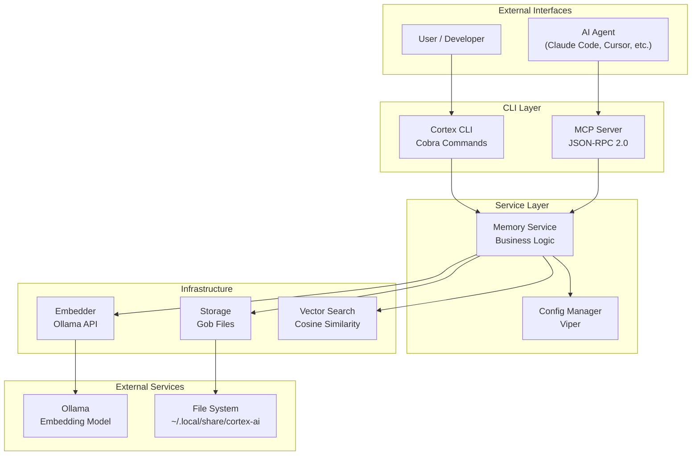

---

## Component Details

### CLI Layer

The CLI layer provides the user interface through Cobra commands.

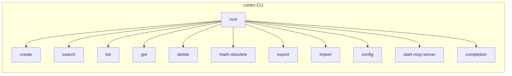

| Command | Purpose | Key Flags |
|---------|---------|-----------|
| `create` | Create a new memory | `--title`, `--type`, `--content`, `--tags` |
| `search` | Semantic search | `--top`, `--min-score`, `--type` |
| `list` | List all memories | `--type`, `--include-obsolete` |
| `get` | Get memory by ID | - |
| `delete` | Delete a memory | - |
| `mark-obsolete` | Soft delete | - |
| `export` | Export to Markdown | `--all`, `--intent`, `--output` |
| `import` | Import from Markdown | `--force`, `--dry-run` |
| `config` | View/edit config | `--show`, `--edit` |
| `start-mcp-server` | Start MCP server | - |
| `completion` | Generate shell completions | `bash`, `zsh`, `fish` |

### Memory Service

The Memory Service (`internal/memory/service.go`) is the core business logic layer.

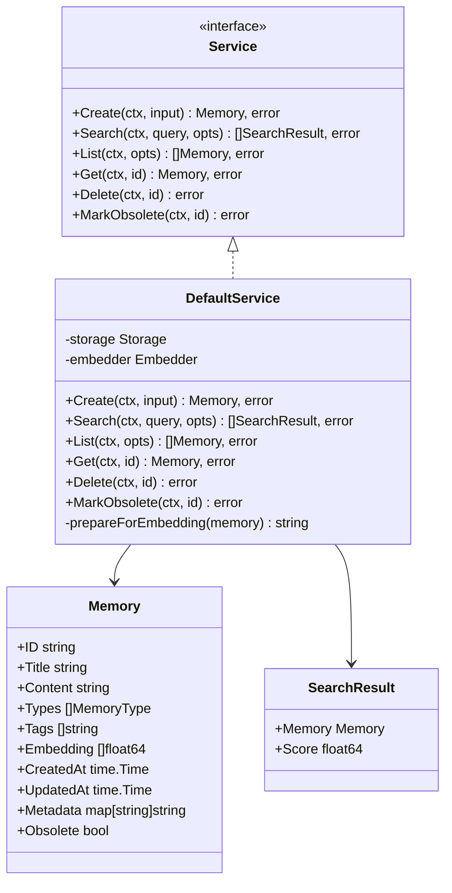

### Memory Types

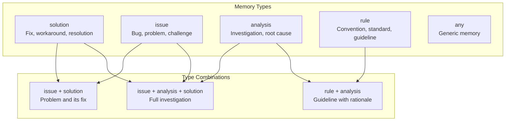

### Embedding System

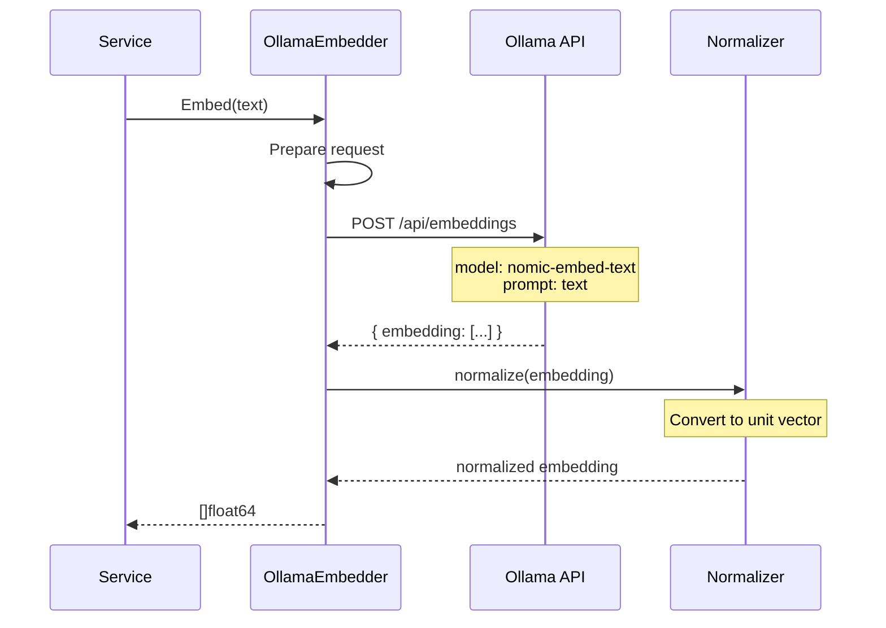

### Storage Layer

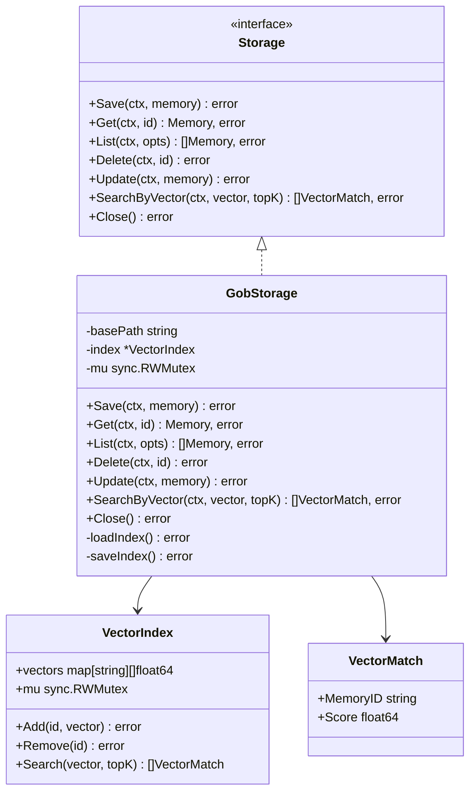

### File System Layout

```
~/.local/share/cortex-ai/
├── memories/
│   ├── <uuid-1>.gob      # Serialized Memory struct
│   ├── <uuid-2>.gob
│   └── ...
└── index.gob              # Serialized VectorIndex
```

### MCP Server

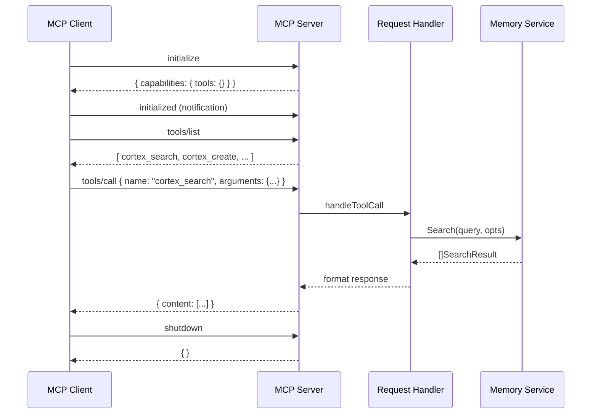

---

## Data Flow

### Create Memory Flow

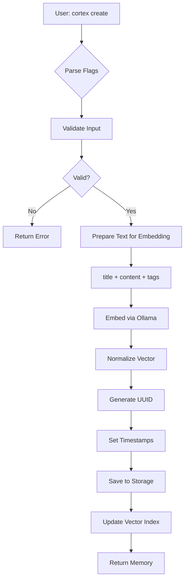

### Search Memory Flow

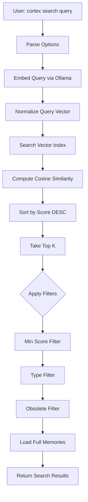

### Export Flow

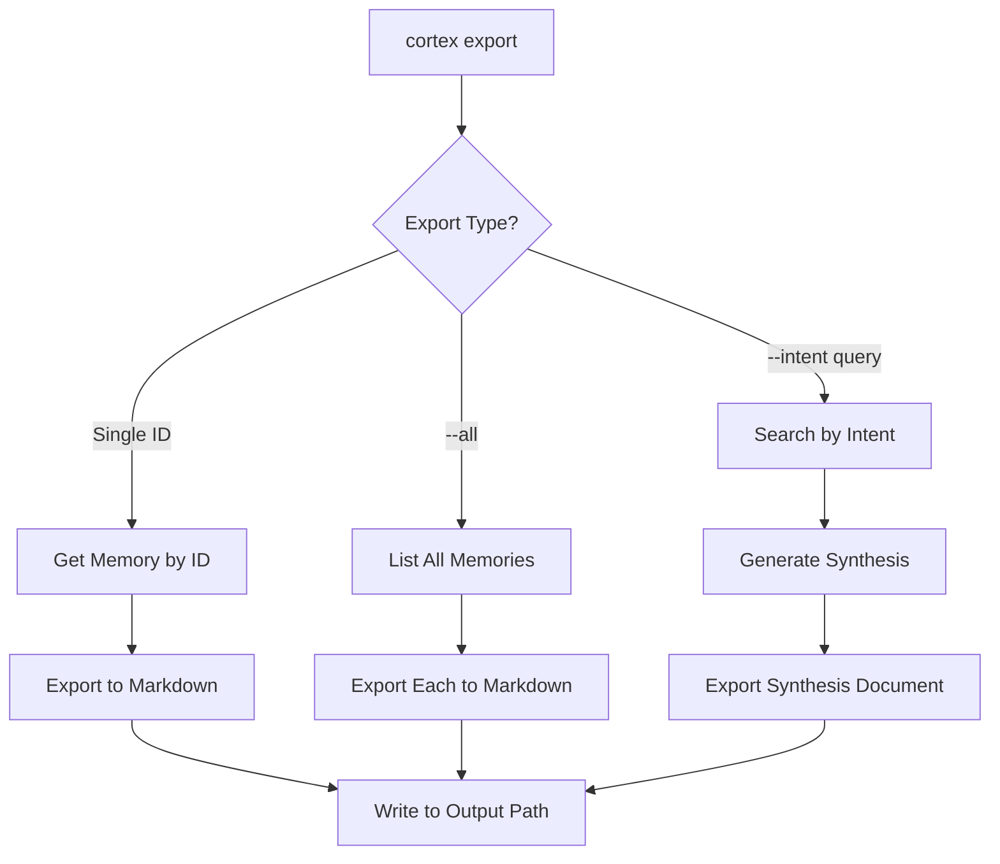

### Import Flow

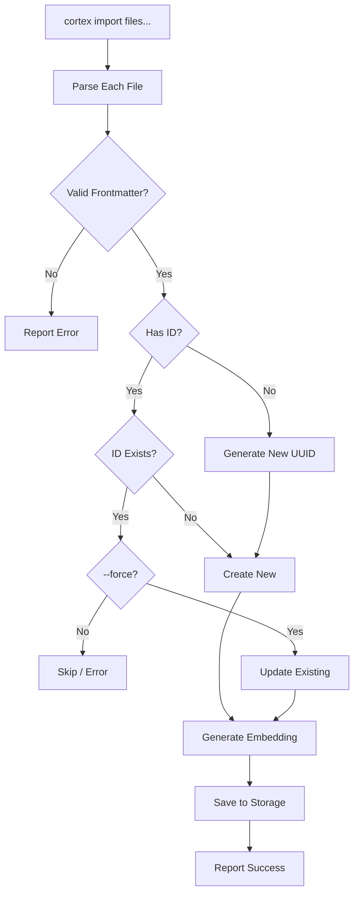

---

## Package Structure

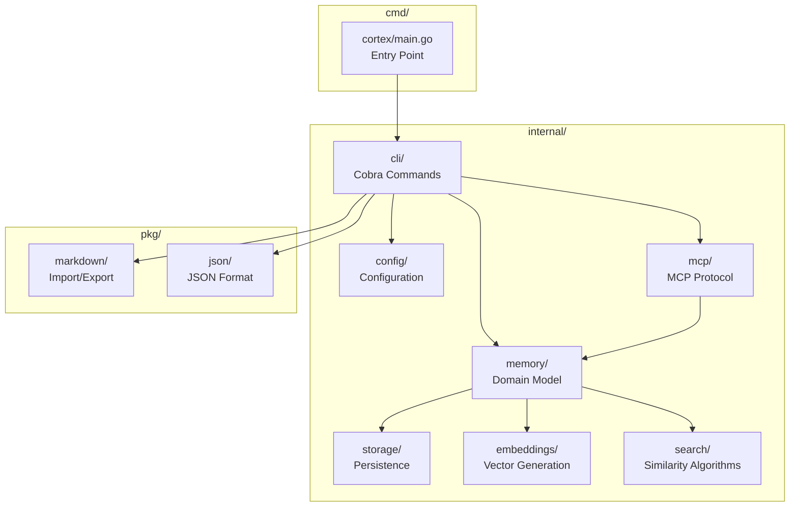

### Package Dependencies

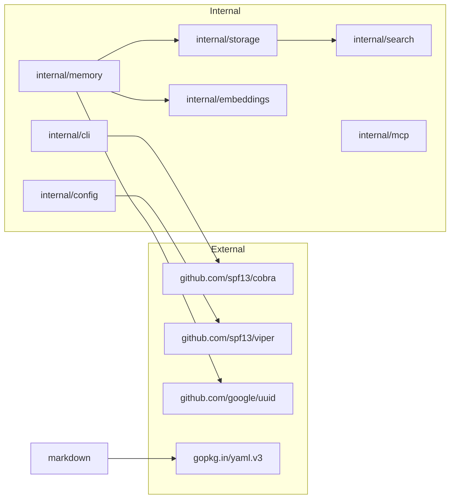

---

## Design Patterns

### Repository Pattern
Storage interface abstracts the persistence mechanism.

```go
type Storage interface {
    Save(ctx context.Context, memory *Memory) error
    Get(ctx context.Context, id string) (*Memory, error)
    // ...
}
```

### Service Layer Pattern
MemoryService encapsulates business logic and coordinates dependencies.

### Dependency Injection
Constructor-based DI for testability.

```go
func NewService(storage Storage, embedder Embedder) *DefaultService {
    return &DefaultService{
        storage:  storage,
        embedder: embedder,
    }
}
```

### Strategy Pattern
Pluggable storage backends and embedding providers.

### Command Pattern
Cobra commands as command objects with standardized execution.

---

## Technical Decisions

### Why Gob Storage?

| Advantage | Description |
|-----------|-------------|
| Zero dependencies | No external database required |
| Fast serialization | Native Go binary encoding |
| Simple backup | Just copy files |
| Version control | Can track memory files in git |

### Why Ollama?

| Advantage | Description |
|-----------|-------------|
| Privacy | All data stays local |
| Free | No API costs |
| Fast | Local inference |
| Offline | Works without internet |

### Why Cosine Similarity?

| Advantage | Description |
|-----------|-------------|
| Standard | Industry standard for text embeddings |
| Normalized | Independent of vector magnitude |
| Efficient | Simple dot product computation |
| Range | Clear 0-1 similarity range |

---

## Related Documentation

- [README.md](../README.md) - Getting started guide
- [CONFIGURATION.md](./CONFIGURATION.md) - Configuration reference
- [MCP.md](./MCP.md) - MCP integration guide
- [CONTRIBUTING.md](./CONTRIBUTING.md) - Contribution guidelines
