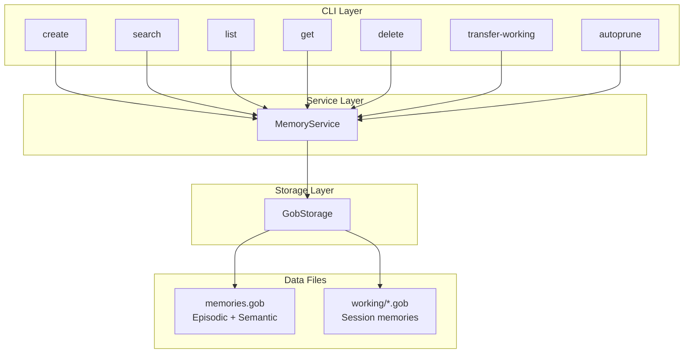
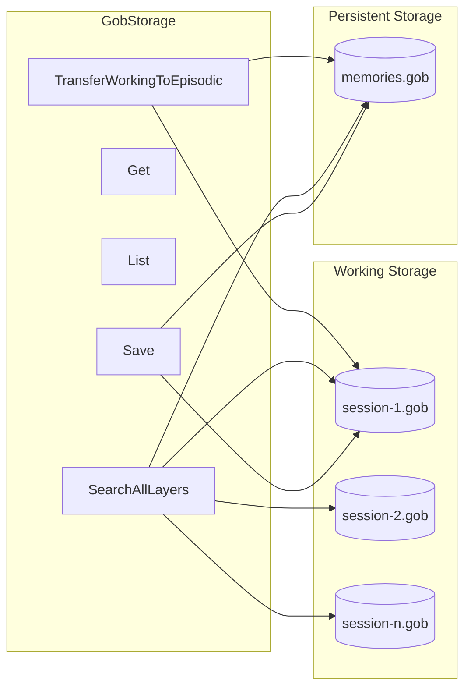

# Cortex - Architecture

## System Overview

```mermaid
graph TB
    subgraph "CLI Layer"
        CREATE[create]
        SEARCH[search]
        LIST[list]
        GET[get]
        DELETE[delete]
        TRANSFER[transfer-working]
        PRUNE[autoprune]
    end

    subgraph "Service Layer"
        MS[MemoryService]
    end

    subgraph "Storage Layer"
        GS[GobStorage]
    end

    subgraph "Data Files"
        PERS[memories.gob<br/>Episodic + Semantic]
        WORK[working/*.gob<br/>Session memories]
    end

    CREATE --> MS
    SEARCH --> MS
    LIST --> MS
    GET --> MS
    DELETE --> MS
    TRANSFER --> MS
    PRUNE --> MS

    MS --> GS
    GS --> PERS
    GS --> WORK
```

## Storage Architecture

```mermaid
graph LR
    subgraph "GobStorage"
        direction TB
        SAVE[Save]
        GET[Get]
        LIST[List]
        SEARCH[SearchAllLayers]
        TRANSFER[TransferWorkingToEpisodic]
    end

    subgraph "Persistent Storage"
        PERS[(memories.gob)]
    end

    subgraph "Working Storage"
        W1[(session-1.gob)]
        W2[(session-2.gob)]
        W3[(session-n.gob)]
    end

    SAVE --> PERS
    SAVE --> W1
    SEARCH --> PERS
    SEARCH --> W1 & W2 & W3
    TRANSFER --> W1
    TRANSFER --> PERS
```
