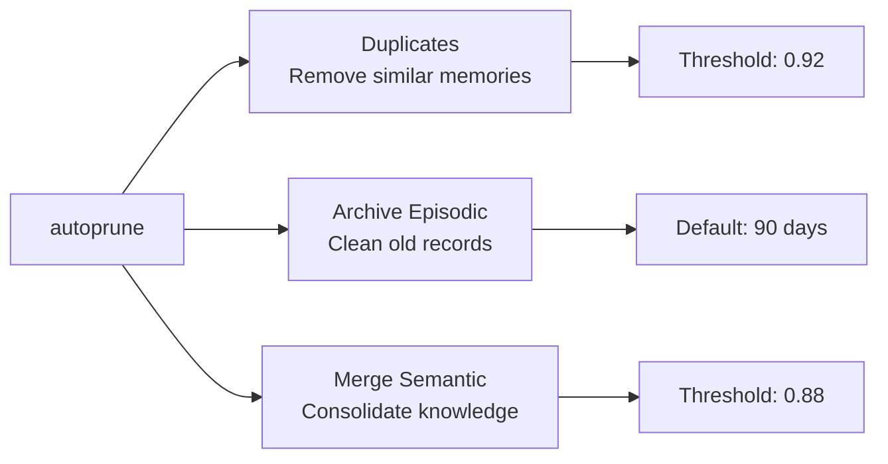

# Cortex - CLI Reference

Complete reference for all Cortex command-line commands.

## Table of Contents

- [Global Flags](#global-flags)
- [create](#create)
- [search](#search)
- [list](#list)
- [get](#get)
- [delete](#delete)
- [mark-obsolete](#mark-obsolete)
- [export](#export)
- [import](#import)
- [config](#config)
- [start-mcp-server](#start-mcp-server)
- [completion](#completion)
- [consolidate](#consolidate)
- [list-consolidated](#list-consolidated)
- [transfer-working](#transfer-working)
- [autoprune](#autoprune)

---

## Global Flags

These flags apply to all commands:

| Flag | Description |
|------|-------------|
| `--help, -h` | Show help message |
| `--version, -v` | Show version |

---

## create

Create a new memory with title, type, and content.

**Usage:**
```bash
cortex create --title "..." --type <type> --content "..."
```

**Required Flags:**
- `--title, -t <string>` - Memory title
- `--type <type>` - Memory type (solution, issue, analysis, rule, any)
- `--content, -c <string>` - Memory content

**Optional Flags:**
- `--tags <tags>` - Comma-separated tags (e.g., `jwt,security,auth`)
- `--metadata <key=value>` - Metadata key-value pairs (repeatable)

**Examples:**
```bash
# Basic creation
cortex create --title "JWT Fix" --type solution --content "Use refresh tokens..."

# With tags
cortex create --title "JWT Bug" --type issue --content "Auth failing" --tags "jwt,security"

# Multiple types (comma-separated)
cortex create --title "Analysis" --type issue,solution,analysis --content "..."

# With metadata
cortex create --title "..." --type solution --content "..." \
  --metadata project=api-gateway \
  --metadata sprint=Q1
```

---

## search

Search memories semantically by meaning.

**Usage:**
```bash
cortex search "<query>" [flags]
```

**Positional Arguments:**
- Query string (natural language)

**Optional Flags:**
- `--top, -n <int>` - Top K results (default: 5)
- `--min-score <float>` - Minimum similarity score 0-1 (default: 0.5)
- `--type <type>` - Filter by type (solution, issue, analysis, rule, any)
- `--include-obsolete` - Include soft-deleted memories
- `--format <format>` - Output format: text, json (default: text)

**Examples:**
```bash
# Basic search
cortex search "authentication issues"

# With options
cortex search "database optimization" --top 10 --min-score 0.7

# Filter by type
cortex search "memory leaks" --type analysis

# JSON output
cortex search "api design" --format json

# Include obsolete
cortex search "deprecated patterns" --include-obsolete
```

---

## list

List all memories with optional filtering.

**Usage:**
```bash
cortex list [flags]
```

**Optional Flags:**
- `--type <type>` - Filter by type
- `--include-obsolete` - Include soft-deleted memories
- `--limit <int>` - Limit number of results
- `--format <format>` - Output format: text, json (default: text)
- `--sort <field>` - Sort by: id, title, created, updated (default: created)
- `--reverse` - Reverse sort order

**Examples:**
```bash
# List all
cortex list

# Filter by type
cortex list --type rule

# Limit results
cortex list --limit 20

# Sort by title
cortex list --sort title --reverse

# JSON output
cortex list --format json
```

---

## get

Get a specific memory by ID.

**Usage:**
```bash
cortex get <memory-id> [flags]
```

**Positional Arguments:**
- Memory ID (UUID)

**Optional Flags:**
- `--json` - Output as JSON

**Examples:**
```bash
# Get by ID
cortex get a1b2c3d4-e5f6-7890-abcd-ef1234567890

# JSON output
cortex get a1b2c3d4-e5f6-7890-abcd-ef1234567890 --json
```

---

## delete

Permanently delete a memory.

**Usage:**
```bash
cortex delete <memory-id>
```

**Positional Arguments:**
- Memory ID (UUID)

**Examples:**
```bash
cortex delete a1b2c3d4-e5f6-7890-abcd-ef1234567890
```

---

## mark-obsolete

Soft delete a memory (mark as obsolete without permanent deletion).

**Usage:**
```bash
cortex mark-obsolete <memory-id>
```

**Positional Arguments:**
- Memory ID (UUID)

**Examples:**
```bash
cortex mark-obsolete a1b2c3d4-e5f6-7890-abcd-ef1234567890
```

---

## export

Export memories to Markdown format.

**Usage:**
```bash
cortex export [flags]
```

**Optional Flags:**
- `<memory-id>` - Export specific memory by ID
- `--all` - Export all memories
- `--intent <string>` - Generate synthesis by intent query
- `--output, -o <path>` - Output directory or file path
- `--type <type>` - Filter by type before export
- `--include-obsolete` - Include soft-deleted memories

**Examples:**
```bash
# Export single memory to file
cortex export a1b2c3d4-e5f6-7890-abcd-ef1234567890 --output memory.md

# Export all to directory
cortex export --all --output ./memories/

# Export synthesis by intent
cortex export --intent "authentication patterns" --output auth-guide.md

# Export specific type
cortex export --all --type solution --output ./solutions/
```

---

## import

Import memories from Markdown files.

**Usage:**
```bash
cortex import <files...> [flags]
```

**Positional Arguments:**
- One or more Markdown files to import

**Optional Flags:**
- `--force, -f` - Overwrite existing memories
- `--dry-run` - Validate without importing
- `--format <format>` - Input format: markdown (default: markdown)

**Examples:**
```bash
# Import single file
cortex import memory.md

# Import multiple files
cortex import memory1.md memory2.md memory3.md

# Import with glob pattern
cortex import ./memories/*.md

# Force overwrite
cortex import --force memory.md

# Validate without importing
cortex import --dry-run *.md
```

---

## config

View and manage configuration.

**Usage:**
```bash
cortex config [flags]
cortex config <subcommand>
```

**Subcommands:**
- `init` - Create default configuration file
- `path` - Show configuration file path
- `get <key>` - Get a configuration value
- `schema <type>` - Show or export JSON schema for templates
- `template validate <file>` - Validate a custom template file

**Optional Flags:**
- `--output <format>` - Output format (yaml, json, text)

**Examples:**
```bash
# Show current config
cortex config

# Show config as JSON
cortex config --output json

# Show config path
cortex config path

# Get specific value
cortex config get embeddings.model

# Create default config file
cortex config init
```

### config schema

Display or export JSON schema for configuration templates.

**Usage:**
```bash
cortex config schema <type> [flags]
```

**Arguments:**
- `markdown` - Markdown export template schema

**Flags:**
- `-o, --output <file>` - Export schema to file

**Examples:**
```bash
# Display schema
cortex config schema markdown

# Export schema to file
cortex config schema markdown -o markdown-template.schema.json
```

### config template validate

Validate a custom template configuration file against the schema.

**Usage:**
```bash
cortex config template validate <file>
```

**Arguments:**
- File path (JSON or YAML format)

**Validation checks:**
- File format (JSON/YAML syntax)
- Schema structure compliance
- Go template syntax validity
- Configuration value constraints

**Examples:**
```bash
# Validate JSON template
cortex config template validate my-template.json

# Validate YAML template
cortex config template validate my-template.yaml
```

---

## start-mcp-server

Start the MCP (Model Context Protocol) server.

**Usage:**
```bash
cortex start-mcp-server [flags]
```

**Optional Flags:**
- `--transport <transport>` - Transport mode: stdio, sse (default: stdio)
- `--address <addr>` - Server address for SSE transport (default: :8080)
- `--log <level>` - Log level: debug, info, warn, error (default: info)

**Examples:**
```bash
# Start with stdio (default)
cortex start-mcp-server

# Start with SSE on custom port
cortex start-mcp-server --transport sse --address :9000

# Enable debug logging
cortex start-mcp-server --log debug
```

---

## completion

Generate shell completion scripts.

**Usage:**
```bash
cortex completion <shell> [flags]
```

**Supported Shells:**
- `bash` - Bash completion
- `zsh` - Zsh completion
- `fish` - Fish completion

**Examples:**
```bash
# Bash completion (add to ~/.bashrc)
cortex completion bash >> ~/.bashrc

# Zsh completion (add to ~/.zshrc)
cortex completion zsh >> ~/.zshrc

# Fish completion (add to ~/.config/fish/completions)
cortex completion fish > ~/.config/fish/completions/cortex.fish
```

---

## consolidate

Consolidate information into the multi-level memory system.

**Usage:**
```bash
cortex consolidate --level <level> --content "..."
```

**Required Flags:**
- `--level, -l <level>` - Memory level: working, episodic, semantic
- `--content <string>` - Content to consolidate

**Optional Flags:**
- `--session <string>` - Session ID (auto-generated if not provided)
- `--tags <tags>` - Comma-separated tags
- `--source <source>` - Source: manual, auto, llm (default: manual)
- `--context <json>` - Additional context as JSON
- `--force, -f` - Bypass duplicate detection
- `--output, -o <format>` - Output format: text, json (default: text)

**Examples:**
```bash
# Working memory for current session
cortex consolidate --level working --session "dev-session" \
  --content "Currently debugging auth timeout issue"

# Episodic memory with tags
cortex consolidate --level episodic \
  --content "Fixed race condition in auth middleware" \
  --tags "bugfix,auth,concurrency"

# Semantic memory (permanent knowledge)
cortex consolidate --level semantic \
  --content "All database queries must use context with timeout"

# Force create (skip duplicate check)
cortex consolidate --level episodic --force \
  --content "Another approach to the same problem"

# With full context JSON
cortex consolidate --level episodic \
  --content "Deployment completed" \
  --context '{"task_id": "TASK-123", "author": "ci-bot"}'
```

---

## list-consolidated

List consolidated memories filtered by level.

**Usage:**
```bash
cortex list-consolidated [flags]
```

**Optional Flags:**
- `--level, -l <level>` - Filter by level: working, episodic, semantic
- `--output, -o <format>` - Output format: text, json (default: text)

**Examples:**
```bash
# List all consolidated memories
cortex list-consolidated

# List only working memories
cortex list-consolidated --level working

# List episodic as JSON
cortex list-consolidated --level episodic --output json

# List semantic memories
cortex list-consolidated --level semantic
```

---

## transfer-working

Transfer working memories from a session to episodic level.

**Usage:**
```bash
cortex transfer-working --session <session-id>
```

**Required Flags:**
- `--session <string>` - Session ID to transfer

**Optional Flags:**
- `--output, -o <format>` - Output format: text, json (default: text)

**Examples:**
```bash
# Transfer session memories to episodic
cortex transfer-working --session "dev-session-2024"

# JSON output
cortex transfer-working --session "my-session" --output json
```

---

## autoprune

Clean and optimize the consolidated memory database.

**Usage:**
```bash
cortex autoprune [flags]
```

**Optional Flags:**
- `--duplicates` - Remove duplicate memories (similarity >= 0.92)
- `--archive-episodic` - Archive old episodic memories
- `--merge-semantic` - Merge similar semantic memories (similarity >= 0.88)
- `--older-than <duration>` - Age threshold for archiving (default: 90d)
- `--dry-run` - Preview changes without executing
- `--output, -o <format>` - Output format: text, json (default: text)

**Note:** If no operation flags are specified, all operations are performed.

**Examples:**
```bash
# Preview all cleanup operations
cortex autoprune --dry-run

# Run all cleanup operations
cortex autoprune

# Only remove duplicates
cortex autoprune --duplicates

# Archive episodic older than 30 days
cortex autoprune --archive-episodic --older-than 30d

# Merge similar semantic memories
cortex autoprune --merge-semantic

# Full cleanup with specific retention
cortex autoprune --duplicates --archive-episodic --merge-semantic --older-than 60d
```

**Autoprune Operations:**



---

## Environment Variables

All configuration can be set via environment variables with `CORTEX_` prefix:

```bash
CORTEX_STORAGE_BACKEND=gob
CORTEX_STORAGE_PATH=~/.local/share/cortex-ai

CORTEX_EMBEDDINGS_PROVIDER=ollama
CORTEX_EMBEDDINGS_MODEL=nomic-embed-text
CORTEX_EMBEDDINGS_ENDPOINT=http://localhost:11434

CORTEX_SEARCH_TOP_K=5
CORTEX_SEARCH_MIN_SCORE=0.5
CORTEX_SEARCH_INCLUDE_OBSOLETE=false

CORTEX_OUTPUT_FORMAT=text
CORTEX_OUTPUT_COLORS=true
```

---

## Related Documentation

- [CONFIGURATION.md](./CONFIGURATION.md) - Configuration reference
- [MARKDOWN_FORMAT.md](./MARKDOWN_FORMAT.md) - Markdown format specification
- [README.md](../README.md) - Quick start guide
