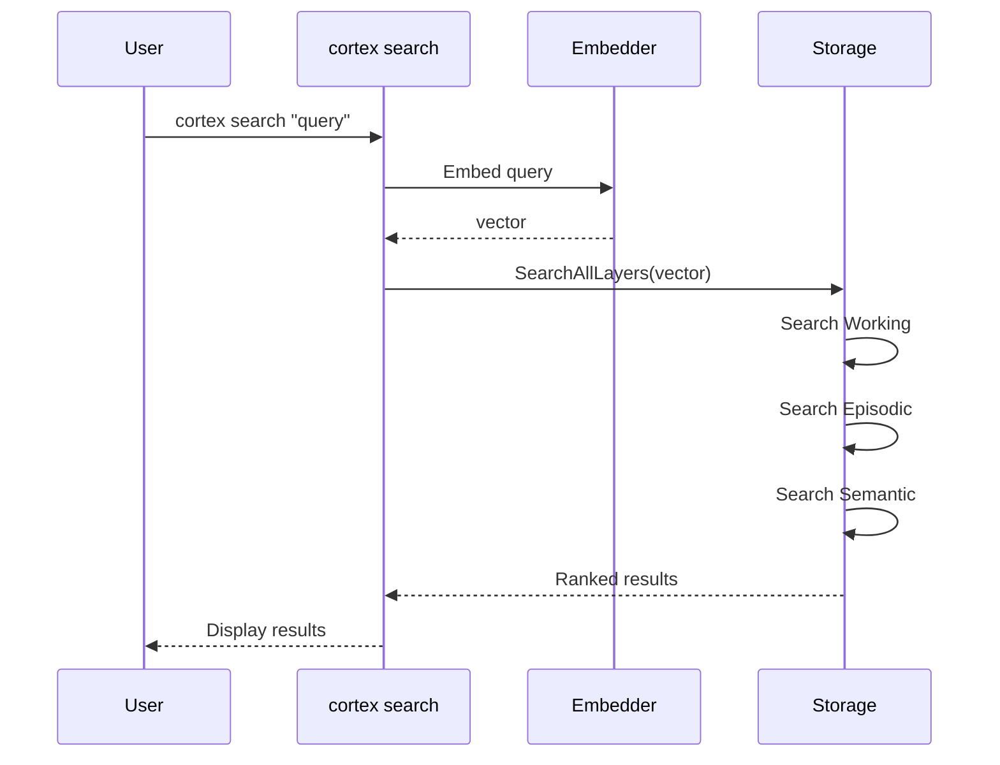

# Cortex - CLI Reference

## search

Search memories semantically across all layers.



**Usage:**
```bash
cortex search "<query>" [flags]
```

**Flags:**
| Flag | Description |
|------|-------------|
| `--top, -n <int>` | Top K results (default: 5) |
| `--min-score <float>` | Minimum similarity 0-1 (default: 0.5) |
| `--level, -l <levels>` | Filter by level(s): working,episodic,semantic |
| `--session <id>` | Filter working by session ID |
| `--include-obsolete` | Include soft-deleted memories |
| `--json` | Output as JSON |

**Examples:**
```bash
# Search all layers
cortex search "authentication issues"

# Search only semantic layer
cortex search "coding conventions" --level semantic

# Search episodic and semantic
cortex search "bug fixes" --level episodic,semantic

# Search working memories for session
cortex search "current task" --level working --session dev-123
```

---

## create

Create a new memory.

**Usage:**
```bash
cortex create --title "..." --level <level> --content "..."
```

**Required Flags:**
| Flag | Description |
|------|-------------|
| `--title, -t <string>` | Memory title (min 3 chars) |
| `--content, -c <string>` | Memory content (min 10 chars) |
| `--level, -l <level>` | Memory level: working, episodic, semantic |

**Optional Flags:**
| Flag | Description |
|------|-------------|
| `--session <id>` | Session ID (required for working level) |
| `--tags <tags>` | Comma-separated tags |
| `--source <source>` | Source: manual, auto, llm (default: manual) |
| `--json` | Output as JSON |

---

## list

List memories with optional filtering.

**Usage:**
```bash
cortex list [flags]
```

**Flags:**
| Flag | Description |
|------|-------------|
| `--level, -l <levels>` | Filter by level(s) |
| `--limit <int>` | Limit number of results |
| `--include-obsolete` | Include soft-deleted |
| `--reverse` | Reverse sort order |
| `--json` | Output as JSON |
