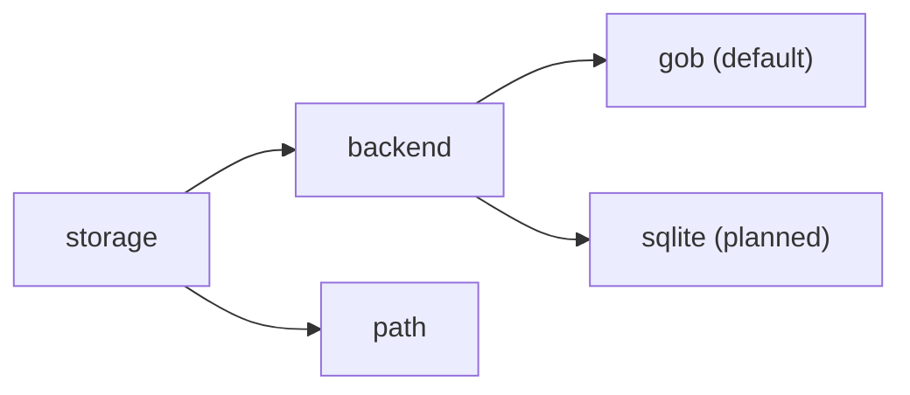
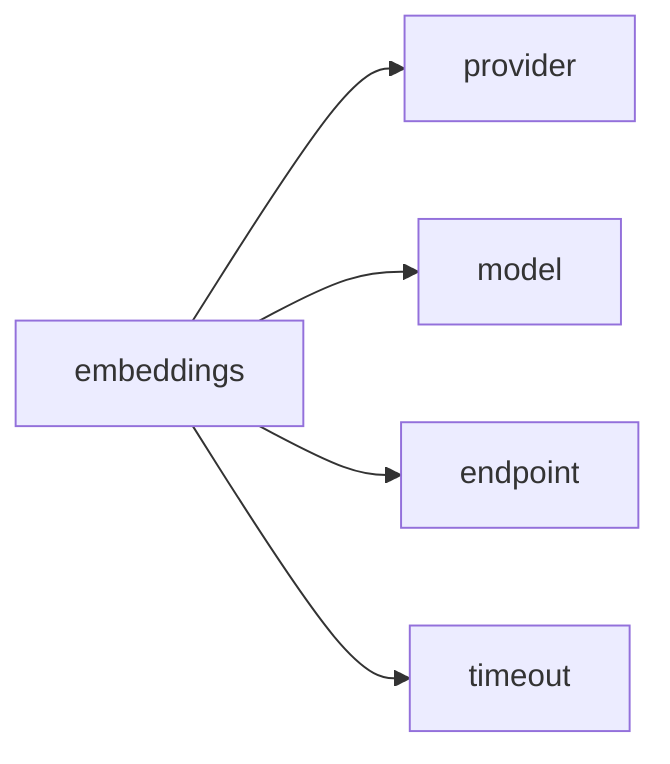
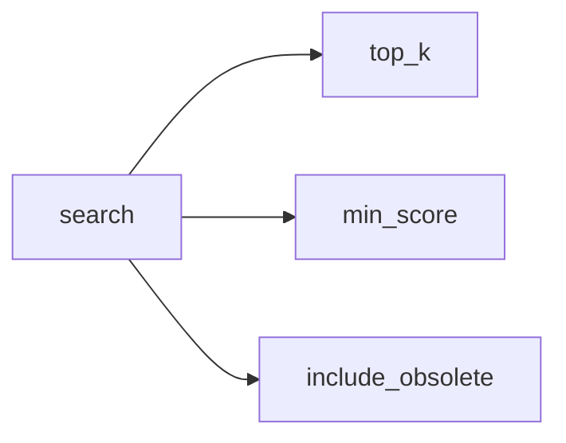
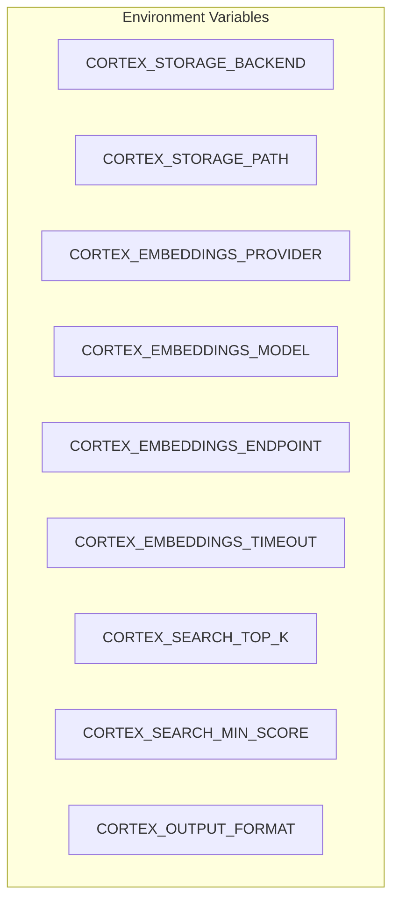
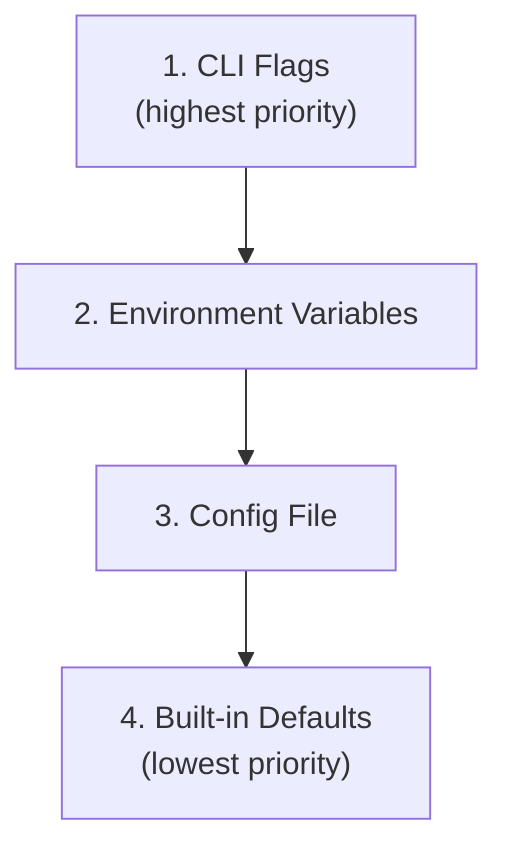

# Cortex - Configuration Reference

This document provides a complete reference for configuring Cortex.

## Table of Contents

- [Configuration File](#configuration-file)
- [Configuration Options](#configuration-options)
- [Environment Variables](#environment-variables)
- [CLI Flags](#cli-flags)
- [Priority Order](#priority-order)
- [Examples](#examples)

---

## Configuration File

The default configuration file location is:

```
~/.config/cortex-ai/config.yaml
```

### Default Configuration

```yaml
storage:
  backend: gob
  path: ~/.local/share/cortex-ai

embeddings:
  provider: ollama
  model: nomic-embed-text
  endpoint: http://localhost:11434
  timeout: 30s

search:
  top_k: 5
  min_score: 0.5
  include_obsolete: false

output:
  format: text
  colors: true
```

---

## Configuration Options

### Storage Section



| Option | Type | Default | Description |
|--------|------|---------|-------------|
| `storage.backend` | string | `gob` | Storage backend to use (`gob` or `sqlite`) |
| `storage.path` | string | `~/.local/share/cortex-ai` | Directory for storing memories |

### Embeddings Section



| Option | Type | Default | Description |
|--------|------|---------|-------------|
| `embeddings.provider` | string | `ollama` | Embedding provider |
| `embeddings.model` | string | `nomic-embed-text` | Embedding model name |
| `embeddings.endpoint` | string | `http://localhost:11434` | API endpoint URL |
| `embeddings.timeout` | duration | `30s` | Request timeout |

#### Recommended Embedding Models

| Model | Dimensions | Speed | Quality | Notes |
|-------|------------|-------|---------|-------|
| `nomic-embed-text` | 768 | Fast | Good | Default, balanced |
| `mxbai-embed-large` | 1024 | Medium | Better | Higher quality |
| `all-minilm` | 384 | Very Fast | Fair | Lightweight |

### Search Section



| Option | Type | Default | Description |
|--------|------|---------|-------------|
| `search.top_k` | integer | `5` | Maximum number of results |
| `search.min_score` | float | `0.5` | Minimum similarity score (0.0-1.0) |
| `search.include_obsolete` | boolean | `false` | Include obsolete memories in results |

### Output Section

| Option | Type | Default | Description |
|--------|------|---------|-------------|
| `output.format` | string | `text` | Output format (`text` or `json`) |
| `output.colors` | boolean | `true` | Enable colored output |

### Templates Section

The templates section allows customization of Markdown export templates.

```yaml
templates:
  markdown:
    memory:
      frontmatter:
        include_id: true
        include_dates: true
        include_metadata: true
        date_format: "2006-01-02T15:04:05Z07:00"
      body: "{{.Content}}"
    synthesis:
      header: "# {{.Intent | title}} - Synthesis\n\nThis document synthesizes {{len .Results}} memories."
      summary_section:
        title: "## Summary"
        content: "Based on the stored memories, the following information was found:"
      learnings_section:
        title: "## Key Learnings"
        item_template: "### From: {{.Title}} (score: {{printf \"%.2f\" .Score}})\n\n{{.Preview}}"
        content_preview_length: 500
      footer: "---\n\n*Generated by Cortex*"
```

#### Template Variables

**Memory templates:**
- `{{.Content}}` - Memory content
- `{{.Title}}` - Memory title
- `{{.Types}}` - Memory types array
- `{{.Tags}}` - Memory tags array
- `{{.CreatedAt}}` - Creation timestamp
- `{{.UpdatedAt}}` - Update timestamp

**Synthesis templates:**
- `{{.Intent}}` - Search query/intent
- `{{len .Results}}` - Number of results
- `{{.Title}}` - Memory title (in item template)
- `{{.Score}}` - Similarity score (in item template)
- `{{.Preview}}` - Content preview (in item template)

#### Template Functions

- `title` - Convert string to Title Case

#### JSON Schema

Export the JSON schema for reference:

```bash
cortex config schema markdown -o markdown-template.schema.json
```

#### Validation

Validate custom template files before use:

```bash
cortex config template validate my-template.yaml
```

---

## Environment Variables

All configuration options can be set via environment variables using the `CORTEX_` prefix:



| Environment Variable | Config Equivalent |
|---------------------|-------------------|
| `CORTEX_STORAGE_BACKEND` | `storage.backend` |
| `CORTEX_STORAGE_PATH` | `storage.path` |
| `CORTEX_EMBEDDINGS_PROVIDER` | `embeddings.provider` |
| `CORTEX_EMBEDDINGS_MODEL` | `embeddings.model` |
| `CORTEX_EMBEDDINGS_ENDPOINT` | `embeddings.endpoint` |
| `CORTEX_EMBEDDINGS_TIMEOUT` | `embeddings.timeout` |
| `CORTEX_SEARCH_TOP_K` | `search.top_k` |
| `CORTEX_SEARCH_MIN_SCORE` | `search.min_score` |
| `CORTEX_SEARCH_INCLUDE_OBSOLETE` | `search.include_obsolete` |
| `CORTEX_OUTPUT_FORMAT` | `output.format` |
| `CORTEX_OUTPUT_COLORS` | `output.colors` |

### Example

```bash
# Set custom endpoint and model
export CORTEX_EMBEDDINGS_ENDPOINT=http://192.168.1.100:11434
export CORTEX_EMBEDDINGS_MODEL=mxbai-embed-large

# Run cortex with environment configuration
cortex search "authentication issues"
```

---

## CLI Flags

### Global Flags

| Flag | Short | Description |
|------|-------|-------------|
| `--config` | `-c` | Path to config file |
| `--storage` | | Storage backend override |
| `--output` | `-o` | Output format (`text` or `json`) |

### Command-Specific Flags

#### `cortex create`

| Flag | Short | Required | Description |
|------|-------|----------|-------------|
| `--title` | `-t` | Yes | Memory title |
| `--type` | | Yes | Memory type(s), comma-separated |
| `--content` | `-c` | Yes | Memory content |
| `--tags` | | No | Tags, comma-separated |

#### `cortex search`

| Flag | Short | Default | Description |
|------|-------|---------|-------------|
| `--top` | `-n` | 5 | Maximum results |
| `--min-score` | | 0.5 | Minimum similarity score |
| `--type` | | | Filter by memory type |

#### `cortex list`

| Flag | Short | Default | Description |
|------|-------|---------|-------------|
| `--type` | | | Filter by memory type |
| `--include-obsolete` | | false | Include obsolete memories |

#### `cortex export`

| Flag | Short | Description |
|------|-------|-------------|
| `--output` | `-o` | Output directory or file |
| `--all` | | Export all memories |
| `--intent` | | Export synthesis by intent |

#### `cortex import`

| Flag | Short | Description |
|------|-------|-------------|
| `--force` | `-f` | Overwrite existing memories |
| `--dry-run` | | Validate without importing |

---

## Priority Order

Configuration values are resolved in the following order (highest priority first):



### Example Resolution

```bash
# Config file has: embeddings.model: nomic-embed-text
# Environment has: CORTEX_EMBEDDINGS_MODEL=mxbai-embed-large
# CLI has: (none)

# Result: mxbai-embed-large (from environment)
cortex create --title "Test" --type solution --content "..."

# But if CLI flag is used:
# Result: all-minilm (from CLI flag)
cortex create --title "Test" --type solution --content "..." --model all-minilm
```

---

## Examples

### Minimal Configuration

```yaml
# Only override what you need
embeddings:
  model: mxbai-embed-large
```

### Development Configuration

```yaml
storage:
  backend: gob
  path: ./data/cortex-dev

embeddings:
  provider: ollama
  model: nomic-embed-text
  endpoint: http://localhost:11434
  timeout: 60s

search:
  top_k: 10
  min_score: 0.3
  include_obsolete: true

output:
  format: json
  colors: false
```

### Production Configuration

```yaml
storage:
  backend: gob
  path: /var/lib/cortex-ai

embeddings:
  provider: ollama
  model: mxbai-embed-large
  endpoint: http://ollama-server:11434
  timeout: 30s

search:
  top_k: 5
  min_score: 0.6
  include_obsolete: false

output:
  format: text
  colors: true
```

### Docker Configuration

```yaml
storage:
  backend: gob
  path: /data

embeddings:
  provider: ollama
  model: nomic-embed-text
  endpoint: http://host.docker.internal:11434
  timeout: 30s
```

---

## Managing Configuration

### View Current Configuration

```bash
cortex config --show
```

### Edit Configuration

```bash
cortex config --edit
```

This opens the config file in your default editor (`$EDITOR` or `vim`).

### Reset to Defaults

```bash
rm ~/.config/cortex-ai/config.yaml
cortex config --show  # Will use defaults
```

---

## Related Documentation

- [README.md](../README.md) - Getting started guide
- [ARCHITECTURE.md](./ARCHITECTURE.md) - System architecture
- [MCP.md](./MCP.md) - MCP integration
