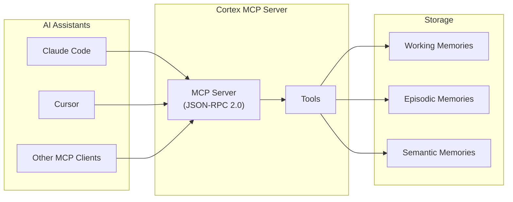
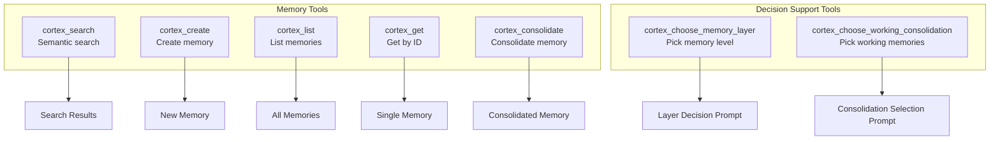
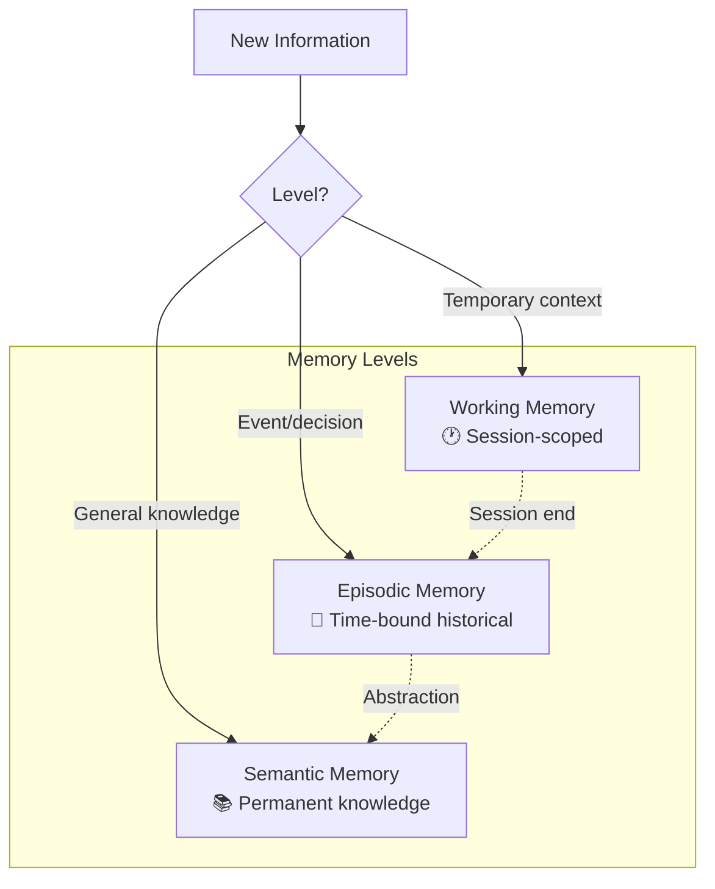
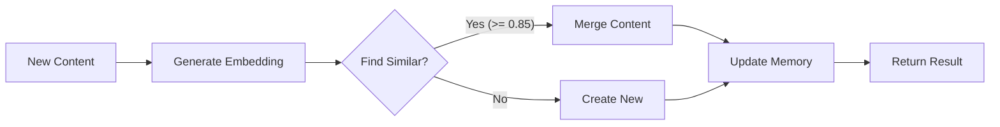
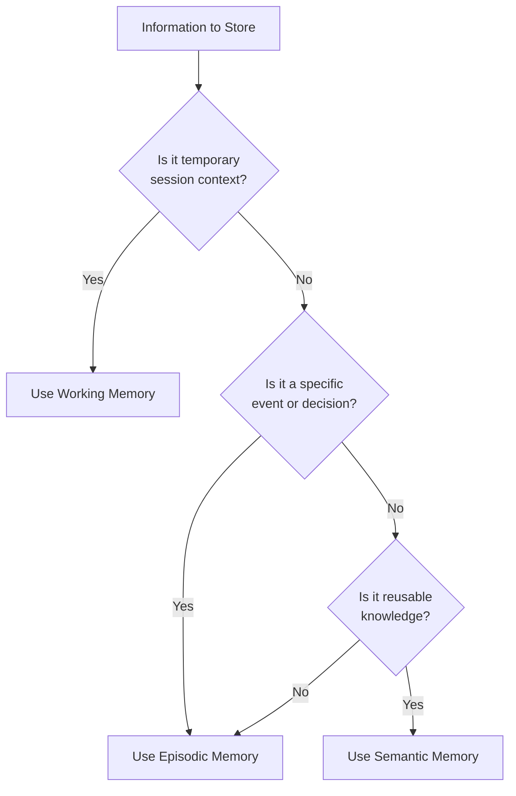

# Cortex - MCP Integration

This document describes how to integrate Cortex with MCP-compatible tools like Claude Code and Cursor.

## Overview

Cortex provides an MCP (Model Context Protocol) server that exposes memory operations as tools. This allows AI assistants to:

- Search for relevant memories semantically
- Create new memories to store solutions, issues, and analyses
- List and retrieve existing memories
- Consolidate information into multi-level memory system



## Installation

Build and install Cortex:

```bash
make build
# or
make install
```

The MCP server is available as a subcommand: `cortex start-mcp-server`

## Transport Modes

The MCP server supports two transport modes:

| Transport | Description | Use Case |
|-----------|-------------|----------|
| `stdio` | Communication via stdin/stdout | CLI integrations (default) |
| `sse` | Server-Sent Events over HTTP | Web integrations, remote access |

### Stdio Transport (Default)

The stdio transport communicates via standard input/output streams. This is the default mode used by CLI tools like Claude Code and Cursor.

```bash
cortex start-mcp-server
# or explicitly:
cortex start-mcp-server --transport stdio
```

### SSE Transport

The SSE (Server-Sent Events) transport runs an HTTP server for web-based integrations.

```bash
cortex start-mcp-server --transport sse --address :8080
```

**Endpoints:**

| Endpoint | Method | Description |
|----------|--------|-------------|
| `/sse` | GET | SSE event stream for server messages |
| `/message?session_id=<id>` | POST | Send JSON-RPC requests to the server |
| `/health` | GET | Health check endpoint |

**Connection Flow:**

1. Client connects to `GET /sse` to establish the event stream
2. Server sends an `endpoint` event with the message URL including session ID
3. Client sends requests via `POST /message?session_id=<id>`
4. Server sends responses as `message` events on the SSE stream

**Example SSE Client (JavaScript):**

```javascript
const eventSource = new EventSource('http://localhost:8080/sse');
let messageEndpoint = '';

eventSource.addEventListener('endpoint', (e) => {
  messageEndpoint = e.data;
  console.log('Message endpoint:', messageEndpoint);
});

eventSource.addEventListener('message', (e) => {
  const response = JSON.parse(e.data);
  console.log('Response:', response);
});

// Send a request
async function sendRequest(method, params) {
  const response = await fetch(messageEndpoint, {
    method: 'POST',
    headers: { 'Content-Type': 'application/json' },
    body: JSON.stringify({
      jsonrpc: '2.0',
      id: Date.now(),
      method: method,
      params: params
    })
  });
  return response.json();
}
```

## CLI Configuration

### Claude Code

Add the following to your Claude Code MCP configuration (`~/.config/claude-code/mcp.json`):

```json
{
  "mcpServers": {
    "cortex": {
      "command": "cortex",
      "args": ["start-mcp-server"]
    }
  }
}
```

### Cursor

Add to your Cursor MCP settings:

```json
{
  "mcp": {
    "servers": {
      "cortex": {
        "command": "cortex",
        "args": ["start-mcp-server"]
      }
    }
  }
}
```

## Command-Line Flags

| Flag | Default | Description |
|------|---------|-------------|
| `--transport` | `stdio` | Transport mode: `stdio` or `sse` |
| `--address` | `:8080` | Address for SSE transport (e.g., `:8080` or `127.0.0.1:8080`) |

## Available Tools



| Tool | Purpose | Key Parameters |
|------|---------|----------------|
| `cortex_search` | Find memories by meaning | `query`, `top_k`, `min_score`, `level` |
| `cortex_create` | Create a memory in a layer | `title`, `content`, `level`, `tags` |
| `cortex_list` | List memories | `level`, `include_obsolete` |
| `cortex_get` | Get memory by ID | `id` |
| `cortex_consolidate` | Consolidate into a layer with dedup | `synthesis`, `memory_level`, `context` |
| `cortex_choose_memory_layer` | Provide a layer-selection prompt | `content`, `prompt` |
| `cortex_choose_working_consolidation` | Provide a consolidation-selection prompt | `working_memories`, `prompt` |

### cortex_search

Search memories using semantic similarity.

**Parameters:**
- `query` (required): The search query
- `top_k` (optional): Maximum results (default: 5)
- `min_score` (optional): Minimum similarity score 0-1 (default: 0.5)
- `level` (optional): Filter by memory level (working|episodic|semantic)

**Example:**
```json
{
  "name": "cortex_search",
  "arguments": {
    "query": "authentication error handling",
    "top_k": 3,
    "level": "semantic"
  }
}
```

### cortex_create

Create a new memory.

**Parameters:**
- `title` (required): Memory title
- `content` (required): Memory content (Markdown supported)
- `level` (required): Memory level (working|episodic|semantic)
- `tags` (optional): Array of tags for categorization

**Example:**
```json
{
  "name": "cortex_create",
  "arguments": {
    "title": "JWT Token Refresh Pattern",
    "content": "## Problem\nTokens expire...\n\n## Solution\nImplement refresh...",
    "level": "semantic",
    "tags": ["authentication", "jwt", "security"]
  }
}
```

### cortex_list

List all memories.

**Parameters:**
- `level` (optional): Filter by level
- `include_obsolete` (optional): Include obsolete memories (default: false)

**Example:**
```json
{
  "name": "cortex_list",
  "arguments": {
    "level": "episodic"
  }
}
```

### cortex_get

Get a specific memory by ID.

**Parameters:**
- `id` (required): The memory ID

**Example:**
```json
{
  "name": "cortex_get",
  "arguments": {
    "id": "550e8400-e29b-41d4-a716-446655440000"
  }
}
```

### cortex_consolidate

Consolidate information into the multi-level memory system. This tool enables AI assistants to store information at different memory levels based on its nature and intended persistence.



**Parameters:**
- `synthesis` (required): Content to consolidate
- `memory_level` (required): Memory level - `working`, `episodic`, or `semantic`
- `context` (optional): Context object with task/session/tags metadata
- `force` (optional): Bypass duplicate detection (default: false)

**Context Fields:**
- `session_id` (required for working level): Session identifier
- `task_id` (optional): Task identifier
- `timestamp` (optional): RFC3339 timestamp
- `author` (optional): Author or source
- `tags` (optional): Tags for categorization
- `source` (optional): Source of content - `manual`, `auto`, or `llm` (default: `llm`)
- `related_memories` (optional): Related memory IDs

**Memory Level Selection:**

| Level | When to Use | Retention |
|-------|-------------|-----------|
| `working` | Current session context, temporary notes | Until session ends |
| `episodic` | Events, decisions, incidents, meeting notes | Configurable (default 90 days) |
| `semantic` | Patterns, conventions, permanent knowledge | Permanent |

**Example - Working Memory:**
```json
{
  "name": "cortex_consolidate",
  "arguments": {
    "synthesis": "Currently investigating auth timeout in module X",
    "memory_level": "working",
    "context": {
      "session_id": "dev-session-2024-01-15",
      "tags": ["debugging", "auth"],
      "source": "llm"
    }
  }
}
```

**Example - Episodic Memory:**
```json
{
  "name": "cortex_consolidate",
  "arguments": {
    "synthesis": "Fixed race condition in auth middleware by adding mutex lock. Issue was caused by concurrent token refresh requests.",
    "memory_level": "episodic",
    "context": {
      "tags": ["bugfix", "auth", "concurrency"],
      "source": "llm"
    }
  }
}
```

**Example - Semantic Memory:**
```json
{
  "name": "cortex_consolidate",
  "arguments": {
    "synthesis": "All database queries must use context with timeout to enable proper cancellation and prevent hanging queries.",
    "memory_level": "semantic",
    "context": {
      "tags": ["convention", "database", "context"],
      "source": "llm"
    }
  }
}
```

**Response:**

The tool returns a result indicating whether a new memory was created or merged with an existing similar memory:

```json
{
  "action": "created",
  "memory_id": "550e8400-e29b-41d4-a716-446655440000",
  "level": "episodic",
  "message": "Memory consolidated successfully"
}
```

Or when merged with existing:

```json
{
  "action": "merged",
  "memory_id": "existing-memory-id",
  "level": "semantic",
  "similarity": 0.89,
  "message": "Content merged with existing similar memory"
}
```

**Duplicate Detection:**

The consolidation system automatically detects similar content (similarity threshold: 0.85) and merges it with existing memories to avoid redundancy. Use `force: true` to bypass this check.



### cortex_choose_memory_layer

Generate a bundled prompt to help select the correct memory layer for a new memory. Provide a custom prompt to override the bundled guidance.

**Parameters:**
- `content` (required): Memory content to classify
- `title` (optional): Memory title
- `tags` (optional): Tags
- `session_id` (optional): Session ID if working-level is likely
- `prompt` (optional): Custom prompt that replaces the bundled guidance

**Example:**
```json
{
  "name": "cortex_choose_memory_layer",
  "arguments": {
    "title": "Cache invalidation decision",
    "content": "We decided to expire cache entries after 10 minutes to reduce stale data.",
    "tags": ["cache", "decision"]
  }
}
```

### cortex_choose_working_consolidation

Generate a bundled prompt to help select which working memories should be consolidated. Provide a custom prompt to override the bundled guidance.

**Parameters:**
- `working_memories` (required): Working memory candidates to review
- `selection_goal` (optional): Optional focus for consolidation
- `prompt` (optional): Custom prompt that replaces the bundled guidance

**Example:**
```json
{
  "name": "cortex_choose_working_consolidation",
  "arguments": {
    "selection_goal": "Keep only completed decisions and outcomes.",
    "working_memories": [
      {
        "id": "mem-1",
        "title": "Investigating auth timeout",
        "content": "Hypothesis: retry logic missing in auth module."
      },
      {
        "id": "mem-2",
        "title": "Fix implemented",
        "content": "Added exponential backoff and jitter to auth retries."
      }
    ]
  }
}
```

## Environment Variables

**Storage:**
- `CORTEX_STORAGE_PATH`: Path to the storage directory (default: `~/.local/share/cortex-ai`)

**Embeddings:**
- `CORTEX_EMBEDDINGS_ENDPOINT`: Ollama endpoint (default: `http://localhost:11434`)
- `CORTEX_EMBEDDINGS_MODEL`: Embedding model (default: `nomic-embed-text`)

**Consolidation:**
- `CORTEX_CONSOLIDATION_SIMILARITY_THRESHOLD`: Duplicate detection threshold (default: `0.85`)
- `CORTEX_CONSOLIDATION_AUTO_TRANSFER`: Auto-transfer working memories on session end (default: `true`)

## Protocol

The MCP server communicates using JSON-RPC 2.0 over the selected transport (stdio or SSE). It implements the MCP specification version `2024-11-05`.

### Supported Methods

- `initialize`: Initialize the server connection
- `initialized`: Notification that client is ready
- `tools/list`: List available tools
- `tools/call`: Invoke a tool
- `shutdown`: Gracefully shutdown the server

## Troubleshooting

### Ollama Connection

Ensure Ollama is running:

```bash
ollama serve
```

And the embedding model is available:

```bash
ollama pull nomic-embed-text
```

### Storage Permissions

Ensure the storage directory exists and is writable:

```bash
mkdir -p ~/.local/share/cortex-ai
```

### Debug Logging

The MCP server logs to stderr. To capture logs:

```bash
cortex start-mcp-server 2>mcp.log
```

## Best Practices for LLM Integration

### When to Use Each Memory Level



### Recommended Patterns

**During Active Development Sessions:**
```
1. Use working memory for current task context
2. At the end of a session, important findings automatically transfer to episodic
3. Extract general patterns into semantic memory
4. Use `cortex_choose_memory_layer` when unsure which layer fits best
5. Use `cortex_choose_working_consolidation` to pick working memories worth preserving
```

**Bug Fix Documentation:**
```
1. Store the fix details in episodic memory (includes timestamp context)
2. If the fix reveals a general pattern, also store in semantic memory
```

**Convention/Rule Documentation:**
```
1. Store directly in semantic memory for permanent retention
2. Include rationale and examples in the content
```

### Content Quality Guidelines

| Level | Content Style | Example |
|-------|---------------|---------|
| Working | Brief, action-oriented | "Debugging auth timeout - tried X, next: Y" |
| Episodic | Complete context with outcome | "Fixed auth timeout by adding retry logic. Root cause was network instability." |
| Semantic | Documentation-quality, self-contained | "Network requests should include retry logic with exponential backoff. Default: 3 retries, base delay 1s." |

### Session Management

For working memory, use consistent session IDs across related work:

```json
{
  "level": "working",
  "session_id": "feature-auth-improvement-2024",
  "content": "..."
}
```

This allows all related context to be transferred together when the session ends.

---

## Related Documentation

- [CONFIGURATION.md](./CONFIGURATION.md) - Configuration reference
- [CLI_REFERENCE.md](./CLI_REFERENCE.md) - CLI command reference
- [MEMORY_MODEL.md](./MEMORY_MODEL.md) - Memory model documentation
- [ARCHITECTURE.md](./ARCHITECTURE.md) - System architecture
