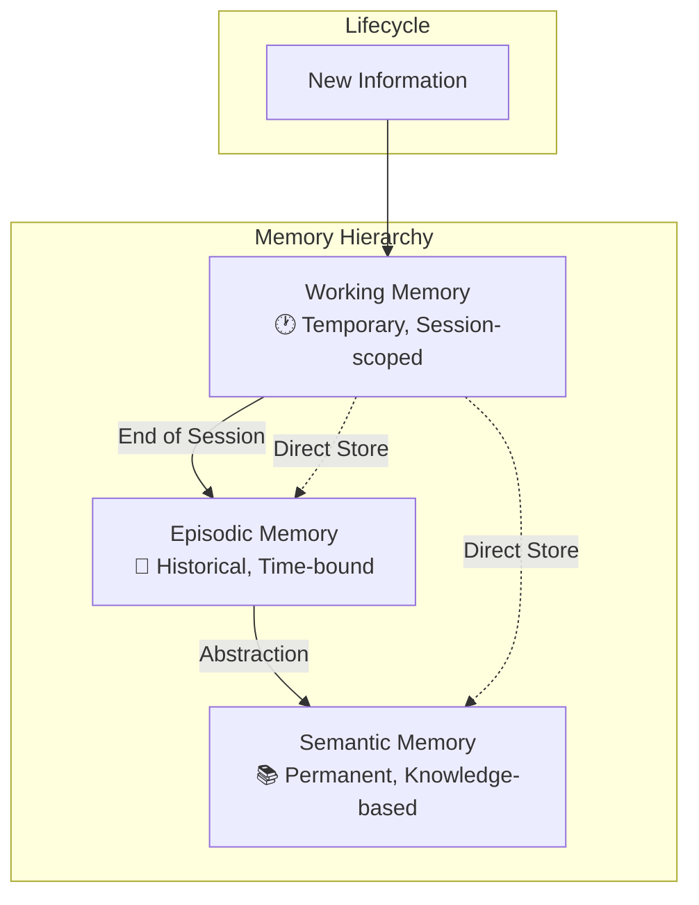
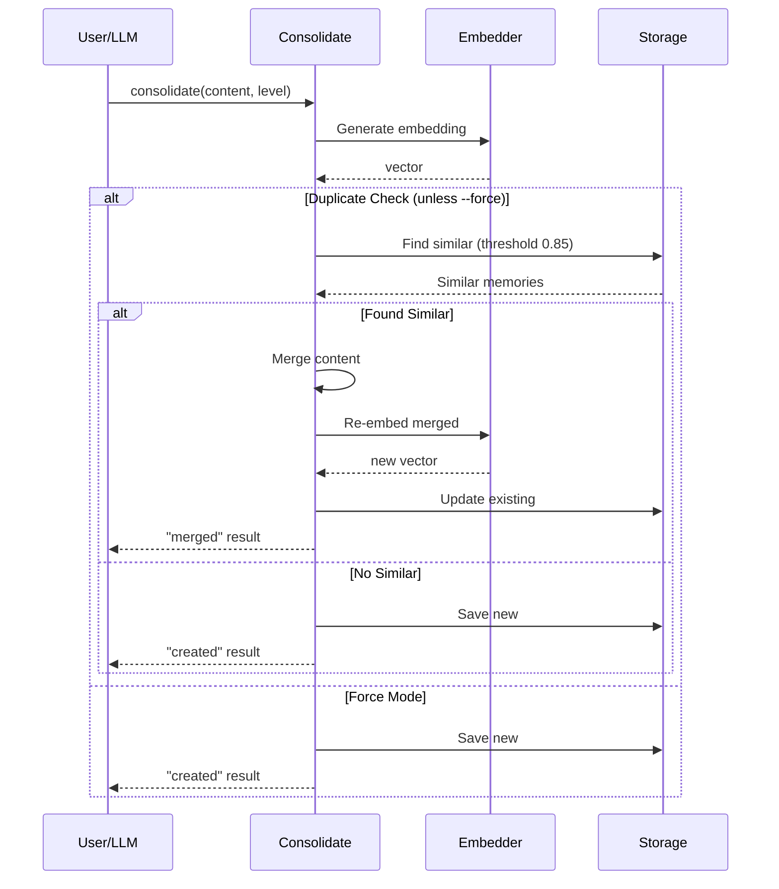
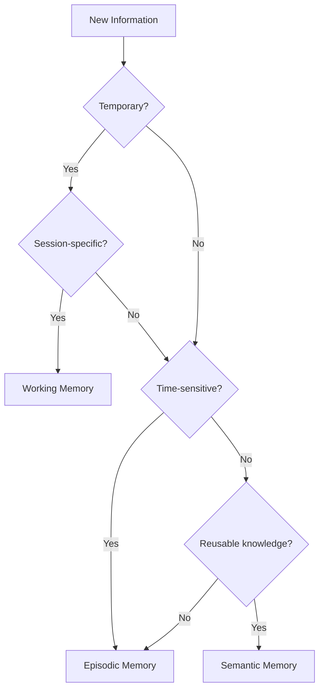

# Cortex - Memory Model

Detailed documentation of the Memory structure, types, and validation rules.

## Table of Contents

- [Memory Structure](#memory-structure)
- [Memory Types](#memory-types)
- [Memory Levels (Consolidation)](#memory-levels-consolidation)
- [Fields Reference](#fields-reference)
- [Validation Rules](#validation-rules)
- [Type Combinations](#type-combinations)
- [Consolidation Best Practices](#consolidation-best-practices)
- [Best Practices](#best-practices)

---

## Memory Structure

A Memory is the core unit of information in Cortex. It represents a single piece of structured knowledge.

```go
type Memory struct {
    ID        string            // Unique identifier (UUID v4)
    Title     string            // Required: descriptive title
    Content   string            // Required: memory content
    Types     []MemoryType      // Required: one or more types
    Tags      []string          // Optional: classification tags
    Embedding []float64         // Hidden: vector representation
    CreatedAt time.Time         // Auto-generated
    UpdatedAt time.Time         // Auto-updated
    Metadata  map[string]string // Optional: custom key-value data
    Obsolete  bool              // Soft delete flag
}
```

---

## Memory Types

Memory types classify the nature and purpose of a memory. Each memory must have **at least one type**.

| Type | Purpose | Best For | Example |
|------|---------|----------|---------|
| `solution` | Fix, workaround, or resolution | Storing working solutions and implementations | "Implement JWT refresh with exponential backoff" |
| `issue` | Bug, problem, or challenge | Documenting bugs and obstacles | "Race condition in auth middleware" |
| `analysis` | Investigation or root cause | Recording investigation findings | "Memory leak analysis: Event listener cleanup missing" |
| `rule` | Convention, standard, or guideline | Documenting project conventions | "Always use context for timeouts" |
| `any` | Generic or uncategorized | Miscellaneous knowledge | General notes and observations |

### Type Characteristics

- **solution** - Action-oriented, focused on fixing or improving
- **issue** - Problem-oriented, documents what's broken or challenging
- **analysis** - Investigation-oriented, explains why something happens
- **rule** - Convention-oriented, establishes guidelines and standards
- **any** - Generic, used when memory doesn't fit other categories

---

## Memory Levels (Consolidation)

Cortex supports a three-tier memory consolidation system for intelligent memory management. This system is separate from memory types and represents the lifecycle and persistence of memories.



### Memory Levels

| Level | Purpose | Retention | Auto-cleanup |
|-------|---------|-----------|--------------|
| `working` | Session-scoped temporary context | Until session ends or manual transfer | Yes (on session end) |
| `episodic` | Historical events, decisions, incidents | Configurable (default 90 days) | Archive after retention period |
| `semantic` | General knowledge, conventions, patterns | Permanent | Merge similar memories |

### Working Memory

Working memory stores temporary, session-specific information that may or may not be preserved.

**Characteristics:**
- Scoped to a specific session ID
- Automatically deleted when session ends (if auto-transfer enabled)
- Can be transferred to episodic on demand
- Stored separately from persistent memories

**Use Cases:**
- Current task context
- In-progress notes
- Temporary debugging information
- Session-specific reminders

**Example:**
```bash
cortex consolidate --level working --session "dev-session-2024" \
  --content "Currently debugging auth timeout issue in module X"
```

### Episodic Memory

Episodic memory stores historical events, decisions, and incidents with temporal context.

**Characteristics:**
- Time-stamped historical records
- Subject to retention-based archival
- Duplicates automatically removed
- Preserves context of when/why decisions were made

**Use Cases:**
- Bug fix documentation
- Decision records
- Incident reports
- Meeting notes
- Configuration changes

**Example:**
```bash
cortex consolidate --level episodic \
  --content "Fixed race condition in auth middleware by adding mutex lock" \
  --tags "bugfix,auth,concurrency"
```

### Semantic Memory

Semantic memory stores general, reusable knowledge that transcends specific events.

**Characteristics:**
- Permanent storage
- Similar memories automatically merged
- Represents distilled knowledge
- No temporal dependency

**Use Cases:**
- Architectural patterns
- Coding conventions
- API documentation
- Best practices
- Project structure rules

**Example:**
```bash
cortex consolidate --level semantic \
  --content "All database queries must use context with timeout for cancellation support" \
  --tags "convention,database,context"
```

### Consolidated Memory Structure

```go
type ConsolidatedMemory struct {
    ID         string               // Unique identifier (UUID v4)
    Level      MemoryLevel          // working | episodic | semantic
    Content    string               // Memory content
    Embedding  []float64            // Vector representation
    Context    ConsolidationContext // Contextual metadata
    CreatedAt  time.Time            // Creation timestamp
    UpdatedAt  time.Time            // Last update timestamp
    MergedFrom []string             // IDs of merged memories
}

type ConsolidationContext struct {
    TaskID          string    // Optional task identifier
    SessionID       string    // Required session identifier
    Timestamp       time.Time // When the consolidation occurred
    Author          string    // Optional author/source
    Tags            []string  // Categorization tags
    Source          string    // "manual" | "auto" | "llm"
    RelatedMemories []string  // Related memory IDs
}
```

### Consolidation Flow



---

## Fields Reference

### ID
- **Type:** String (UUID v4)
- **Auto-generated:** Yes
- **Required:** Yes
- **Mutable:** No
- **Description:** Unique identifier for the memory. Generated automatically when creating a new memory.

### Title
- **Type:** String
- **Auto-generated:** No
- **Required:** Yes
- **Mutable:** Yes
- **Min Length:** 3 characters
- **Max Length:** 255 characters
- **Description:** Descriptive title that summarizes the memory's content.

**Examples:**
```
✓ "JWT Token Refresh Implementation"
✓ "Race Condition in Auth Middleware"
✗ "" (too short)
✗ "X" (too short)
```

### Content
- **Type:** String
- **Auto-generated:** No
- **Required:** Yes
- **Mutable:** Yes
- **Min Length:** 10 characters
- **Max Length:** 1MB
- **Description:** The actual memory content. Can be Markdown formatted.

**Examples:**
```
✓ "When JWT tokens expire, implement refresh..."
✗ "" (too short)
✗ "Short text" (may be too brief for useful memory)
```

### Types
- **Type:** Array of MemoryType
- **Auto-generated:** No
- **Required:** Yes
- **Mutable:** Yes
- **Min Items:** 1
- **Max Items:** 5
- **Description:** One or more types that classify the memory.

**Valid Combinations:**
```
✓ ["solution"]
✓ ["issue", "solution"]
✓ ["issue", "analysis", "solution"]
✓ ["rule", "analysis"]
✗ [] (must have at least one type)
```

### Tags
- **Type:** Array of String
- **Auto-generated:** No
- **Required:** No
- **Mutable:** Yes
- **Max Items:** 20
- **Description:** Optional tags for additional classification and filtering.

**Guidelines:**
- Use lowercase
- Keep concise (1-20 characters each)
- Use hyphens for multi-word tags
- Useful for project-specific categorization

**Examples:**
```
["jwt", "authentication", "security"]
["memory-leak", "performance", "debugging"]
["refactoring", "technical-debt"]
```

### Metadata
- **Type:** Map[String]String
- **Auto-generated:** No
- **Required:** No
- **Mutable:** Yes
- **Max Items:** 50
- **Description:** Custom key-value metadata for application-specific data.

**Common Uses:**
```yaml
metadata:
  project: api-gateway
  sprint: Q1-2024
  severity: high
  related-issue: "#123"
  status: resolved
```

### Embedding
- **Type:** Array of Float64
- **Auto-generated:** Yes
- **Required:** Yes
- **Mutable:** No
- **Hidden:** Yes (not exposed in JSON/CLI output)
- **Dimensions:** 768 (for nomic-embed-text model)
- **Normalized:** Yes (unit vector)
- **Description:** Vector representation for semantic search. Automatically generated from title + content + tags.

### CreatedAt
- **Type:** Timestamp (RFC3339)
- **Auto-generated:** Yes
- **Mutable:** No
- **Description:** When the memory was created.

### UpdatedAt
- **Type:** Timestamp (RFC3339)
- **Auto-generated:** Yes
- **Mutable:** Auto-updated
- **Description:** When the memory was last updated.

### Obsolete
- **Type:** Boolean
- **Auto-generated:** No
- **Default:** false
- **Mutable:** Yes
- **Description:** Soft delete flag. Obsolete memories can be hidden from results but not permanently deleted.

---

## Validation Rules

### Create Validation

When creating a memory, the following validation is performed:

1. **Title**
   - ✓ Length: 3-255 characters
   - ✓ Not empty or whitespace-only

2. **Content**
   - ✓ Length: 10-1MB
   - ✓ Not empty or whitespace-only

3. **Types**
   - ✓ At least one type
   - ✓ All types are valid (solution, issue, analysis, rule, any)
   - ✓ Maximum 5 types

4. **Tags**
   - ✓ Maximum 20 tags
   - ✓ Each tag 1-50 characters

5. **Metadata**
   - ✓ Maximum 50 key-value pairs
   - ✓ Keys and values must be non-empty strings

### Update Validation

Updates follow the same validation rules as creation, with this exception:
- ID, CreatedAt, and Embedding cannot be changed

### Search Validation

Queries must:
- ✓ Be 3+ characters
- ✓ Not be empty or whitespace-only

---

## Type Combinations

### Single Type
```
[solution]       # A fix or implementation
[issue]          # A problem or bug
[analysis]       # An investigation finding
[rule]           # A convention or guideline
[any]            # Miscellaneous knowledge
```

### Two Types
```
[issue, solution]      # Problem with its fix
[issue, analysis]      # Problem with root cause
[analysis, solution]   # Root cause with resolution
[rule, analysis]       # Guideline with rationale
```

### Three+ Types
```
[issue, analysis, solution]  # Full investigation: problem → analysis → fix
[issue, solution, analysis]  # Problem with fix and explanation
```

### Best Practices for Type Selection

**Issue + Solution:**
Use when you have a specific problem and its working solution.

```
Title: JWT Token Refresh Fix
Types: [issue, solution]
Content: Explain the problem (race condition), then the solution
```

**Issue + Analysis + Solution:**
Use for complex problems requiring investigation and explanation.

```
Title: Memory Leak Investigation
Types: [issue, analysis, solution]
Content:
  1. Problem description
  2. Investigation findings
  3. Root cause
  4. Solution
```

**Rule + Analysis:**
Use when establishing a convention with reasoning.

```
Title: Always Use Context for Timeouts
Types: [rule, analysis]
Content: The rule and why it's important
```

---

## Consolidation Best Practices

### Choosing the Right Level



### Level Selection Guide

| Question | Yes → | No → |
|----------|-------|------|
| Is this temporary context for current session? | Working | Continue |
| Is this a specific event, decision, or incident? | Episodic | Continue |
| Is this general knowledge, pattern, or convention? | Semantic | Episodic |
| Will this be useful beyond this project? | Semantic | Episodic |
| Does this have a specific timestamp/date context? | Episodic | Semantic |

### Session Management

**Starting a Session:**
```bash
# Generate unique session ID
SESSION_ID=$(uuidgen)

# Store working memories during session
cortex consolidate --level working --session $SESSION_ID \
  --content "Task: Implement user authentication"
```

**Ending a Session:**
```bash
# Transfer all working memories to episodic
cortex transfer-working --session $SESSION_ID

# Or let autoprune handle it
cortex autoprune --archive-episodic
```

### Autoprune Strategy

Run autoprune regularly to maintain database health:

```bash
# Preview what would be cleaned (recommended first)
cortex autoprune --dry-run

# Full cleanup
cortex autoprune --duplicates --archive-episodic --merge-semantic

# Or run all operations (default when no flags)
cortex autoprune
```

**Recommended Schedule:**
- Daily: `cortex autoprune --duplicates`
- Weekly: `cortex autoprune`
- On project completion: `cortex transfer-working --session <session-id>`

### Content Guidelines for Each Level

**Working Memory:**
- Keep it brief and action-oriented
- Include current context and next steps
- Don't worry about formatting

```
Current task: fixing auth timeout
- Investigated X, found Y
- Next: try Z approach
```

**Episodic Memory:**
- Include problem description
- Document what was tried
- Note the outcome
- Reference related issues/PRs

```
## Auth Timeout Fix (2024-01-15)
Problem: Users experiencing random logouts
Root cause: Token refresh race condition
Solution: Added mutex lock in refreshToken()
Related: Issue #123
```

**Semantic Memory:**
- Write as documentation
- Make it self-contained
- Include rationale
- Use clear examples

```
## Database Query Convention

All database queries must include context with timeout:

db.QueryContext(ctx, query, args...)

Rationale: Enables proper cancellation and prevents hanging queries.
```

---

## Best Practices

### Titles
- **Be descriptive:** Titles should summarize the memory's essence
- **Use action verbs:** "Fix JWT expiry issue", "Implement retry logic"
- **Avoid generic:** Don't use "Bug", "Solution", "Note"
- **Use title case:** "Authentication Timeout Fix" not "authentication timeout fix"

**Good Titles:**
```
✓ "JWT Token Refresh with Exponential Backoff"
✓ "Race Condition in Auth Middleware"
✓ "Always Use Context for Database Queries"
```

**Poor Titles:**
```
✗ "Issue"
✗ "Security stuff"
✗ "important"
✗ "TODO: Fix this"
```

### Content
- **Be comprehensive:** Include context, problem, and solution
- **Use markdown:** Format with headers, code blocks, lists
- **Include examples:** Show code snippets or concrete examples
- **Link to sources:** Reference related issues, PRs, documentation
- **Use sections:** Break content into logical sections

**Good Content Structure:**
```markdown
## Problem
Describe the issue clearly.

## Root Cause
Explain why it happens (for analysis).

## Solution
Provide the fix or workaround.

## Implementation
Code examples and step-by-step instructions.

## Related
Links to issues, PRs, documentation.
```

### Tags
- **Use lowercase:** `jwt`, not `JWT`
- **Use hyphens:** `auth-flow`, not `auth_flow` or `authflow`
- **Be specific:** `retry-logic`, not `code`
- **Project-scoped:** Include project names if applicable
- **Keep it lean:** Use 3-7 tags per memory

**Good Tags:**
```
["jwt", "authentication", "refresh-token", "security"]
["database", "indexing", "performance", "postgres"]
```

### Types Selection
- **Use multiple types:** Help semantic search find memories in different contexts
- **Issue + Solution:** For bug fixes
- **Analysis:** For investigations and deep dives
- **Rule:** For conventions and standards
- **Any:** Only when memory doesn't fit categories

---

## Related Documentation

- [CLI_REFERENCE.md](./CLI_REFERENCE.md) - Command-line reference
- [MARKDOWN_FORMAT.md](./MARKDOWN_FORMAT.md) - Markdown format specification
- [ARCHITECTURE.md](./ARCHITECTURE.md) - System architecture
