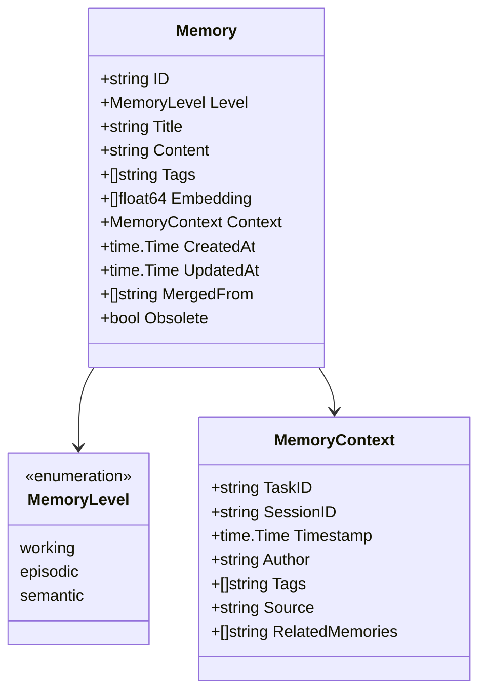
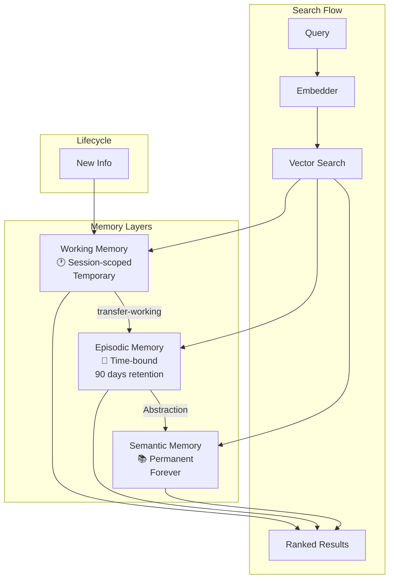

# Cortex - Memory Model

## Memory Structure

## Three-Layer Architecture

## Layer Characteristics

### Working Memory
- **Scope**: Session-specific
- **Retention**: Until session ends or explicit transfer
- **Use case**: Current task context, temporary notes
- **Requires**: `--session` flag

### Episodic Memory
- **Scope**: Time-bound events
- **Retention**: Configurable (default 90 days)
- **Use case**: Bug fixes, decisions, completed tasks
- **Auto-cleanup**: Via `autoprune --archive-episodic`

### Semantic Memory
- **Scope**: Permanent knowledge
- **Retention**: Forever (unless manually deleted)
- **Use case**: Conventions, patterns, best practices
- **Optimization**: Via `autoprune --merge-semantic`
