# Cortex - Memory Model

This document describes Cortex's three-layer memory system, memory structure, and best practices.

## Table of Contents

- [Overview](#overview)
- [Three-Layer Architecture](#three-layer-architecture)
- [Memory Structure](#memory-structure)
- [Memory Lifecycle](#memory-lifecycle)
- [Memory Levels in Detail](#memory-levels-in-detail)
- [Best Practices](#best-practices)
- [Common Patterns](#common-patterns)
- [Anti-Patterns](#anti-patterns)

---

## Overview

Cortex implements a **three-layer memory system** inspired by human cognitive architecture, enabling efficient organization and retrieval of knowledge at different temporal and semantic scales.

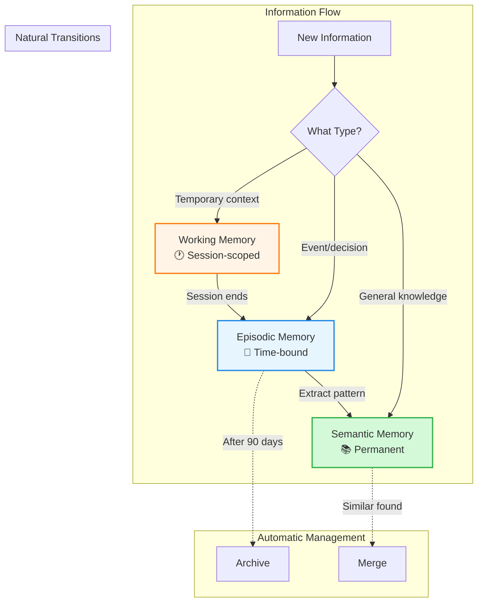

### Key Principles

| Principle | Description |
|-----------|-------------|
| **Temporal Separation** | Different levels for different time scales |
| **Automatic Management** | System handles transitions and cleanup |
| **Semantic Richness** | Vector embeddings enable meaning-based search |
| **Explicit Context** | Metadata tracks relationships and provenance |

---

## Three-Layer Architecture

### Layer Comparison

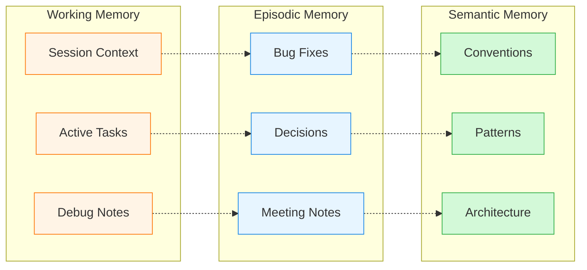

| Layer | Scope | Retention | Storage | Use Cases |
|-------|-------|-----------|---------|-----------|
| **Working** | Session-specific | Until transferred | `working/session-{id}.gob` | Current tasks, debug notes, temporary context |
| **Episodic** | Time-bound events | 90 days (default) | `memories.gob` | Bug fixes, decisions, meetings, incidents |
| **Semantic** | Permanent knowledge | Forever | `memories.gob` | Conventions, patterns, architecture, best practices |

### Visual Decision Tree

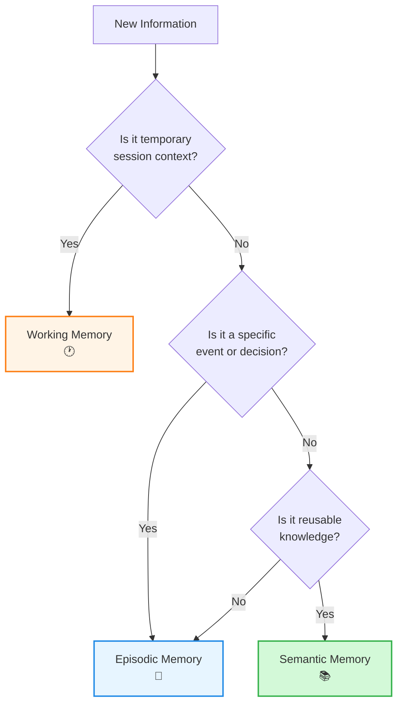

---

## Memory Structure

### Core Data Model

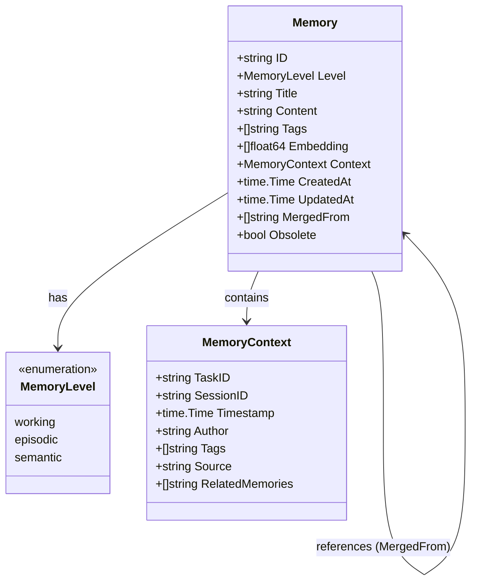

### Field Descriptions

#### Core Fields

| Field | Type | Description |
|-------|------|-------------|
| `ID` | string | UUID identifier (auto-generated) |
| `Level` | MemoryLevel | Memory layer: working, episodic, semantic |
| `Title` | string | Human-readable title (min 3 chars) |
| `Content` | string | Full content (min 10 chars, supports Markdown) |
| `Tags` | []string | Categorization tags (optional) |
| `Embedding` | []float64 | Vector representation (768 dimensions for nomic-embed-text) |

#### Metadata Fields

| Field | Type | Description |
|-------|------|-------------|
| `Context` | MemoryContext | Rich metadata and relationships |
| `CreatedAt` | time.Time | Creation timestamp |
| `UpdatedAt` | time.Time | Last modification timestamp |
| `MergedFrom` | []string | Source memory IDs (when consolidated) |
| `Obsolete` | bool | Soft delete flag |

#### Context Fields

| Field | Type | Description |
|-------|------|-------------|
| `TaskID` | string | Associated task/ticket (e.g., JIRA-123) |
| `SessionID` | string | Development session identifier (required for working) |
| `Timestamp` | time.Time | Event timestamp |
| `Author` | string | Creator identity |
| `Source` | string | Origin: manual, auto, llm |
| `RelatedMemories` | []string | Connected memory IDs |

---

## Memory Lifecycle

### State Machine

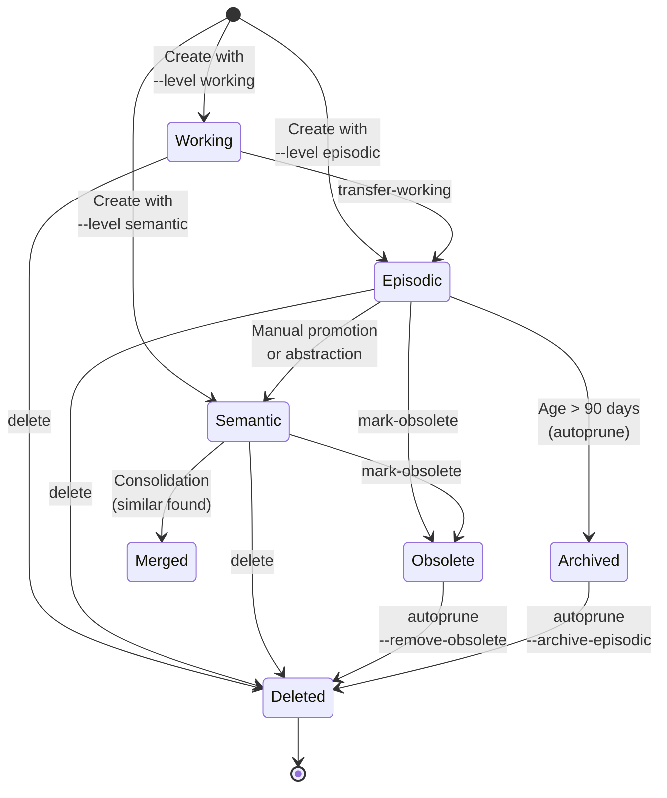

### Lifecycle Phases

#### 1. Creation

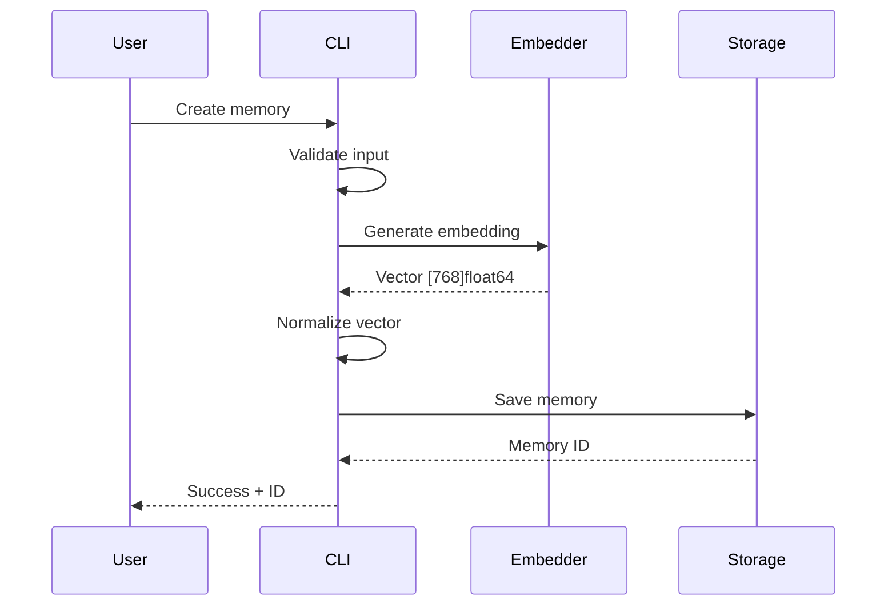

**Requirements**:
- Title (min 3 chars)
- Content (min 10 chars)
- Level (working/episodic/semantic)
- Session ID (if working level)

#### 2. Active Use

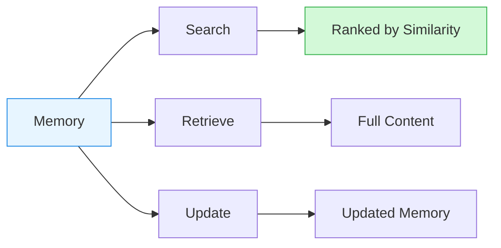

**Operations**:
- Semantic search (by meaning)
- Direct retrieval (by ID)
- Tag-based filtering
- Updates and modifications

#### 3. Transition

**Working → Episodic**:
```bash
cortex transfer-working --session dev-2024
```

**Episodic → Semantic** (manual):
```bash
# Extract pattern and create semantic memory
cortex create --level semantic \
  --content "Pattern extracted from incident X"
```

#### 4. Cleanup

**Automatic** (via `autoprune`):
- Remove duplicates (similarity >= 0.92)
- Archive old episodic (> 90 days)
- Merge similar semantic (similarity >= 0.88)

**Manual**:
- Mark as obsolete (soft delete)
- Permanent deletion

---

## Memory Levels in Detail

### Working Memory

**Purpose**: Temporary session context and active task tracking.

```mermaid
graph TB
    subgraph "Working Memory Characteristics"
        T1[Temporary]
        T2[Session-Scoped]
        T3[High Churn]
        T4[Context-Rich]
    end

    subgraph "Storage"
        F[working/session-{id}.gob]
    end

    subgraph "Lifecycle"
        C[Create] --> U[Use During Session]
        U --> T[Transfer to Episodic]
        T --> D[Delete Working File]
    end

    T1 --> F
    T2 --> F
    T3 --> F
    T4 --> F

    style T1 fill:#fff4e6,stroke:#fd7e14
    style T2 fill:#fff4e6,stroke:#fd7e14
    style T3 fill:#fff4e6,stroke:#fd7e14
    style T4 fill:#fff4e6,stroke:#fd7e14
```

**Characteristics**:
- Stored separately by session
- Not included in main persistence file
- High creation/deletion rate
- Short-lived (hours to days)

**Best For**:
- Current debugging notes
- Active task context
- Work-in-progress ideas
- Temporary research findings
- Session-specific decisions

**Example**:
```bash
# Auto-derived session from git branch (recommended)
# Branch: fix/auth-2024/timeout → Session: session-fix-auth-2024
cortex create \
  --title "Debugging auth timeout" \
  --level working \
  --content "Reproduced issue after 30s. Checking middleware next."

# Or manually specify session ID
cortex create \
  --title "Debugging auth timeout" \
  --level working \
  --session bug-auth-2024 \
  --content "Reproduced issue after 30s. Checking middleware next."
```

**Session Configuration**:

Cortex automatically derives session IDs from your git branch name, making session management seamless:

| Git Branch Convention | Pattern Type | Config Example | Result |
|----------------------|--------------|----------------|--------|
| `fix/TICKET-123/feature` | `prefix` (default) | `max_segments: 2` | `session-fix-TICKET-123` |
| `feature/JIRA-456/auth` | `regex` | `pattern: '([A-Z]+-\d+)'` | `session-JIRA-456` |
| `hotfix/prod/db-leak` | `full` | All segments | `session-hotfix-prod-db-leak` |

Configure in `~/.config/cortex-ai/config.yaml`:
```yaml
session:
  auto_derive: true          # Enable auto-derivation (default)
  pattern_type: prefix       # prefix, regex, or full
  max_segments: 2           # Number of segments for prefix mode
  prefix: "session-"        # Prefix for all session IDs
  separator: "-"            # Separator for branch parts
  fallback_to_uuid: true    # Use UUID if pattern fails
```

> **💡 Tip:** Match your team's git branch naming convention for consistent session IDs across your team.

**When to Transfer**:
- End of work session
- Issue resolved
- Context no longer needed for active work
- Task completed

---

### Episodic Memory

**Purpose**: Time-bound events, decisions, and historical context.

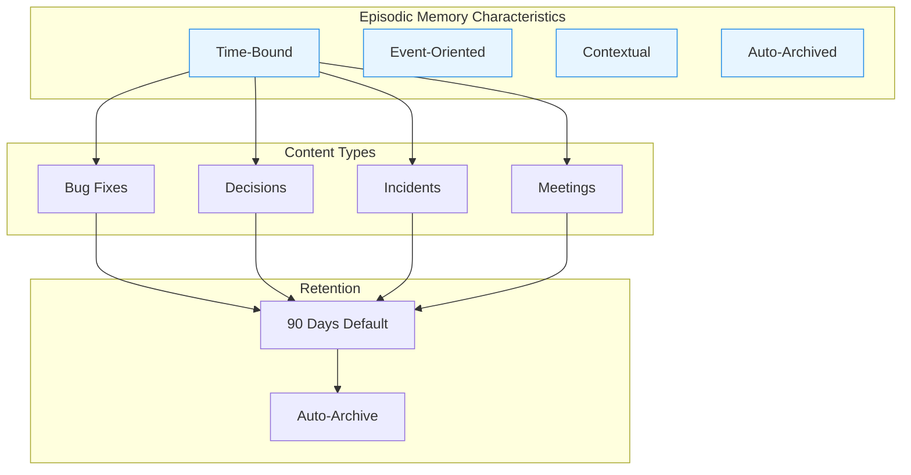

**Characteristics**:
- Stored in main persistence file
- Includes temporal context
- Subject to retention policies
- Can be promoted to semantic

**Best For**:
- Bug fix documentation
- Architecture decisions
- Incident post-mortems
- Meeting notes and outcomes
- Project milestones
- Performance investigations

**Example**:
```bash
cortex create \
  --title "Fixed race condition in auth middleware" \
  --level episodic \
  --content "Added mutex lock to token refresh. Root cause was concurrent access." \
  --tags "bugfix,auth,concurrency" \
  --task-id "JIRA-456"
```

**Retention**:
- Default: 90 days
- Configurable: `autoprune.episodic_retention_days`
- Action: Archived/deleted by autoprune
- Override: Mark as important (no auto-archive)

---

### Semantic Memory

**Purpose**: Permanent, reusable knowledge and patterns.

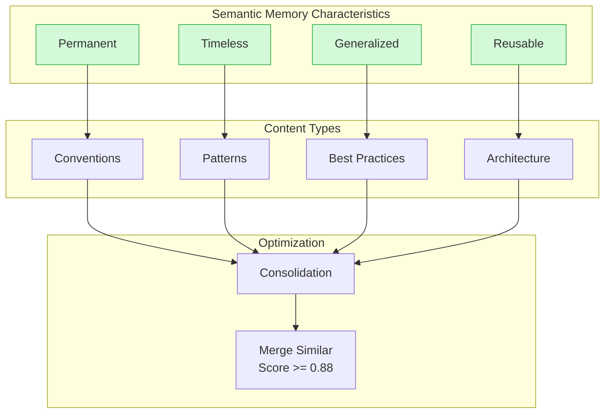

**Characteristics**:
- Stored in main persistence file
- No automatic expiration
- Subject to consolidation
- Highest value for reuse

**Best For**:
- Coding conventions
- Design patterns
- Architectural principles
- Best practices
- Team standards
- Error handling strategies
- Performance patterns

**Example**:
```bash
cortex create \
  --title "Database query timeout convention" \
  --level semantic \
  --content "All database queries must use context with timeout" \
  --tags "convention,database,context"
```

**Consolidation**:
- Similar memories merged (threshold: 0.88)
- Deduplication prevents redundancy
- MergedFrom tracks sources
- Content combined intelligently

---

## Best Practices

### 1. Choose the Right Level

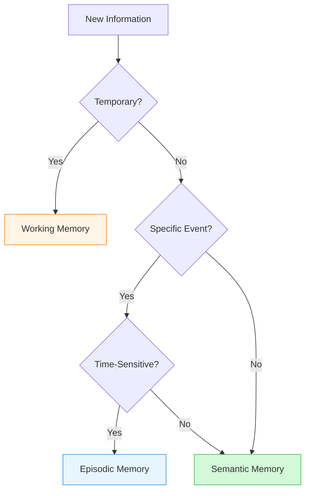

**Guidelines**:

| If the information is... | Use... | Example |
|--------------------------|--------|---------|
| Temporary session context | Working | "Currently debugging X" |
| A specific event/decision | Episodic | "Fixed bug Y on 2024-01-15" |
| A general rule/pattern | Semantic | "Always use context timeouts" |
| Still being figured out | Working | "Investigating options A vs B" |
| A completed task | Episodic | "Implemented feature Z" |
| A timeless principle | Semantic | "Dependency injection pattern" |

### 2. Use Descriptive Titles

**Bad**:
```bash
--title "Bug fix"
--title "Meeting"
--title "Note"
```

**Good**:
```bash
--title "Fixed auth timeout in middleware"
--title "Architecture review: microservices decision"
--title "Database indexing strategy for user queries"
```

### 3. Add Relevant Tags

**Purpose**: Enable filtering and categorization.

**Good Tag Strategies**:
```bash
# By domain
--tags "auth,database,api"

# By type
--tags "bugfix,feature,refactor"

# By component
--tags "middleware,worker-pool,cache"

# Combined
--tags "bugfix,auth,middleware,production"
```

### 4. Include Context

**For Working Memory**:
- Session IDs are auto-derived from git branch by default (e.g., `fix/sil-123/auth` → `session-fix-sil-123`)
- Or manually specify `--session` for custom session IDs
- Use consistent session naming patterns for your team
- Include current investigation status

**For Episodic Memory**:
- Add `--task-id` for tracking
- Include `--author` for attribution
- Document the outcome

**For Semantic Memory**:
- Focus on the pattern, not the instance
- Include rationale
- Provide examples

### 5. Regular Maintenance

```bash
# Weekly: Review and transfer working memories
cortex list --level working
cortex transfer-working --session old-session

# Monthly: Run autoprune
cortex autoprune --all

# Quarterly: Review semantic memories
cortex list --level semantic | less
```

---

## Common Patterns

### Pattern 1: Bug Investigation → Fix → Pattern

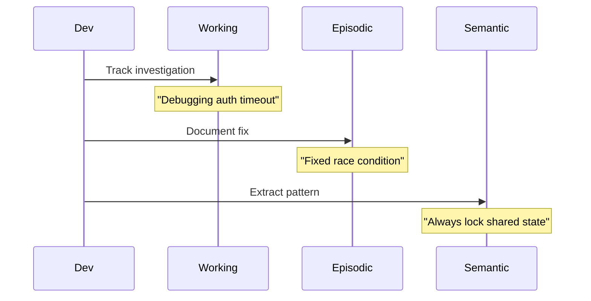

**Commands**:
```bash
# 1. Investigation (working)
cortex create --level working --session bug-123 \
  --title "Investigating auth timeout" \
  --content "Reproduced after 30s. Checking middleware."

# 2. Fix documentation (episodic)
cortex create --level episodic \
  --title "Fixed auth timeout race condition" \
  --content "Added mutex lock to token refresh logic" \
  --tags "bugfix,auth" --task-id "BUG-123"

# 3. Pattern extraction (semantic)
cortex consolidate --level semantic \
  --content "Always protect shared state with mutex locks" \
  --tags "pattern,concurrency"
```

### Pattern 2: Feature Development

```bash
# Start: Working memory for context
cortex create --level working --session feature-xyz \
  --title "Starting OAuth implementation" \
  --content "Using library X. Need to handle refresh tokens."

# Progress: Update working memory
cortex create --level working --session feature-xyz \
  --title "OAuth progress: token refresh working" \
  --content "Implemented refresh. Next: error handling."

# Complete: Transfer to episodic
cortex transfer-working --session feature-xyz
```

### Pattern 3: Team Knowledge Building

```bash
# Document convention (semantic)
cortex create --level semantic \
  --title "Error handling convention" \
  --content "Wrap errors with context using fmt.Errorf"

# Share knowledge (export)
cortex export --level semantic --output ./team-docs/

# Import team knowledge
cortex import ./shared-conventions/*.md
```

### Pattern 4: Research Session

```bash
# Capture findings (working)
cortex create --level working --session research-db \
  --title "Database options research" \
  --content "Comparing PostgreSQL vs MySQL vs SQLite..."

# Capture decision (episodic)
cortex create --level episodic \
  --title "Database decision: PostgreSQL chosen" \
  --content "Chose PostgreSQL for JSON support and ACID guarantees" \
  --task-id "ARCH-42"

# Extract principle (semantic)
cortex create --level semantic \
  --title "Database selection criteria" \
  --content "Choose DB based on: data structure, consistency needs, scale"
```

---

## Anti-Patterns

### ❌ Anti-Pattern 1: Wrong Level Selection

**Bad**: Storing temporary notes as semantic
```bash
cortex create --level semantic \
  --title "TODO: Check auth timeout" \
  --content "Need to investigate this tomorrow"
```

**Good**: Use working memory for temporary context
```bash
cortex create --level working --session daily-work \
  --title "TODO: Check auth timeout" \
  --content "Need to investigate tomorrow morning"
```

### ❌ Anti-Pattern 2: Vague Titles and Content

**Bad**:
```bash
cortex create --level episodic \
  --title "Fixed bug" \
  --content "Changed the code"
```

**Good**:
```bash
cortex create --level episodic \
  --title "Fixed auth timeout by adding retry logic" \
  --content "Root cause: network instability. Solution: 3 retries with exponential backoff."
```

### ❌ Anti-Pattern 3: Not Using Sessions for Working Memory

> **Note:** As of v2.0, session IDs are auto-derived from git branches by default, making this less of a concern. However, understanding session management is still important.

**Automatic (Recommended)**:
```bash
# Session ID is auto-derived from git branch
# Branch: fix/auth-2024/timeout → Session: session-fix-auth-2024
cortex create --level working \
  --title "Auth timeout debug findings"
```

**Manual (When Needed)**:
```bash
# Explicitly specify session ID if needed
cortex create --level working --session bug-auth-2024 \
  --title "Auth timeout debug findings"
```

**How Auto-Derivation Works**:
- Current branch `fix/sil-123/auth-timeout` → Session ID `session-fix-sil-123`
- Configurable patterns via `session.pattern_type` (prefix, regex, full)
- Falls back to UUID if not in a git repository
- See [Configuration](CONFIGURATION.md#session-section) for customization

### ❌ Anti-Pattern 4: Never Transferring Working Memory

**Problem**: Working memories pile up and clutter the system.

**Solution**: Regular transfers
```bash
# At end of day/week
cortex list --level working
cortex transfer-working --session completed-session
```

### ❌ Anti-Pattern 5: Duplicate Semantic Memories

**Problem**: Creating similar semantic memories without checking.

**Solution**: Use consolidate command
```bash
# Automatically detects and merges duplicates
cortex consolidate --level semantic \
  --content "Use context with timeout for DB queries"
```

### ❌ Anti-Pattern 6: No Tags

**Bad**:
```bash
cortex create --level semantic \
  --title "Convention" \
  --content "Some rule"  # How to find this later?
```

**Good**:
```bash
cortex create --level semantic \
  --title "Database timeout convention" \
  --content "Use context with timeout" \
  --tags "convention,database,context"
```

---

## Related Documentation

- **[CLI Reference](./CLI_REFERENCE.md)** - Commands for managing memories
- **[Architecture](./ARCHITECTURE.md)** - System design and implementation
- **[MCP Integration](./MCP.md)** - Using with AI assistants
- **[Configuration](./CONFIGURATION.md)** - Configuring retention and thresholds

---

**Last Updated**: 2026-02-04
**Memory Model Version**: 1.0 (Three-layer system with consolidation)
