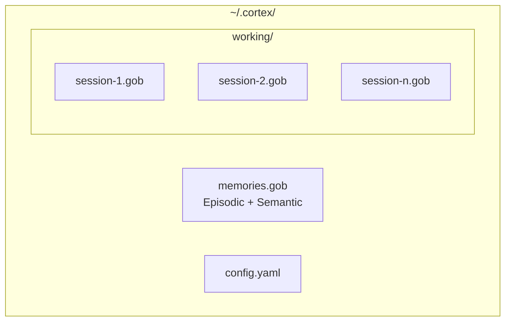

# Cortex - Storage

## Overview

Cortex uses Gob-encoded files for persistent storage with separate handling for working (session) and persistent (episodic/semantic) memories.

## Storage Structure



## GobStorage

The `GobStorage` struct implements the `Storage` interface:

```go
type Storage interface {
    Save(ctx context.Context, m *Memory) error
    Get(ctx context.Context, id string) (*Memory, error)
    List(ctx context.Context, opts ListOptions) ([]*Memory, error)
    Delete(ctx context.Context, id string) error
    Update(ctx context.Context, m *Memory) error
    SearchAllLayers(ctx context.Context, vector []float64, opts SearchOptions) ([]*SearchResult, error)
    TransferWorkingToEpisodic(ctx context.Context, sessionID string) (int, error)
    Close() error
}
```
