# Cortex - Architecture

This document provides a comprehensive overview of Cortex's system architecture, component design, and data flow.

## Table of Contents

- [System Overview](#system-overview)
- [Architectural Layers](#architectural-layers)
- [Core Components](#core-components)
- [Data Flow](#data-flow)
- [Memory System Architecture](#memory-system-architecture)
- [Storage Architecture](#storage-architecture)
- [MCP Integration](#mcp-integration)
- [Design Decisions](#design-decisions)

---

## System Overview

Cortex is a **three-layer semantic memory system** for AI assistants, implementing a clean architecture with clear separation of concerns.

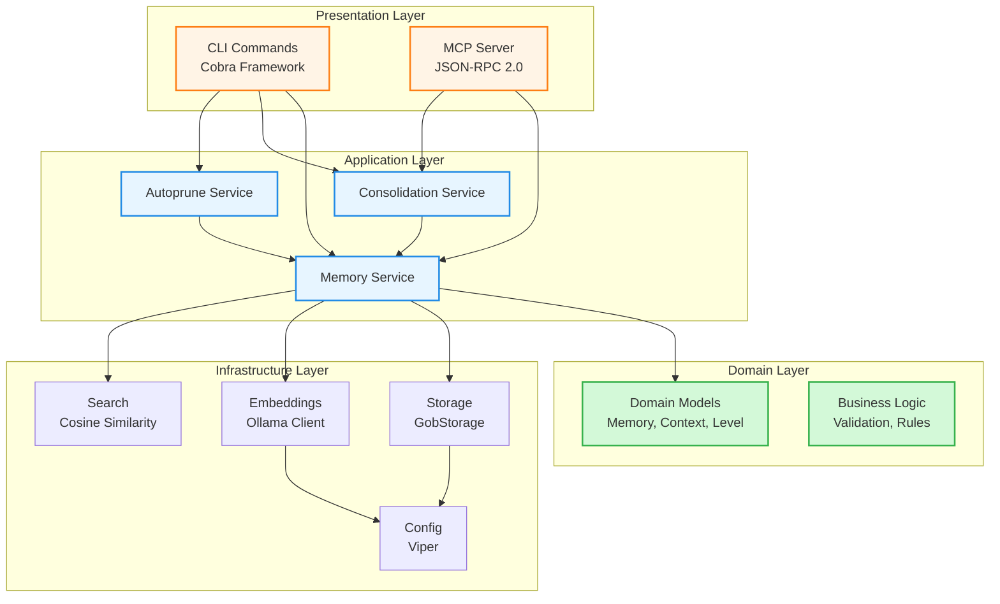

### Key Characteristics

- **Layered Architecture**: Clear separation between presentation, application, domain, and infrastructure
- **Dependency Injection**: Services receive dependencies via constructors
- **Interface-Based Design**: Infrastructure components implement interfaces for testability
- **Context-Aware**: All I/O operations accept `context.Context` for cancellation and timeout
- **Thread-Safe**: Concurrent operations protected by appropriate synchronization primitives

---

## Architectural Layers

### 1. Presentation Layer

**Purpose**: Handle user interaction and external communication

**Components**:
- **CLI Commands** (`internal/cli/`)
  - Cobra command definitions
  - Flag parsing and validation
  - User-facing error messages
  - Output formatting (text/JSON)

- **MCP Server** (`internal/mcp/`)
  - JSON-RPC 2.0 protocol implementation
  - Tool definitions and handlers
  - Transport abstraction (stdio/SSE)
  - MCP specification compliance

**Responsibilities**:
- Parse and validate user input
- Format and display output
- Handle protocol-specific concerns
- Translate between external and internal representations

### 2. Application Layer

**Purpose**: Coordinate business operations and use cases

**Components**:
- **Memory Service** (`internal/memory/service.go`)
  - CRUD operations for memories
  - Semantic search orchestration
  - Embedding generation coordination
  - Memory lifecycle management

- **Consolidation Service** (`internal/consolidation/service.go`)
  - Duplicate detection
  - Memory merging logic
  - Similarity threshold enforcement
  - Multi-level consolidation

- **Autoprune Service** (`internal/consolidation/autoprune.go`)
  - Duplicate cleanup
  - Episodic memory archiving
  - Semantic memory merging
  - Batch optimization

**Responsibilities**:
- Implement use cases
- Coordinate between domain and infrastructure
- Enforce business rules
- Manage transactions and error handling

### 3. Domain Layer

**Purpose**: Define core business entities and rules

**Components**:
- **Memory Model** (`internal/memory/types.go`)
  ```go
  type Memory struct {
      ID         string        // UUID identifier
      Level      MemoryLevel   // working|episodic|semantic
      Title      string        // Human-readable title
      Content    string        // Full content (Markdown supported)
      Tags       []string      // Categorization tags
      Embedding  []float64     // Vector representation
      Context    MemoryContext // Metadata and relationships
      CreatedAt  time.Time     // Creation timestamp
      UpdatedAt  time.Time     // Last modification
      MergedFrom []string      // Source memory IDs (for consolidation)
      Obsolete   bool          // Soft delete flag
  }
  ```

- **Memory Level Enum**
  ```go
  type MemoryLevel string
  const (
      LevelWorking  MemoryLevel = "working"   // Session-scoped
      LevelEpisodic MemoryLevel = "episodic"  // Time-bound
      LevelSemantic MemoryLevel = "semantic"  // Permanent
  )
  ```

- **Memory Context**
  ```go
  type MemoryContext struct {
      TaskID          string    // Associated task/ticket
      SessionID       string    // Development session
      Timestamp       time.Time // Event timestamp
      Author          string    // Creator identity
      Tags            []string  // Additional categorization
      Source          string    // Origin (manual|auto|llm)
      RelatedMemories []string  // Connected memory IDs
  }
  ```

**Responsibilities**:
- Define core entities
- Enforce domain invariants
- Encapsulate business logic
- Provide domain services

### 4. Infrastructure Layer

**Purpose**: Implement technical capabilities

**Components**:

#### Storage (`internal/storage/`)

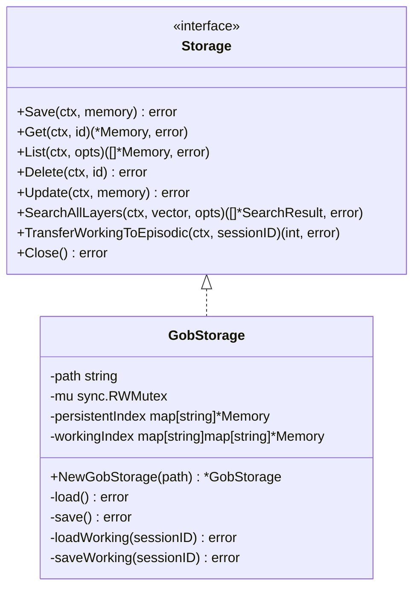

#### Embeddings (`internal/embeddings/`)

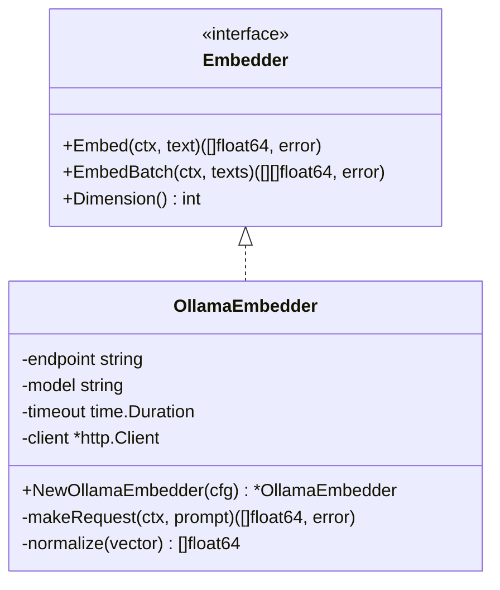

#### Search (`internal/search/`)

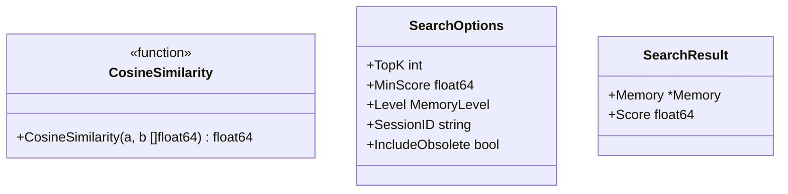

**Responsibilities**:
- Implement storage mechanisms
- Provide embedding generation
- Execute similarity search
- Manage configuration
- Handle external integrations

---

## Core Components

### Memory Service

The central orchestrator for all memory operations.

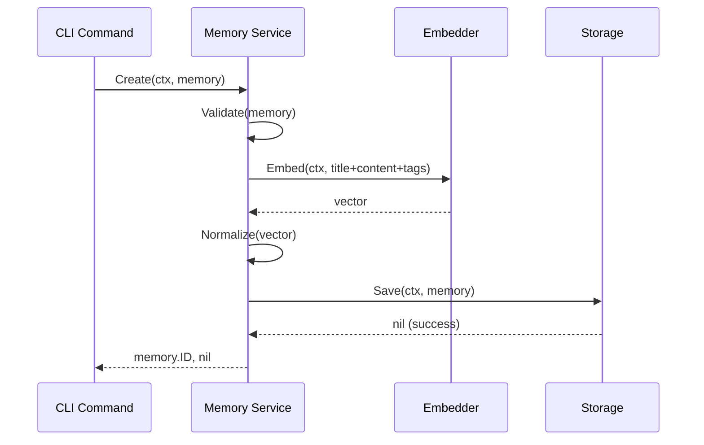

**Key Methods**:
- `Create(ctx, memory)` - Create new memory with embeddings
- `Search(ctx, query, opts)` - Semantic search across layers
- `Get(ctx, id)` - Retrieve memory by ID
- `List(ctx, opts)` - List with filtering
- `Update(ctx, memory)` - Update existing memory
- `Delete(ctx, id)` - Permanent deletion
- `MarkObsolete(ctx, id)` - Soft deletion

### Consolidation Service

Handles memory consolidation with duplicate detection.

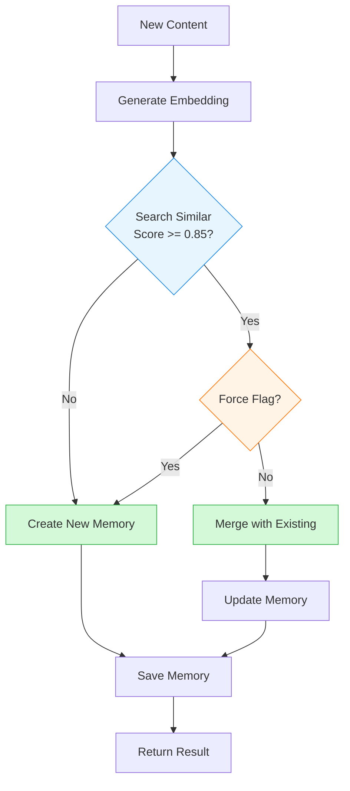

**Consolidation Result**:
```go
type ConsolidationResult struct {
    Action     string  // "created" | "merged"
    MemoryID   string  // Resulting memory ID
    Level      string  // Memory level
    Similarity float64 // Similarity score (if merged)
    Message    string  // Human-readable description
}
```

### Autoprune Service

Automated memory maintenance and optimization.

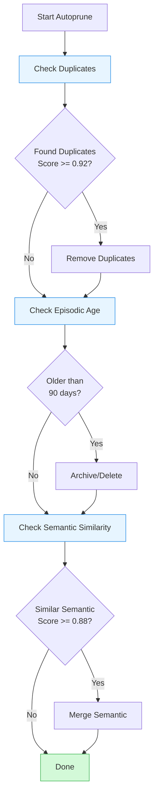

**Autoprune Operations**:
1. **Remove Duplicates**: Similarity >= 0.92
2. **Archive Episodic**: Age > retention period (default 90 days)
3. **Merge Semantic**: Similarity >= 0.88

---

## Data Flow

### Create Memory Flow

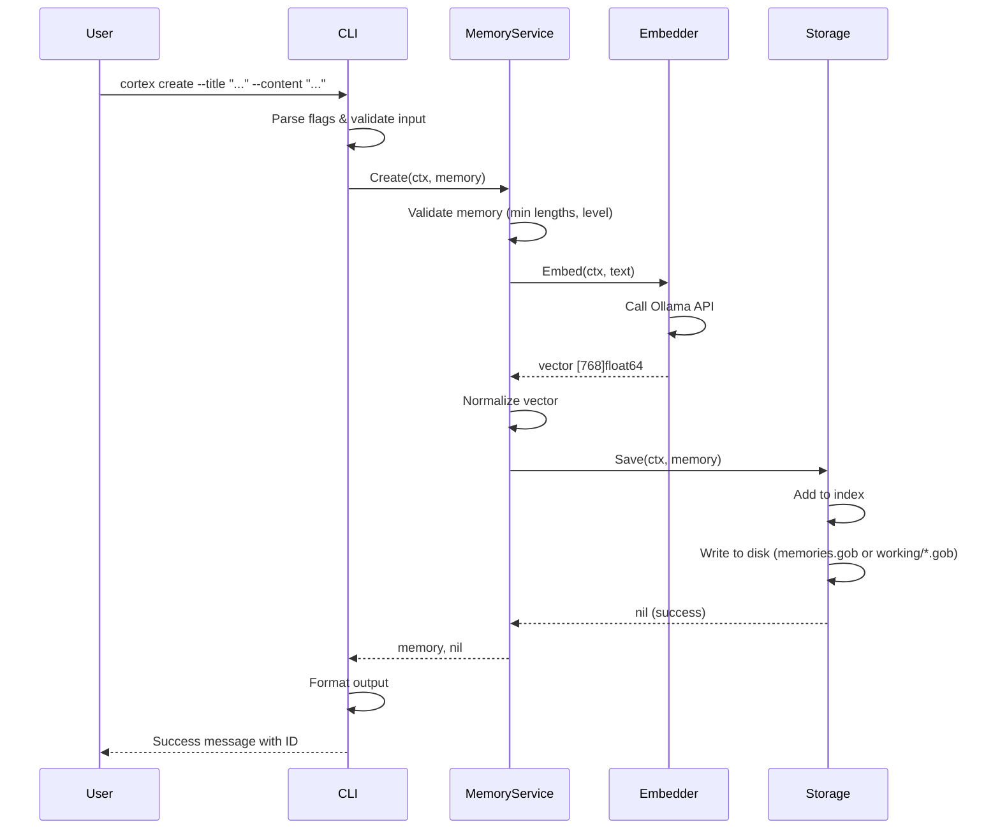

### Search Memory Flow

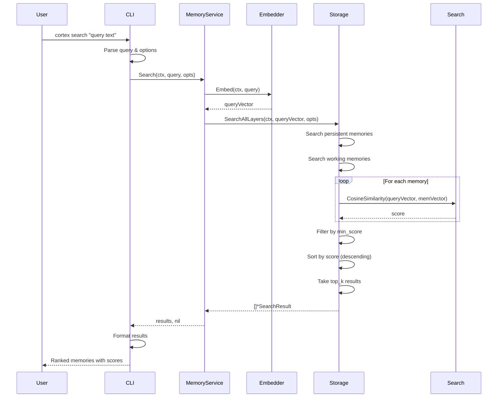

### Transfer Working Memory Flow

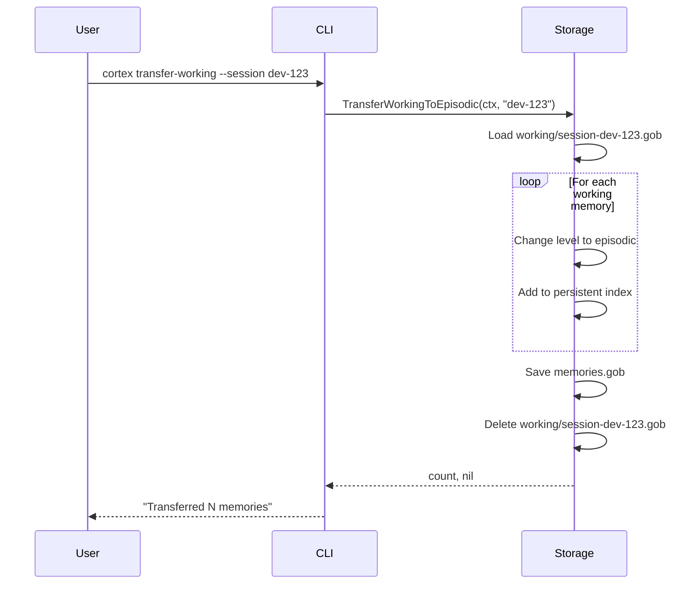

---

## Memory System Architecture

### Three-Layer Hierarchy

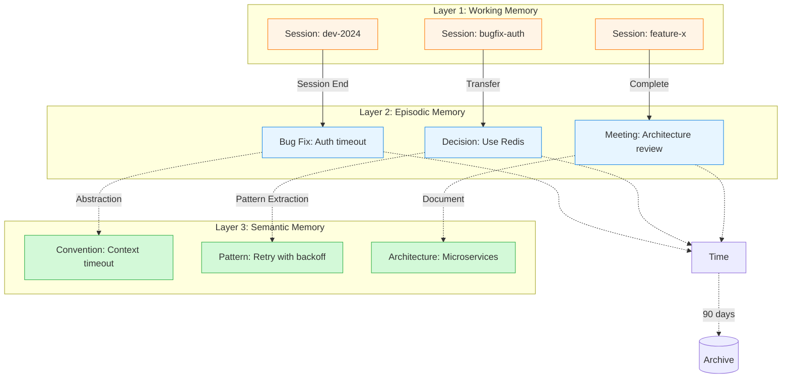

### Memory Lifecycle

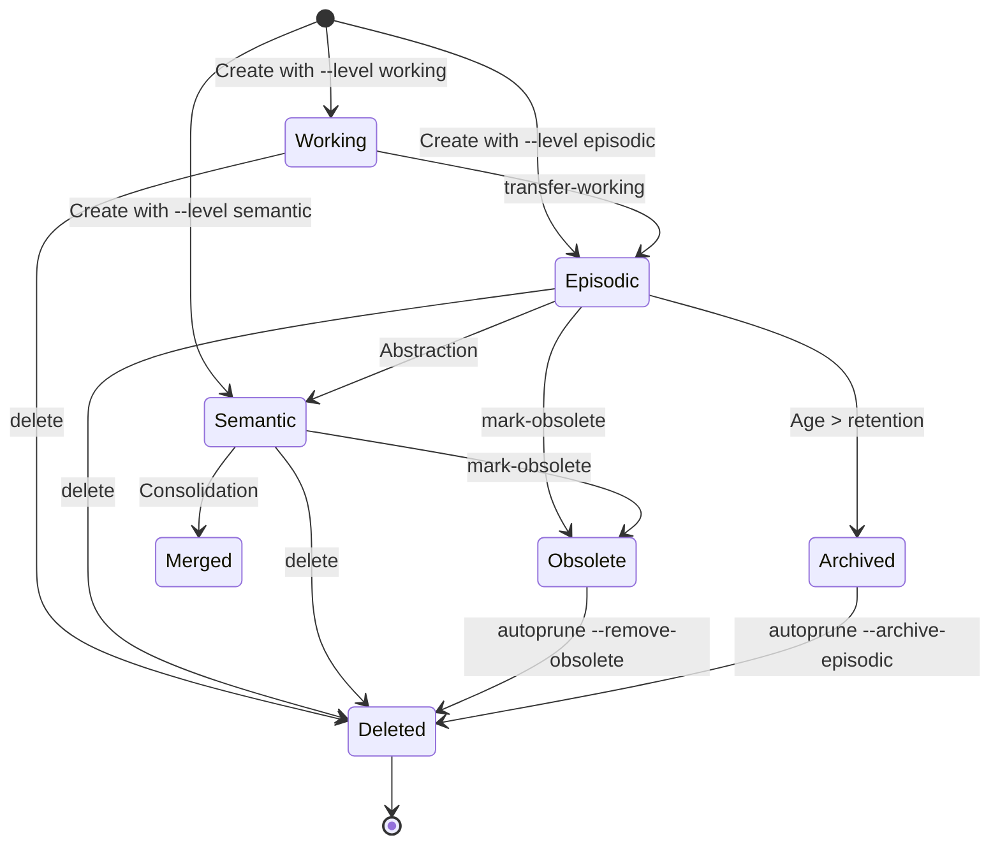

---

## Storage Architecture

### File Organization

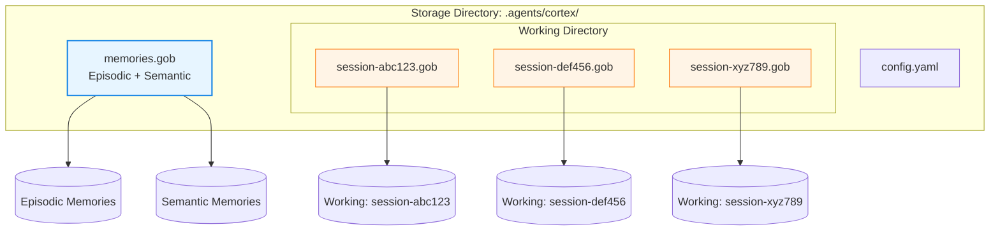

### GobStorage Implementation

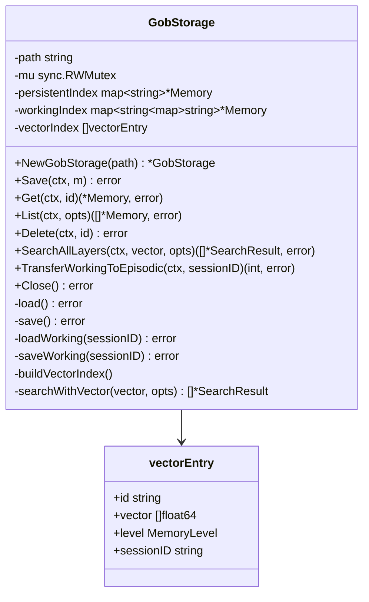

**Key Features**:
- **Thread-Safe**: Uses `sync.RWMutex` for concurrent access
- **In-Memory Index**: Fast lookups without disk I/O
- **Separate Files**: Working memories isolated by session
- **Vector Index**: Optimized for similarity search
- **Lazy Loading**: Working files loaded on-demand

---

## MCP Integration

### MCP Server Architecture

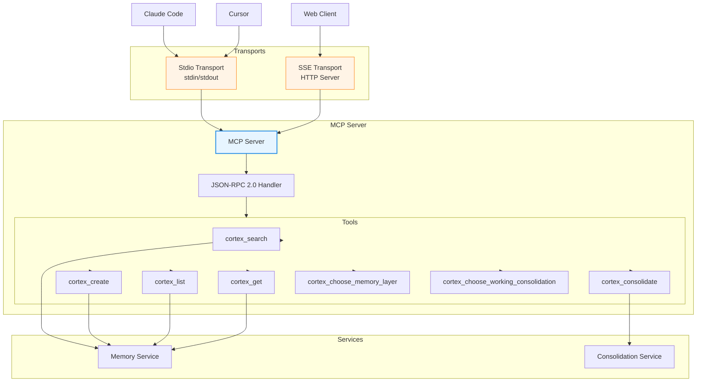

### MCP Protocol Flow

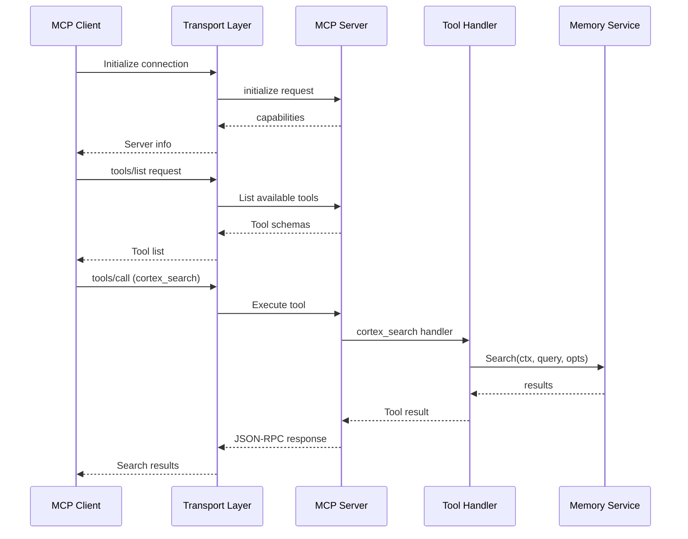

---

## Design Decisions

### Why Three Memory Layers?

**Rationale**: Mimics human memory systems (working, episodic, semantic)

**Benefits**:
- **Working**: Fast, temporary context for active sessions
- **Episodic**: Time-bound events with automatic cleanup
- **Semantic**: Permanent knowledge without clutter

**Trade-offs**:
- More complexity than flat storage
- Requires user understanding of levels
- Additional transfer operations

### Why Gob Storage?

**Rationale**: Simple, efficient, Go-native serialization

**Benefits**:
- No external dependencies
- Type-safe serialization
- Fast encoding/decoding
- Single-file simplicity

**Trade-offs**:
- Go-specific format
- No cross-language compatibility
- Not human-readable
- Limited query capabilities

**Future**: SQLite for advanced queries and larger datasets

### Why Ollama for Embeddings?

**Rationale**: Local-first, privacy-preserving, cost-effective

**Benefits**:
- Runs locally (no cloud costs)
- Privacy (no data leaves machine)
- Fast inference
- Offline capability
- Free and open source

**Trade-offs**:
- Requires Ollama installation
- Limited to Ollama-supported models
- Requires disk space and compute

### Why Cosine Similarity?

**Rationale**: Standard for semantic similarity in embedding spaces

**Benefits**:
- Well-understood metric
- Normalized to [0, 1] range
- Efficient computation
- Handles different vector magnitudes

**Trade-offs**:
- Linear search (O(n) for n memories)
- No spatial indexing (yet)

**Future**: Consider HNSW or Annoy for > 10k memories

### Why In-Memory Index?

**Rationale**: Fast search for small-to-medium datasets

**Benefits**:
- O(1) lookups by ID
- Fast similarity search
- Simple implementation
- No index maintenance overhead

**Trade-offs**:
- Memory usage scales with dataset
- Cold start requires loading
- Not suitable for 100k+ memories

**Threshold**: Consider disk-based index at 50k+ memories

---

## Performance Characteristics

### Time Complexity

| Operation | Complexity | Notes |
|-----------|------------|-------|
| Create | O(E + W) | E = embedding time, W = disk write |
| Get by ID | O(1) | In-memory hash lookup |
| Search | O(N·D) | N = memories, D = vector dimension |
| List | O(N) | Linear scan with filter |
| Delete | O(1 + W) | Hash delete + disk write |
| Transfer | O(M·W) | M = memories to transfer |

### Space Complexity

| Component | Complexity | Notes |
|-----------|------------|-------|
| Memory Index | O(N) | N = total memories |
| Vector Index | O(N·D) | D = vector dimension (768) |
| Gob Files | O(N·S) | S = average memory size |

### Bottlenecks

1. **Embedding Generation**: 100-500ms per request (Ollama latency)
2. **Disk I/O**: File writes block (mitigated by in-memory index)
3. **Search**: Linear scan of all vectors

### Optimization Strategies

1. **Batch Embeddings**: Use `EmbedBatch` for bulk operations
2. **Lazy Loading**: Load working files on-demand
3. **Concurrent Search**: Can parallelize similarity computation
4. **Caching**: Ollama caches model in memory

---

## Related Documentation

- **[Storage Implementation](storage.md)** - Detailed storage design
- **[Embeddings System](embeddings.md)** - Vector generation details
- **[Memory Model](memory-model.md)** - Domain model specification
- **[MCP Integration](../cli/mcp.md)** - MCP server implementation
- **[Development Guide](../contributing/development.md)** - Contributing to architecture

---

**Last Updated**: 2026-02-04
**Architecture Version**: 1.0 (Three-layer system with consolidation)
