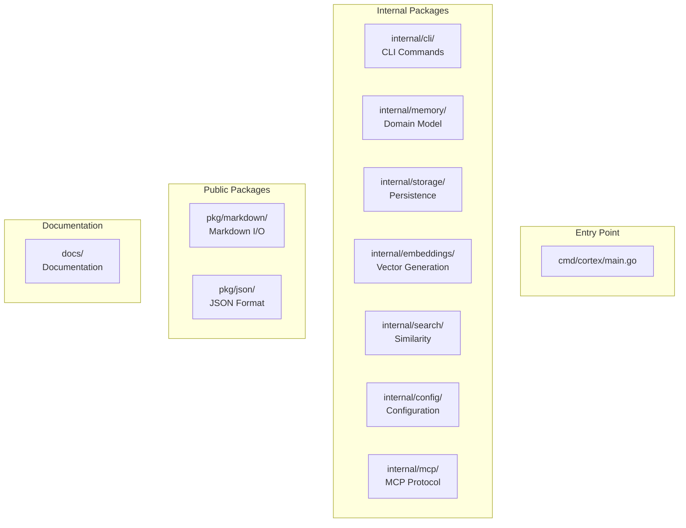
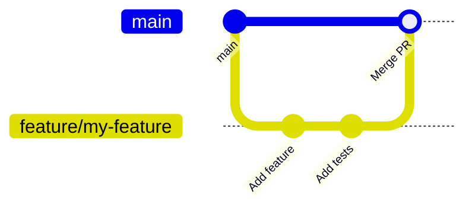

# Contributing to Cortex

Thank you for your interest in contributing to Cortex! This document provides guidelines and information for contributors.

## Table of Contents

- [Code of Conduct](#code-of-conduct)
- [Getting Started](#getting-started)
- [Development Setup](#development-setup)
- [Project Structure](#project-structure)
- [Making Changes](#making-changes)
- [Testing](#testing)
- [Code Style](#code-style)
- [Commit Messages](#commit-messages)
- [Pull Requests](#pull-requests)
- [Release Process](#release-process)

---

## Code of Conduct

Please be respectful and constructive in all interactions. We aim to maintain a welcoming environment for all contributors.

---

## Getting Started

### Prerequisites

- Go 1.24 or later
- Ollama (for embedding generation)
- Git
- Make

### Fork and Clone

```bash
# Fork the repository on GitHub, then:
git clone https://github.com/YOUR_USERNAME/cortex-ai.git
cd cortex-ai
```

---

## Development Setup

### Install Dependencies

```bash
make deps
```

### Build

```bash
make build
```

### Install Locally

```bash
make install
```

### Run Tests

```bash
make test
```

### Run with Race Detector

```bash
make test-race
```

### Lint Code

```bash
make lint
```

---

## Project Structure



### Key Directories

| Directory | Purpose |
|-----------|---------|
| `cmd/cortex/` | CLI entry point |
| `internal/cli/` | Cobra command implementations |
| `internal/memory/` | Memory domain model and service |
| `internal/storage/` | Storage backends (Gob, SQLite) |
| `internal/embeddings/` | Embedding providers (Ollama) |
| `internal/search/` | Vector similarity algorithms |
| `internal/config/` | Configuration management |
| `internal/mcp/` | MCP server implementation |
| `pkg/markdown/` | Markdown import/export |
| `pkg/json/` | JSON format handling |
| `docs/` | Documentation files |

---

## Making Changes

### Branching Strategy



1. Create a feature branch from `main`:
   ```bash
   git checkout -b feature/my-feature
   ```

2. Make your changes with clear, focused commits

3. Push and create a pull request

### Adding a New CLI Command

1. Create a new file in `internal/cli/`:
   ```go
   // internal/cli/mycommand.go
   package cli

   import "github.com/spf13/cobra"

   var myCommand = &cobra.Command{
       Use:   "mycommand",
       Short: "Brief description",
       Long:  "Longer description",
       RunE:  runMyCommand,
   }

   func init() {
       rootCmd.AddCommand(myCommand)
       // Add flags here
   }

   func runMyCommand(cmd *cobra.Command, args []string) error {
       // Implementation
       return nil
   }
   ```

2. Add tests in `internal/cli/cli_test.go`

### Adding a New Storage Backend

1. Implement the `Storage` interface:
   ```go
   // internal/storage/mystorage.go
   type MyStorage struct {
       // ...
   }

   func (s *MyStorage) Save(ctx context.Context, memory *memory.Memory) error {
       // Implementation
   }

   // Implement all interface methods...
   ```

2. Add to storage factory
3. Add configuration options
4. Add tests and benchmarks

### Adding a New Embedding Provider

1. Implement the `Embedder` interface:
   ```go
   // internal/embeddings/myprovider.go
   type MyEmbedder struct {
       // ...
   }

   func (e *MyEmbedder) Embed(ctx context.Context, text string) ([]float64, error) {
       // Implementation
   }

   // Implement all interface methods...
   ```

2. Add configuration options
3. Add tests

---

## Testing

### Running Tests

```bash
# Run all tests
make test

# Run with coverage
go test -cover ./...

# Run specific package
go test ./internal/memory/...

# Run with race detector
make test-race

# Run benchmarks
go test -bench=. ./internal/storage/...
```

### Test Structure

```
internal/
├── memory/
│   ├── memory.go
│   ├── memory_test.go      # Unit tests for memory.go
│   ├── service.go
│   └── service_test.go     # Unit tests for service.go
├── storage/
│   ├── gob.go
│   ├── gob_test.go         # Unit tests
│   └── gob_bench_test.go   # Benchmarks
```

### Writing Tests

```go
func TestMemoryValidation(t *testing.T) {
    tests := []struct {
        name    string
        input   Memory
        wantErr bool
    }{
        {
            name:    "valid memory",
            input:   Memory{Title: "Test", Content: "Content", Types: []MemoryType{TypeSolution}},
            wantErr: false,
        },
        {
            name:    "missing title",
            input:   Memory{Content: "Content", Types: []MemoryType{TypeSolution}},
            wantErr: true,
        },
    }

    for _, tt := range tests {
        t.Run(tt.name, func(t *testing.T) {
            err := tt.input.Validate()
            if (err != nil) != tt.wantErr {
                t.Errorf("Validate() error = %v, wantErr %v", err, tt.wantErr)
            }
        })
    }
}
```

---

## Code Style

### Go Standards

- Follow [Effective Go](https://golang.org/doc/effective_go)
- Use `gofmt` for formatting
- Run `golangci-lint` before committing

### Naming Conventions

| Type | Convention | Example |
|------|------------|---------|
| Packages | lowercase, single word | `memory`, `storage` |
| Interfaces | Verb + "er" or descriptive | `Embedder`, `Storage` |
| Structs | Descriptive nouns | `Memory`, `SearchResult` |
| Functions | Verb + noun | `CreateMemory`, `SearchByVector` |
| Constants | CamelCase or SCREAMING_CASE | `MemoryTypeSolution`, `MAX_RESULTS` |

### Error Handling

```go
// Good: wrap errors with context
if err != nil {
    return fmt.Errorf("failed to save memory: %w", err)
}

// Good: custom error types for specific cases
type NotFoundError struct {
    ID string
}

func (e *NotFoundError) Error() string {
    return fmt.Sprintf("memory not found: %s", e.ID)
}
```

### Documentation

```go
// Memory represents a stored piece of knowledge.
// It includes semantic content, metadata, and a vector embedding
// for similarity search.
type Memory struct {
    // ID is the unique identifier (UUID v4)
    ID string `json:"id"`

    // Title is a brief, descriptive name for the memory
    Title string `json:"title"`

    // ...
}
```

---

## Commit Messages

### Format

```
<type>(<scope>): <description>

[optional body]

[optional footer]
```

### Types

| Type | Description |
|------|-------------|
| `feat` | New feature |
| `fix` | Bug fix |
| `docs` | Documentation only |
| `style` | Formatting, no code change |
| `refactor` | Code restructuring |
| `test` | Adding tests |
| `chore` | Build, CI, or tooling |

### Examples

```
feat(cli): add export command with markdown support

Implements the export command with:
- Single memory export by ID
- Bulk export with --all flag
- Synthesis export with --intent flag

Closes #42
```

```
fix(storage): handle concurrent access in GobStorage

Add RWMutex to protect index operations during
concurrent read/write access.

Fixes #123
```

---

## Pull Requests

### Checklist

Before submitting a PR, ensure:

- [ ] Code compiles without errors
- [ ] All tests pass (`make test`)
- [ ] No linting errors (`make lint`)
- [ ] New code has tests
- [ ] Documentation updated if needed
- [ ] Commit messages follow guidelines

### PR Template

```markdown
## Description

Brief description of changes.

## Type of Change

- [ ] Bug fix
- [ ] New feature
- [ ] Breaking change
- [ ] Documentation update

## Testing

Describe how you tested these changes.

## Checklist

- [ ] Tests pass
- [ ] Lint passes
- [ ] Documentation updated
```

### Review Process

1. Submit PR with clear description
2. CI runs tests and linting
3. Maintainer reviews code
4. Address feedback if needed
5. Merge when approved

---

## Release Process

### Versioning

We use [Semantic Versioning](https://semver.org/):

- `MAJOR.MINOR.PATCH`
- `MAJOR`: Breaking changes
- `MINOR`: New features (backward compatible)
- `PATCH`: Bug fixes (backward compatible)

### Creating a Release


1. Update version in relevant files
2. Create and push tag:
   ```bash
   git tag -a v1.2.3 -m "Release v1.2.3"
   git push origin v1.2.3
   ```
3. CI/CD (GoReleaser) handles build and release

---

## Getting Help

- Open an issue for bugs or feature requests
- Discussions for questions and ideas
- Check existing issues before creating new ones

---

## Related Documentation

- [README.md](../README.md) - Getting started
- [ARCHITECTURE.md](../architecture/overview.md) - System design
- [CONFIGURATION.md](../guides/configuration.md) - Configuration reference
